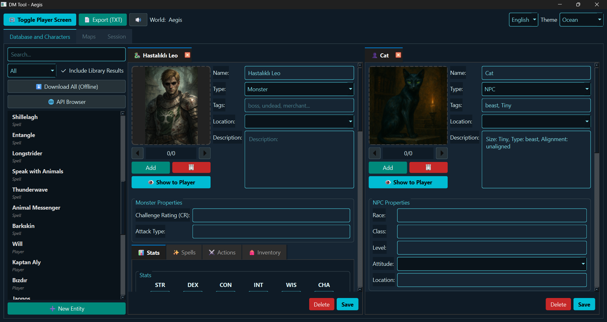
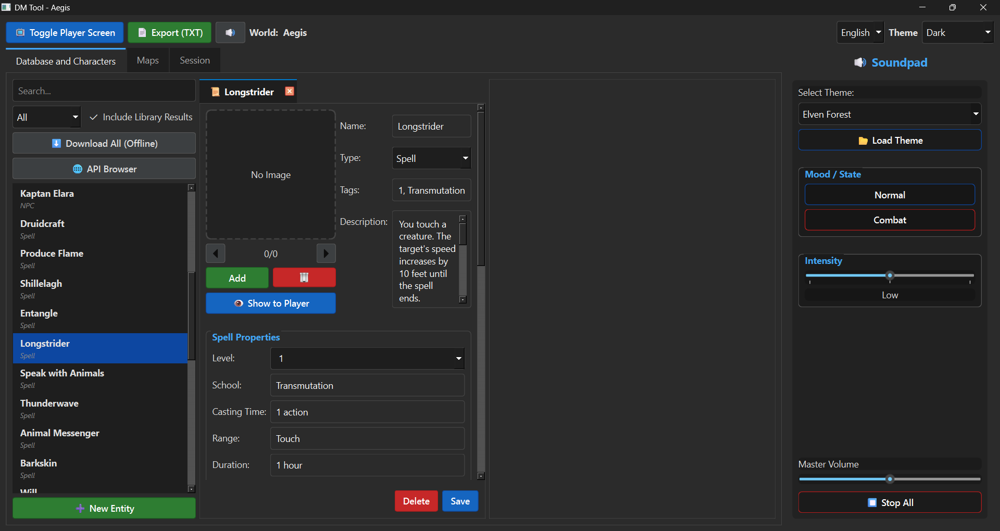
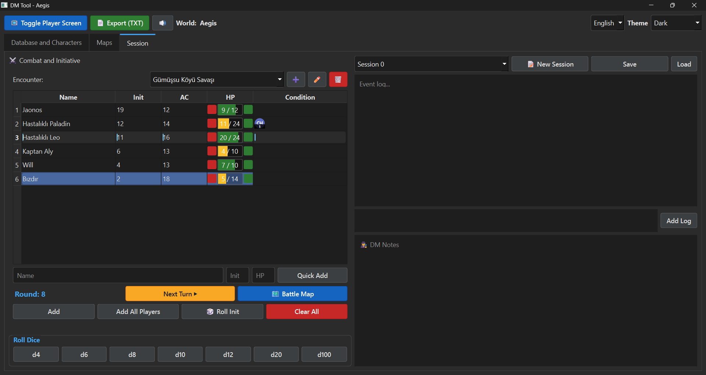
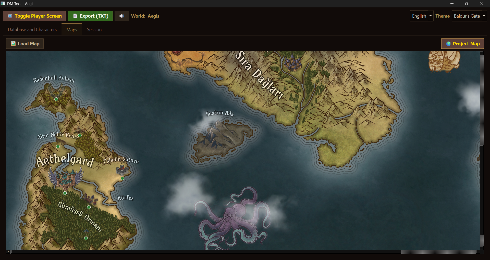
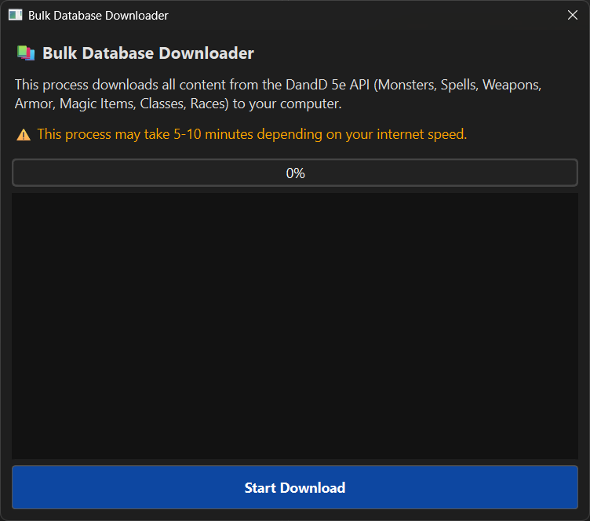
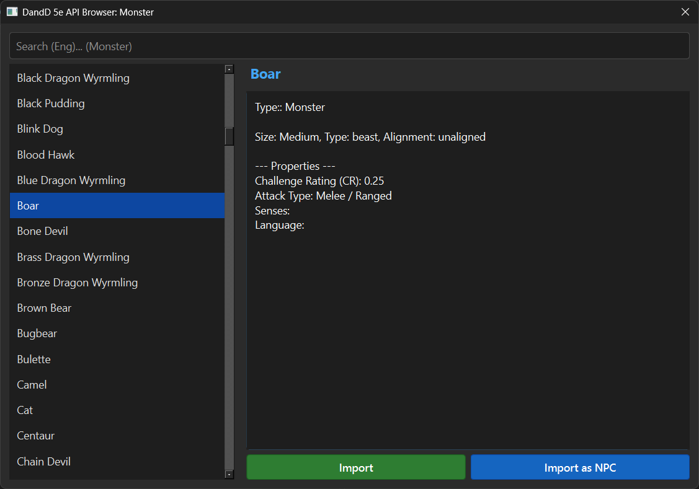

# 🐉 Dungeon Master Tool


**A portable, offline-first DM tool designed for dual-monitor setups.**
Manage combat, track stats, and project maps to your players without the hassle.

[📥 Download Latest Release](https://github.com/elymsyr/dungeon-master-tool/releases)

> ✨ UI/UX Status: The user interface is now in a much better state—cleaner, more consistent, and easier to read. We are committed to continuously improving the look and feel in upcoming updates!

> Hey guys, leaving a star or a feedback would be the best motivation for me, since I work on a full-time job. I am trying to create an app for dungeon masters. Hope you'll like it :)
---

## ✨ Key Features

*   **Dual Screen Support:** Keep your DM notes private while projecting maps and stat blocks to a second screen.
*   **Combat Tracker:** Streamlined Initiative, HP, and Condition tracking.
*   **Lightweight VTT:** Drag & drop tokens onto maps instantly.
*   **5e Database:** Built-in API browser for Monsters, Spells, and Items.
*   **Portable:** No installation required. Runs entirely from a USB drive.

## 🗺️ Roadmap

### ✅ Completed
- [x] **Visual Status:** Status badges/icons on Combat Tracker & Battlemap.
- [x] **UI/UX Overhaul:** Modernized interface, new themes (Baldur, Grim, Discord), and split-view editing.
- [x] **Multi-Encounter:** Manage multiple encounters simultaneously within a session.
- [x] **System Upgrades:** Advanced Entity Cards, Multi-Add, and Status Effect systems.

### 🚧 In Progress / Planned

- [ ] **More Sources and Prebuild Worlds:** We're planning to add more entities from other sources like 5E 2024, Forgotten Realms and else... Also adding custom design prebuild worlds to help newbies.
- [ ] **Soundpad:** Support for custom music and sound effects.
- [ ] **Fog of War:** Interactive masking/revealing areas on the Battle Map.
- [ ] **Campaign Notes:** Rich text editor, linking, and better folder organization for DM notes.
- [ ] **Integrations:** Support for D&D Beyond, Obsidian, and other tools.
- [ ] **Multi-Window:** Advanced support for projecting to specific/multiple player screens.

## 📝 Additional Plan Notes
- [ ] Save folder path change
- [ ] Adding battlemaps as entities and into location entities and load
- [ ] Split DM note area to control the battlemap fog and pawns
- [ ] Add API import with image support
- [ ] A better World control, bulk export entities from one world to another 
- [ ] Add custom entity sets

## 🚀 Installation

### Option 1: Executable (Recommended)
1.  Go to the **Releases** page.
2.  Download the latest `.exe`.
3.  Run it! (Data saves locally).

### Option 2: From Source
```bash
git clone https://github.com/elymsyr/dungeon-master-tool.git
cd dungeon-master-tool
pip install -r requirements.txt
python main.py
```

## 📸 Screenshots
<p align="center">
  
  
  
  
  
  
  
  
  
</p>

## ⚠️ Disclaimer
This project is currently in Pre-Alpha. Expect bugs and frequent updates.
