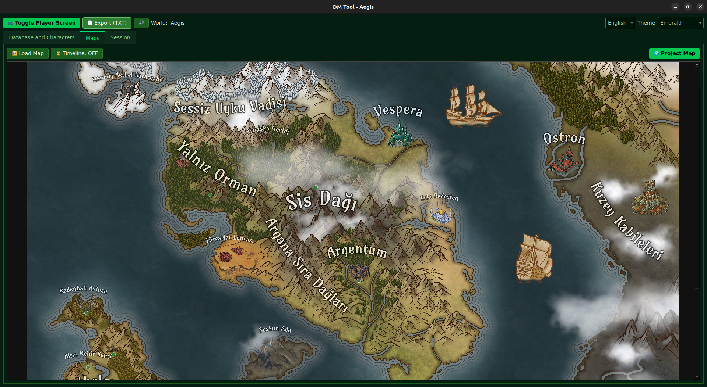
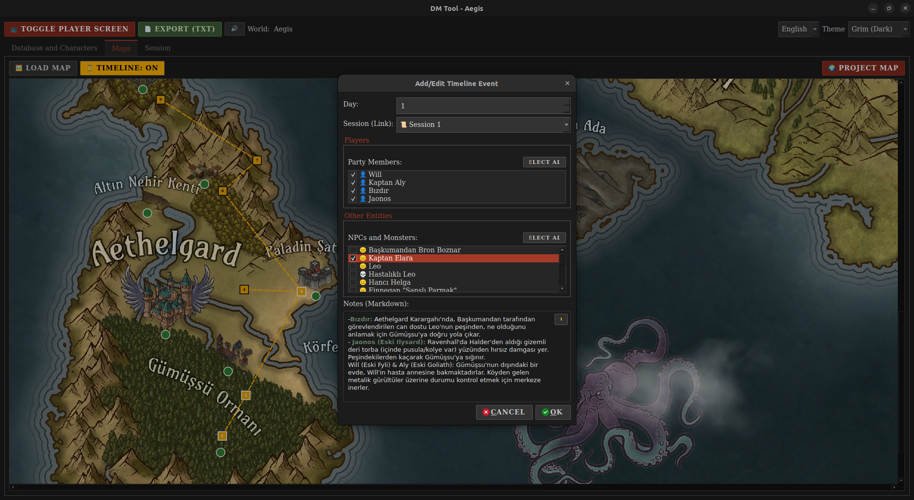

# 🐉 Dungeon Master Tool


**A portable, offline-first DM tool designed for dual-monitor setups.**  
Manage combat, track branching timelines, and project a rich campaign wiki to your players seamlessly.

[📥 Download Latest for Windows](https://github.com/elymsyr/dungeon-master-tool/releases/download/alpha-v0.6.5/DungeonMasterTool-Windows.zip)

[📥 Download Latest Release](https://github.com/elymsyr/dungeon-master-tool/releases)

> ✨ **v0.6.5 Update:** Now featuring Multi-Image Projection, Drag & Drop workflow, Video Maps, and a fully integrated Fog of War system!

---

## 📣 Feedback & Communication / Geri Bildirim ve İletişim

🇹🇷 **Türkçe**

Bu proje aktif olarak geliştirilmektedir ve kullanıcı geri bildirimi benim için çok değerlidir.  
Uygulama ile ilgili **öneri, bug bildirimi, şikayet, soru veya genel geri bildirimlerinizi** paylaşmaktan lütfen çekinmeyin.

Aşağıdaki kanallardan size en uygun olanı kullanabilirsiniz:

- 🐛 **GitHub Issues (önerilen)**  
  Bug bildirimleri, özellik istekleri ve teknik konular için:  
  👉 https://github.com/elymsyr/dungeon-master-tool

- 📩 **E-posta**  
  Daha özel veya uzun geri bildirimler için:  
  - orhun868@gmail.com  
  - orhunerenyalcinkaya@gmail.com

- 📸 **Instagram**  
  Hızlı mesajlar, fikirler veya proje hakkında sohbet için:  
  👉 https://www.instagram.com/erenorhun

- 💼 **LinkedIn**  
  Profesyonel iletişim, işbirliği veya proje hakkında konuşmak için:  
  👉 https://www.linkedin.com/in/orhuneren

Her geri bildirimi okuyorum ve projeyi daha iyi hale getirmek için değerlendiriyorum.  
Katkınız için teşekkürler! 🙏

---

🇬🇧 **English**

This project is under active development, and user feedback is extremely valuable to me.  
Please feel free to share **feature requests, bug reports, complaints, questions, or any kind of feedback**.

You can reach out through any of the following channels:

- 🐛 **GitHub Issues (recommended)**  
  For bug reports, feature requests, and technical discussions:  
  👉 https://github.com/elymsyr/dungeon-master-tool

- 📩 **Email**  
  For more detailed or private feedback:  
  - orhun868@gmail.com  
  - orhunerenyalcinkaya@gmail.com

- 📸 **Instagram**  
  For quick messages, ideas, or casual discussion about the project:  
  👉 https://www.instagram.com/erenorhun

- 💼 **LinkedIn**  
  For professional contact, collaboration, or project-related discussions:  
  👉 https://www.linkedin.com/in/orhuneren

I carefully read all feedback and use it to improve the project continuously.  
Thank you for your support! 🙏

---

## ✨ Key Features

*   **Dynamic Player Screen:** Drag & drop multiple images (NPCs, Maps, Items) to the projection bar to create an instant **second split-screen view** for players.
*   **Fog of War:** Interactive masking on the Battle Map. Draw fog to hide secrets and erase it to reveal rooms as players explore. **Persists per encounter.**
*   **Animated Battle Maps:** Support for local video files (`.mp4`, `.webm`) to create immersive, moving battlegrounds.
*   **Embedded Battle Map:** Move tokens, manage combat, and sync views without leaving the session log. Control the second battlemap screen for players with a single click.
*   **Adaptive Soundpad:** Layered music system with intensity sliders (Base -> Low -> High) with ambiences and instant SFX. **Now supports importing your own Sounds and Themes directly from the app!**
*   **Story Timeline:** Map-based tracker with **branching paths**, travel lines, and session-linked events. Implement NPC or Monster stories using timeline pins and hide them from players.
*   **System Agnostic:** While optimized for 5e, you can play **any TTRPG** (Pathfinder, OSR, Homebrew) by creating custom entity cards or using "Handwritten" notes without code. Please create an issue if you want more sources :)
*   **Multi-Source Database:** Integrated browser with **SRD 5e** and **Open5e** support. Instantly fetch Monsters, Spells, Feats, Backgrounds and more.
*   **Portable & Offline:** No installation or internet required.

## 🗺️ Roadmap

### ✅ Completed
- [x] **Dynamic Projection:** Drag & drop images to header to project. Support for multi-image split view.
- [x] **Fog of War:** Drawing tools (Lasso), global fill/clear, and per-encounter persistence.
- [x] **Animated Maps:** Support for local video files as battle maps.
- [x] **Embedded Map:** Seamless synchronization between DM view and Player view.
- [x] **Soundpad:** Support for custom music, ambience layers, and sound effects.
- [x] **Story Timeline 2.0:** Branching map paths and parent-child event linking.
- [x] **Dynamic Linking:** Personal wiki experience using `@mentions` in any text area.
- [x] **Markdown Integration:** Rich text editing for descriptions, logs, and DM notes.
- [x] **Binary Storage:** Migration from JSON to high-speed MsgPack (`.dat`).
- [x] **Advanced Linking and Mentioning:** Support linking entities on any text in the app.
- [x] **Multi-Window:** Advanced support for projecting to specific/multiple player screens.
- [x] **Campaign Notes:** Rich text editor, linking, and better folder organization for DM notes.
- [x] **More Sources:** Open5E API is connected.
- [x] **Battlemap View Lock and Toggle:** Toggle player view and lock map movement for player's battlemap screen.
- [x] **In-App Soundpad Import:** Add single sounds and create full themes directly from the UI.


### 🚧 In Progress / Planned
- [ ] **Random Creator:** Random creator for NPCs, NPC names, battles and more...
- [ ] **Notes and Mindmap:** Quick notes and note mind map. Also notes on map.
- [ ] **Image to Note:** Image to note transformer.
- [ ] **Battlemap:** Better battle map visualizations and features.
- [ ] **Prebuild Worlds:** We're planning to add more entities from other sources and custom design prebuild worlds to help newbies.
- [ ] **Soundpad:** Better soundpad and songs. Currently, the songs are uploaded only for test purposes.
- [ ] **Integrations:** Support for D&D Beyond, Obsidian, and other tools.
- [ ] **Custom World Pre-build:** Creating custom pre-build worlds and creating fast worlds.
- [ ] **Online Experience:** After developing all the features and focusing on quality of automated gameplay, I am planning to create an online experience. The local servers for users and offline gameplay will still be free. However, ready-to-use servers will probably require subscription.

## 🎮 Feature Guide

### 📺 Using the Player Screen (Projection)
1.  Click the **"📺 Toggle Player Screen"** button in the top toolbar to open the second window.
2.  A **"Drop to Project"** area will appear next to the World Name in the main toolbar.
3.  **Drag & Drop:** Click and drag any image (from an NPC sheet, Item card, or Map list) and drop it into this area.
4.  **Multi-View:** Drop a second image to automatically split the player screen and show both side-by-side.
5.  **Remove:** Click the small thumbnail in the toolbar to remove that specific image from the projection.
6.  **Project Map:** Inside the Map Tab or Session Tab, click "Project Map" to instantly send the current battle map state (including fog) to the screen.

### 🌫️ Using Fog of War
1.  Go to the **Session Tab** (or open the Battle Map Window).
2.  Click the **"☁️ Fog"** button on the map toolbar to enable editing mode.
3.  **Hide Area:** Hold **Left Click** and draw a shape to cover an area with fog.
4.  **Reveal Area:** Hold **Right Click** and draw a shape to clear the fog.
5.  **Persistence:** Fog state is saved automatically for each unique encounter ID in the Combat Tracker.
6.  **Fill/Clear:** Use the toolbar buttons to instantly fill the whole map with fog or clear it.

## 🎵 Customizing Soundpad

You no longer need to edit YAML files manually! Use the new **Theme Builder** in the Soundpad panel to create themes, assign tracks, and handle file organization automatically.

## 🚀 Installation

### Option 1: Executable (Recommended)
1.  Go to the **Releases** page.
2.  Download the latest `.zip` (Windows).
3.  Extract it and run it! Your campaign data saves locally in the application folder.

### Option 2: From Source (Linux & Advanced Users)
#### Linux (Automated)
```bash
git clone https://github.com/elymsyr/dungeon-master-tool.git
cd dungeon-master-tool
# For Debian/Ubuntu/Fedora/Generic:
bash installer/install.sh
# For Arch Linux:
bash installer/install-arch.sh
```

#### Windows (Manual)
```bash
git clone https://github.com/elymsyr/dungeon-master-tool.git
cd dungeon-master-tool
python -m venv venv
venv\Scripts\activate
pip install -r requirements.txt
python main.py
```

## 📸 Screenshots (Pictures are from v0.5) (Resimler versiyon 5'ten kalma)
<p align="center">
  
  
  
  
  
  
  
  
  
  
</p>

## ⚠️ Disclaimer
This project is currently in **Alpha**. Expect frequent updates and occasional bugs. Backup your world data regularly!

## ✏️ Credits

- [DND 5E SRD API](https://www.dnd5eapi.co/)
- [Open5E](https://open5e.com/)
- <a href="https://www.flaticon.com/free-icons/mage" title="mage icons">Mage icons created by David Carapinha - Flaticon</a>
