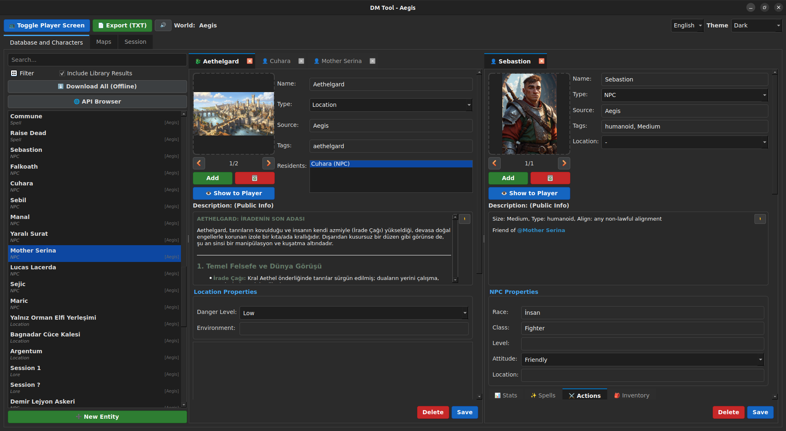
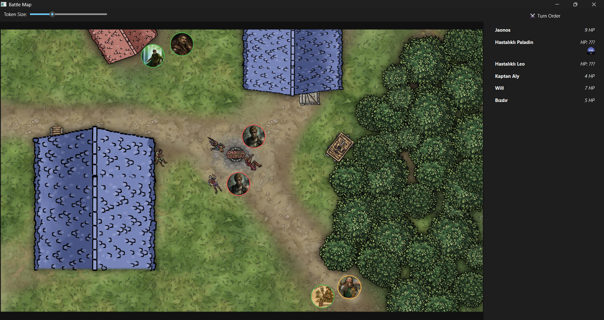
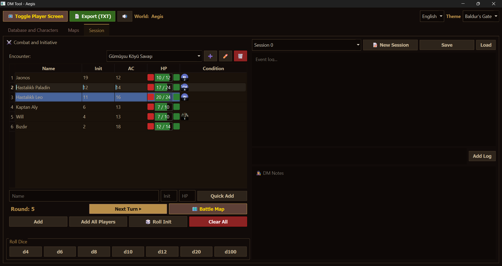

# 🐉 Dungeon Master Tool

<p align="center">
  
  <br>
  <b>A portable, offline-first DM tool designed for dual-monitor setups.</b>
  <br>
  <i>Manage combat, track timelines, and project a rich campaign wiki seamlessly.</i>
  <br>
  <br>
  <a href="https://github.com/elymsyr/dungeon-master-tool/releases/download/alpha-v0.7./DungeonMasterTool-Windows.zip">
    
  </a>
  <a href="https://github.com/elymsyr/dungeon-master-tool/releases">
    
  </a>
  <a href="https://github.com/elymsyr/dungeon-master-tool/releases/download/alpha-v0.7./DungeonMasterTool-MacOS.zip">
    
  </a>
  <br>
  <br>
  
  
  
</p>

---

> 📢 **Developer Note:**
> You can find current priorities and known bugs in **[TODO.md](TODO.md)**.
>
> *Due to personal time constraints, updates might be slower recently. However, I am doing my best to stick to the roadmap and implement planned features. Thank you for your support!*

---

## ✨ Highlights

| 📺 **Dynamic Projection** | 🌫️ **Fog of War** | 🧠 **Mind Map** |
|:---:|:---:|:---:|
| Drag & drop images to project instantly to a second screen. | Draw fog to hide secrets on the battle map. Persists per encounter. | Infinite canvas to link notes, NPCs, and create story workspaces. |

| 🎵 **Adaptive Audio** | ⚔️ **Combat Tracker** | 🌍 **System Agnostic** |
|:---:|:---:|:---:|
| Layered music with intensity sliders. Create custom themes easily. | Manage initiative, HP, and conditions integrated with the map. | Built-in 5e SRD/Open5e browser, but adaptable to any system. |

---

## 🚀 Quick Start

### 1. Installation
*   **Windows:** [Download the .zip](https://github.com/elymsyr/dungeon-master-tool/releases/latest), extract, and run `DungeonMasterTool.exe`.
*   **Linux:** Run the automated installer:
    ```bash
    git clone https://github.com/elymsyr/dungeon-master-tool.git
    cd dungeon-master-tool
    bash installer/install.sh  # (Use install-arch.sh for Arch)
    ```

### 2. Core Features Guide
*   **📺 Project to Players:** Click **"Toggle Player Screen"**. Drag any image (NPC/Map) to the "Drop to Project" bar at the top.
*   **🌫️ Fog of War:** In the **Session Tab**, click **"Fog"**. Left-click to hide, Right-click to reveal.
*   **🧠 Mind Map:** Right-click on the canvas to add Nodes or Workspaces. Middle-click to pan.
*   **🎵 Soundpad:** Open the panel, select a theme (e.g., "Forest"), and use the **Intensity Slider** to shift music dynamically.

---

## 🗺️ Roadmap & Status

### ✅ Ready to Use
- [x] **Projector:** Multi-image split view & Battle Map sync.
- [x] **Maps:** Video map support (`.mp4`), Fog of War, Grid.
- [x] **Campaign:** Rich text notes, binary storage (`.dat`), Timeline tracker.
- [x] **Customization:** Theme Engine (10+ themes), English/Turkish localization.
- [x] **Audio:** Custom Soundpad with Theme Builder.

### 🚧 Coming Soon
- [ ] **Generators:** Random NPC & Encounter creators.
- [ ] **Tools:** Image-to-Note (OCR) transformer.
- [ ] **Content:** Pre-built worlds & "One-Click" campaign setups.
- [ ] **Online:** Hosted servers for remote play.

---

## 📸 Gallery

<p align="center">
  
  
</p>
<p align="center">
  
  
</p>

---

## 📣 Feedback / İletişim

**I read every piece of feedback.** Whether it's a bug report or a feature request, please reach out!  
*Her geri bildirimi okuyorum. Hata bildirimi veya özellik isteği için lütfen ulaşın!*

| Platform | Link / Contact |
| :--- | :--- |
| 🐛 **GitHub Issues** | [Report a Bug](https://github.com/elymsyr/dungeon-master-tool/issues) |
| 📸 **Instagram** | [@erenorhun](https://www.instagram.com/erenorhun) |
| 💼 **LinkedIn** | [Orhun Eren Yalçınkaya](https://www.linkedin.com/in/orhuneren) |
| 📩 **Email** | *orhunerenyalcinkaya@gmail.com* |

---

## ✏️ Credits
*   [DND 5E SRD API](https://www.dnd5eapi.co/)
*   [Open5E](https://open5e.com/)
*   *Mage icons created by David Carapinha - Flaticon*