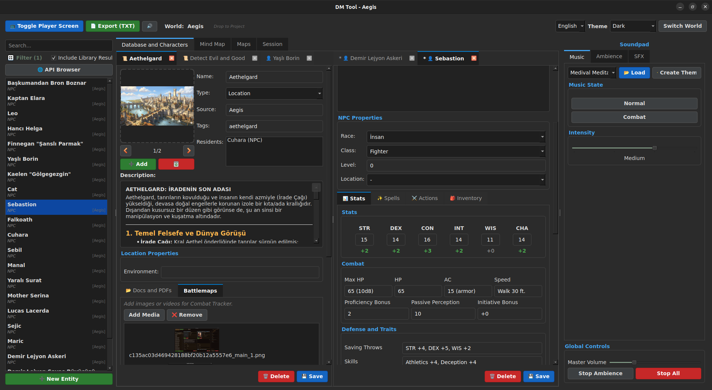
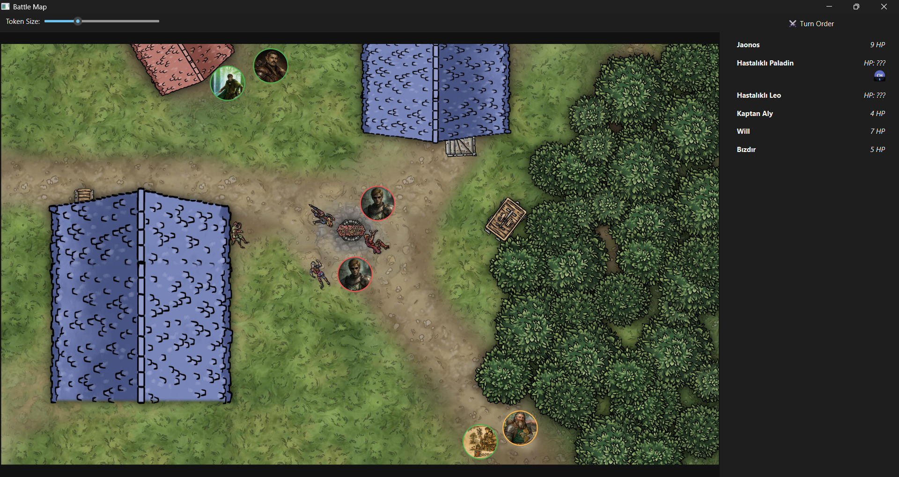
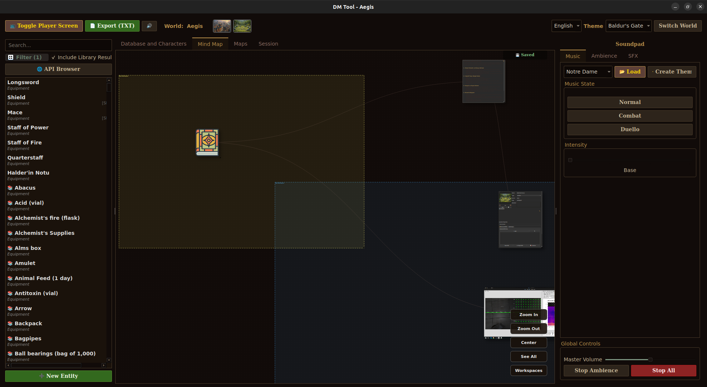
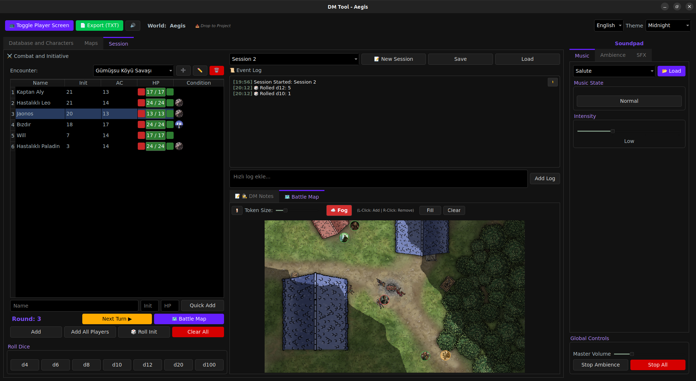

# 🐉 Dungeon Master Tool

<p align="center">
  
  <br>
  <b>A portable, offline-first DM tool designed for dual-monitor setups.</b>
  <br>
  <i>Manage combat, track timelines, and project a rich campaign wiki seamlessly.</i>
  <br><br>
  ✨  <a href="https://elymsyr.github.io/">Check out our over-engineered amazing website here!</a> ✨
  <br><br>
  <a href="https://github.com/elymsyr/dungeon-master-tool/releases/download/alpha-v0.8.4/DungeonMasterTool-Windows.zip">
    
  </a>
  <a href="https://github.com/elymsyr/dungeon-master-tool/releases/download/alpha-v0.8.4/DungeonMasterTool-Linux.zip">
    
  </a>
  <a href="#macos-installation">
    
  </a>
  <br>
  <br>
  
  
  
  
  <br>
  <b>Supported Languages:</b>
  <br>
  🇺🇸 English | 🇹🇷 Türkçe | 🇩🇪 Deutsch | 🇫🇷 Français
</p>

---

> 📢 **Developer Note:**
> Current priorities, known bugs, and full changelog are in **[TODO.md](TODO.md)**.
>
> *Due to personal time constraints, updates might be slower recently. However, I am doing my best to stick to the roadmap and implement planned features. Thank you for your support!*

---

## ✨ Highlights

| 📺 **Dynamic Projection** | 🌫️ **Fog of War** | 🧠 **Mind Map** |
|:---:|:---:|:---:|
| Drag & drop images to project instantly to a second screen. | Draw fog to hide secrets on the battle map. Left-click adds, right-click erases. | Infinite canvas with Level-of-Detail rendering — stays smooth even with dozens of nodes. |

| 🎵 **Adaptive Audio** | ⚔️ **Combat Tracker** | 🌍 **System Agnostic** |
|:---:|:---:|:---:|
| Layered music with intensity sliders. Create custom themes easily. | Manage initiative, HP, and conditions. Combat events auto-log to the session event log. | Built-in 5e SRD/Open5e browser, but adaptable to any system. |

---

## 🚀 Core Features Guide

- **📺 Project to Players:** Click **"Toggle Player Screen"**. Drag any image (NPC/Map) to the "Drop to Project" bar at the top.
- **🗺️ Battle Map:** Load a map image (up to 1 GB decoded). The toolbar is split into four groups:
  - **Navigate** — pan the map; click any ruler or circle to delete it
  - **Ruler / Circle** — draw persistent distance/area measurements displayed in feet; stack as many as you want; **Clear Rulers** removes all at once
  - **Draw** — free-hand annotation brush; **Clear Draw** erases all drawings
  - **Fog** — left-click to add fog, right-click to erase; **Fill Fog** / **Clear Fog** for quick resets
- **📡 Player Screen Sync:** Every tool — fog, drawings, rulers, circles — renders on the player screen (second monitor) in real time. Clearing via the action buttons also clears the player view instantly.
- **🧠 Mind Map:** Right-click on the canvas to add Notes, Images, or Workspaces. Middle-click to pan. Zoom out freely — the LOD system keeps it smooth.
- **🎵 Soundpad:** Open the panel, select a theme (e.g., "Forest"), and use the **Intensity Slider** to shift music dynamically.

---

## 🗺️ Roadmap & Status

### ✅ Ready to Use
- [x] **Projector:** Multi-image split view & Battle Map sync to player screen.
- [x] **Battle Map:** Fog of War, Grid, persistent Rulers & Circles, Draw tool — all synced to the second screen.
- [x] **Combat Tracker:** Initiative, HP, conditions, and auto event logging.
- [x] **Mind Map:** Infinite canvas with LOD rendering, workspaces, entity nodes, and image nodes.
- [x] **Campaign:** Rich text notes, binary storage (`.dat`), Timeline tracker.
- [x] **Customization:** Theme Engine (10+ themes), 4-language localization (EN/TR/DE/FR).
- [x] **Audio:** Custom Soundpad with Theme Builder.

### 🚧 Coming Soon
- [ ] **Generators:** Random NPC & Encounter creators.
- [ ] **Tools:** Image-to-Note (OCR) transformer.
- [ ] **Content:** Pre-built worlds & "One-Click" campaign setups.
- [ ] **Online:** Hosted servers for remote play.

---

## 🆕 What's New in v0.8.4

- **Architecture overhaul** — NpcSheet, CombatTracker, and API client decomposed into focused sub-modules. MVP/Presenter layer added.
- **Right-side PDF Panel** — view entity PDFs in a collapsible side panel (mutually exclusive with soundpad).
- **Spells tab refactoring** — manual spells replaced with a dialog; linked and custom spells in a unified list.
- **Theme & button polish** — background color fixes across all 11 themes, HP buttons themed via QSS, emoji buttons replaced with icons, combat table columns auto-sized.
- **Battle map toolbar** — DM tools split into two rows for better readability across themes.

See the full version history in **[TODO.md → Changelog](TODO.md#-changelog)**.

---

## 🚀 Installation

### 🪟 Windows
1. Download `DungeonMasterTool-Windows.zip` [here](https://github.com/elymsyr/dungeon-master-tool/releases/download/alpha-v0.8.4/DungeonMasterTool-Windows.zip).
2. Extract the folder and run `DungeonMasterTool.exe`.

### 🐧 Linux

#### Preferred

1. Download `DungeonMasterTool-Linux.zip` [here](https://github.com/elymsyr/dungeon-master-tool/releases/download/alpha-v0.8.4/DungeonMasterTool-Linux.zip).
2. Extract the folder and run `DungeonMasterTool`.

#### Manual

```bash
git clone https://github.com/elymsyr/dungeon-master-tool.git
cd dungeon-master-tool
bash installer/install.sh  # (Use install-arch.sh for Arch Linux)
./run.sh
```

<div id="macos-installation"></div>

### 🍎 MacOS Installation & Security Note
Since this is an open-source project and not signed with an official Apple Developer account, you need to manually bypass the "unverified developer" warning.

**[Click here to download DungeonMasterTool-MacOS.zip](https://github.com/elymsyr/dungeon-master-tool/releases/download/alpha-v0.8.4/DungeonMasterTool-MacOS.zip)**

**Steps to run the app:**

1. **Extract** the downloaded `.zip` file.
2. Drag `DungeonMasterTool.app` to your **Applications** folder.
3. Open **Terminal** (Cmd + Space, type 'Terminal') and run the following command to remove the quarantine flag:
   ```bash
   sudo xattr -rd com.apple.quarantine /Applications/DungeonMasterTool.app
   ```
4. **Launch:** You can now open the app from your Applications or Launchpad.

---

## 🛠️ Developer Hot Reload

### Install (Dev)

```bash
pip install -r requirements-dev.txt
```

### Run

```bash
python dev_run.py
```

Optional flags:

- `--path <dir>`: watch/run from a specific root (default is repo root)
- `--patterns "*.py,*.ui,*.qss,*.json,*.yaml,*.yml"`: override watched patterns
- `--debounce-ms 300`: debounce window for change bursts
- `--no-restart`: disable fallback auto-restart when hot reload fails
- `--restart-only`: disable in-process hot reload, restart on every change

### What Reloads Live

- `.py`: changed modules are reloaded with `importlib.reload()`, then root UI is rebuilt in-process
- `.qss`: active stylesheet is reapplied live (no restart)
- `.ui`, `.json`, `.yaml`, `.yml`: root UI is rebuilt in-process
- `locales/*.yml` / `locales/*.yaml`: UI is retranslated after rebuild

Restart-required boundaries:

- `main.py`
- `dev_run.py`
- any file under `core/dev/`

### Fallback Behavior

- Hot reload is attempted first.
- If it fails and `--no-restart` is not set, dev runner gracefully restarts the app.
- In dev mode, restart tries to reopen the last active world automatically.
- Reload status values are explicit: `APPLIED`, `NO_OP`, `RESTART_REQUIRED`, `FAILED`, `BUSY`.
- `BUSY` retries once in-process with a coalesced change set; additional retries wait for the next change event.

Outcome troubleshooting:

| Status | Meaning | Default Supervisor Action |
| :--- | :--- | :--- |
| `APPLIED` | Reload + optional rebuild succeeded | Continue |
| `NO_OP` | No actionable files in batch | Continue |
| `RESTART_REQUIRED` | Stable-shell/dev infra changed | Restart (unless `--no-restart`) |
| `FAILED` | Reload/rebuild/health-check failed | Restart (unless `--no-restart`) |
| `BUSY` | Another reload in progress | Retry once, then defer |

### Known Limitations

- State preservation is best-effort (tab index/splitter/soundpad visibility). Deep widget state may reset.
- If startup fails (for example syntax error), supervisor waits for the next file change before retry.
- Production startup is unchanged (`python main.py` does not enable dev hot reload).
- App-write directories `cache/` and `worlds/` are excluded from watch to avoid self-trigger reload loops.

### Manual Test Plan

1. Run `python dev_run.py`.
2. Modify a `.qss` file in `themes/` and save.
3. Confirm styling updates in the running app without closing it.
4. Modify a UI python file such as `ui/tabs/map_tab.py`.
5. Confirm UI rebuild happens while the app process stays alive.
6. Introduce a syntax error in a loaded python module and save.
7. Confirm hot reload fails and the app auto-restarts.
8. Confirm app reopens the last world in dev mode after restart.
9. Fix the syntax error and save.
10. Confirm hot reload succeeds again.

---

## 📸 Gallery

<p align="center">
  
  
</p>
<p align="center">
  
  
</p>

---

## 📣 Feedback / İletişim

**I read every piece of feedback.** Whether it's a bug report or a feature request, please reach out!
*Her geri bildirimi okuyorum. Hata bildirimi veya özellik isteği için lütfen ulaşın!*

| Platform | Link / Contact |
| :--- | :--- |
| 🐛 **GitHub Issues** | [Report a Bug](https://github.com/elymsyr/dungeon-master-tool/issues) |
| 📸 **Instagram** | [@erenorhun](https://www.instagram.com/erenorhun) |
| 💼 **LinkedIn** | [Orhun Eren Yalçınkaya](https://www.linkedin.com/in/orhuneren) |
| 📩 **Email** | *orhunerenyalcinkaya@gmail.com* |

---

## ✏️ Credits
*   [DND 5E SRD API](https://www.dnd5eapi.co/)
*   [Open5E](https://open5e.com/)
*   <a href="https://www.flaticon.com/free-icons/sorcery" title="sorcery icons">Sorcery icons created by David Carapinha - Flaticon</a>
