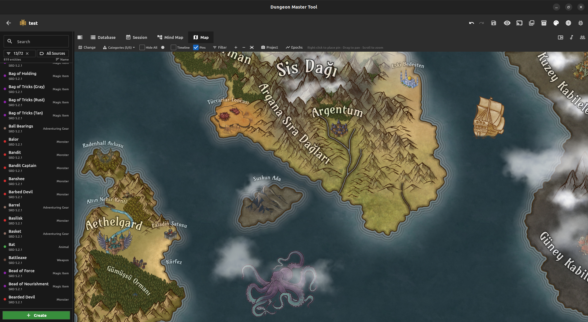
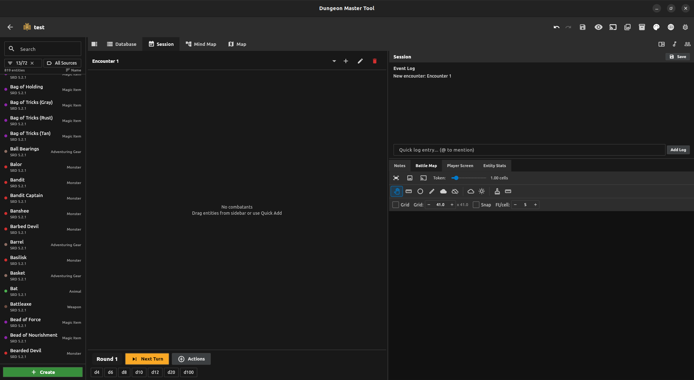

# Dungeon Master Tool

<p align="center">
  <b>A portable, offline-first DM tool built with Flutter.</b>
  <br>
  <i>Manage combat, build characters, run online worlds, and project a rich campaign wiki seamlessly.</i>
  <br><br>
  <a href="https://elymsyr.github.io/">Project Website</a>
  <br><br>
  <a href="https://github.com/elymsyr/dungeon-master-tool/releases/latest">
    
  </a>
  <a href="https://github.com/elymsyr/dungeon-master-tool/releases/latest">
    
  </a>
  <a href="https://github.com/elymsyr/dungeon-master-tool/releases/latest">
    
  </a>
  <a href="https://github.com/elymsyr/dungeon-master-tool/releases/latest">
    
  </a>
  <a href="https://github.com/elymsyr/dungeon-master-tool/releases/latest">
    
  </a>
  <br><br>
  
  
  
  
  
  <br>
  <b>Platforms:</b> Android | iOS | Windows | Linux | macOS
  <br>
  <b>Languages:</b> English | Turkish | German | French
</p>

<p align="center">
  <table align="center">
    <tr>
      <td align="center"></td>
      <td align="center"></td>
    </tr>
    <tr>
      <td align="center"></td>
      <td align="center"></td>
    </tr>
    <tr>
      <td align="center"></td>
      <td align="center"></td>
    </tr>
    <tr>
      <td align="center"></td>
      <td align="center"></td>
    </tr>
  </table>
</p>

---

## Roadmap

Planned for upcoming releases — order not final, scope may shift between patch and minor versions.

- **Better battle map system** — Smoother large-grid performance, snap-to-grid tokens with stat-block previews, line-of-sight + dynamic vision, measurement modes (cone/line/sphere), and animated AoE overlays.
- **Second screen for online play** — Dedicated player-screen view for online worlds: every member's client can act as the projected view, so remote players see the same battle map, entity cards, and reveals the in-person table sees.
- **Built-in D&D 5e package visuals** — Cover art, monster/species/class portraits, equipment icons, and spell glyphs bundled with the SRD core pack so default content stops looking like raw text.
- **More online storage for users** — Larger per-account quota for personal cloud sync (characters, worlds, templates, packages) and selectable retention tiers; current beta cap is intentionally conservative.
- **Deeper D&D 5e implementation** — Close remaining SRD gaps (Drow 120ft superior darkvision, Berserker condition immunities, Lore Bard L3 extra skills, missing `auto_granted_by` metadata), automate more class/subclass effects, and finish bidirectional sync of mechanical resolutions across devices.
- **Full custom-content editors** — WYSIWYG editors for schemas, templates, and packages so creators stop hand-editing JSON.
- **Bidirectional personal sync** — Push edits from Device A back to Device B without a manual pull.

---

## Features

### Table & Campaign Tools

- **Combat Tracker** -- Initiative, HP tracking, conditions, turn management, and auto event logging.
- **Battle Map** -- 6-layer canvas (grid, token, annotation, fog, terrain, decal) with fog of war, persistent rulers, circles, and a draw tool. All synced to the player screen.
- **Mind Map** -- Infinite canvas with Bezier connections, level-of-detail rendering, workspaces, undo/redo.
- **World Map** -- Pin system with location and timeline data, fog of war, epoch timeline.
- **Entity System** -- Schema-driven entity cards with 16 field widget types (text, markdown, image, stat block, dice roller, and more).
- **Soundpad** -- Layered audio engine with gapless loops, volume fade, and custom themes.
- **Player Window** -- Second-screen projection for battle maps, entity cards, and images.
- **Session and Campaign Management** -- Create, load, and manage campaigns with rich text notes, timeline tracking, and encounter setup.
- **Templates and Packages** -- Built-in D&D 5e schema, user-defined templates, and package import/export.
- **PDF Viewer** -- Integrated viewer with page navigation and zoom.
- **Dice Roller** -- d4, d6, d8, d10, d12, d20, d100.
- **Customization** -- 11 themes (dark and light variants) and 4-language localization.

### Characters & SRD

- **Character Creation Wizard** -- SRD-driven character builder covering species, class, background, ability scores (point-buy, standard array, roll, manual), skills, equipment, and starting traits.
- **Level-Up Planner** -- Auto-applies non-interactive deltas (HP, proficiency bonus, hit dice) and queues interactive picks (ASI/feat, fighting styles, subclass, divine order, weapon mastery, spell choices) as **Pending Choices** you resolve inline in the character editor.
- **Multiclass Support** -- Full SRD multiclass prerequisite checks (AND/OR ability gates) with human-readable rejection reasons and multiclass caster spell-slot math.
- **Weapon Mastery** -- Auto-grants mastery slot counts per class/subclass features, taking the maximum across feats that overlap.
- **Pending Choices Panel** -- Existing characters keep working; the editor reveals a panel for every choice the SRD says you owe yourself.

### Online Worlds & Multiplayer

- **Share a World** -- Publish a campaign online so other players can join and see live character, member, and entity updates.
- **Invite Codes** -- One active invite per world; generate, regenerate, copy, and revoke from the world panel.
- **Roles** -- Player and DM roles with row-level security; only the DM can publish, manage members, or delete characters that aren't owned by anyone.
- **Realtime Sync** -- Character, member, and world-entity changes stream to every connected client via change-data-capture; offline edits reconcile on reconnect.
- **Character Ownership** -- Claim a world character to make it yours, release it back to the world, or delete it (if you're the DM and nobody owns it).
- **Personal Cloud Sync** -- Back up your own characters, worlds, templates, and packages to your account so you can pick them up on another device.

### Social & Community

- **Public Profiles** -- Username, display name, bio, avatar, and follower/following counts. Opt-out of discovery supported.
- **Follow System** -- Follow and unfollow other players with optimistic updates; browse followers and following lists per profile.
- **Activity Feed** -- Share text and image posts, like entries, and toggle the feed between *all users* and *following only*. Rate-limited server-side to keep the feed healthy.
- **Direct Messaging** -- Realtime 1-to-1 and group conversations with unread counters, group renaming, member leave, and admin-managed deletion.
- **User Discovery** -- Suggested profiles based on community activity and username search with prefix matching.

### Player Search & Looking-for-Group

- **Game Listings** -- DMs can post open games with title, description, system (D&D 5e, Pathfinder, etc.), seat count, schedule, language, and tags.
- **Filtering** -- Browse listings filtered by language, system, and tags; status tracking for open/closed seats.
- **Applications** -- Players apply to a listing with a personal message. Listing owners review, accept, or reject applicants; applicants can withdraw at any time.

### Marketplace

- **Publish & Share** -- Publish worlds, templates, packages, and characters as immutable snapshots with title, description, tags, changelog, and cover image.
- **Versioning & Lineage** -- Every publish creates a new version; all releases of the same item are linked via lineage tracking so subscribers can see history.
- **Browse & Download** -- Filter by item type (world, template, package, character), language, and tags. Atomic download counters and separate built-in vs. community sections.
- **Integrity Guarantees** -- Database-enforced immutability for core metadata (title, description, content hash, ownership) prevents silent edits after publish.

---

## Installation

### Android
1. Download `DungeonMasterTool-Android.apk` from the [latest release](https://github.com/elymsyr/dungeon-master-tool/releases/latest).
2. Enable "Install from unknown sources" in your device settings if prompted.
3. Open the APK to install and launch.

### Windows
1. Download `DungeonMasterTool-Windows.zip` from the [latest release](https://github.com/elymsyr/dungeon-master-tool/releases/latest).
2. Extract the folder and run `dungeon_master_tool.exe`.

### Linux
1. Download `DungeonMasterTool-Linux.zip` from the [latest release](https://github.com/elymsyr/dungeon-master-tool/releases/latest).
2. Extract and run:
   ```bash
   unzip DungeonMasterTool-Linux.zip
   cd bundle
   ./dungeon_master_tool
   ```

<div id="macos-installation"></div>

### macOS
1. Download `DungeonMasterTool-MacOS.zip` from the [latest release](https://github.com/elymsyr/dungeon-master-tool/releases/latest).
2. Extract and drag `dungeon_master_tool.app` to your **Applications** folder.
3. Remove the quarantine flag:
   ```bash
   sudo xattr -rd com.apple.quarantine /Applications/dungeon_master_tool.app
   ```
4. Launch from Applications or Launchpad.

### iOS
> **Note:** iOS builds are currently unsigned. You will need to sideload via Xcode or a signing service.

1. Download `DungeonMasterTool-iOS.ipa` from the [latest release](https://github.com/elymsyr/dungeon-master-tool/releases/latest).
2. Sideload using Xcode, AltStore, or a similar tool.

---

## Development

```bash
cd flutter_app
flutter pub get
dart run build_runner build --delete-conflicting-outputs
flutter run
```

See [flutter_app/README.md](flutter_app/README.md) for full developer documentation and [CONTRIBUTING.md](CONTRIBUTING.md) for contribution guidelines.

---

## License

This project is licensed under [CC BY-NC 4.0](LICENSE). See the LICENSE file for details.

---

## Contact

| Platform | Link |
| :--- | :--- |
| **GitHub Issues** | [Report a Bug](https://github.com/elymsyr/dungeon-master-tool/issues) |
| **Instagram** | [@erenorhun](https://www.instagram.com/erenorhun) |
| **LinkedIn** | [Orhun Eren Yalcinkaya](https://www.linkedin.com/in/orhuneren) |
| **Email** | orhun868@gmail.com |
