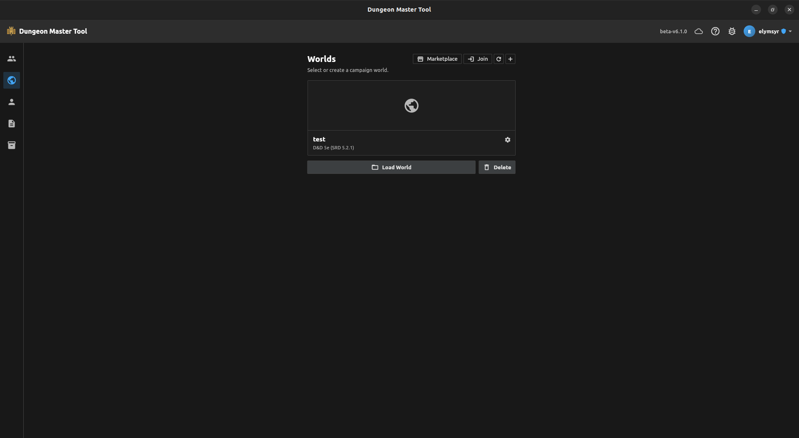

# Dungeon Master Tool

<p align="center">
  <b>A portable, offline-first DM tool.</b><br>
  <i>Build worlds, run sessions, play together — all in one app.</i>
</p>

<p align="center">
  <a href="https://elymsyr.github.io/"><b>Website</b></a> ·
  <a href="https://github.com/elymsyr/dungeon-master-tool/releases/latest"><b>Releases</b></a> ·
  <a href="https://github.com/elymsyr/dungeon-master-tool/issues"><b>Report a Bug</b></a>
</p>

<p align="center">
  
  
  
  
  
</p>

<p align="center">
  <b>Platforms:</b> Android · iOS · Windows · Linux · macOS &nbsp;|&nbsp;
  <b>Languages:</b> EN · TR · DE · FR
</p>

<h3 align="center">Download</h3>

<p align="center">
  <a href="https://github.com/elymsyr/dungeon-master-tool/releases/latest"></a>
  <a href="https://github.com/elymsyr/dungeon-master-tool/releases/latest"></a>
  <a href="https://github.com/elymsyr/dungeon-master-tool/releases/latest"></a>
  <a href="https://github.com/elymsyr/dungeon-master-tool/releases/latest"></a>
  <a href="https://github.com/elymsyr/dungeon-master-tool/releases/latest"></a>
</p>

<p align="center">
  <sub>Support development:</sub><br><br>
  <a href="https://www.patreon.com/elymsyr"></a>
  <a href="https://thanks.dev/u/gh/elymsyr"></a>
  <p align="center">
    <a href="https://groupfinder.eu/library/dungeon-master-tool">
      
    </a>
  </p>
</p>

---

## What's New in v13 ✨

- **Local Sync (Wi-Fi)** — Move worlds, packages and characters straight between *your own* devices on the same network. Nothing goes online. Open it from the profile menu (or the save/sync panel), pair once with a QR code or an IP + PIN, then hit **Sync**.
- **Use it without an account** — Pick **Continue without an account** on the landing screen and everything local works. Sign in later and your offline workspace is carried into the account.
- **PDF Library per world** — PDFs you open are copied into the world, live under the **Library** tab of the PDF sidebar, and can be shared with your online players (they download on demand).
- **Package Links** — A package can borrow another package's content instead of copying it. Open a package → **Linked Packages** → pick one.
- **Every ref on a card is a link** — Spells, items, traits and relation chips inside cards are now tappable and open the card they point at.
- **Spell slots on the sheet** — Caster classes now land a real spell-slot grid on the character sheet at creation and level-up, and a template's own slot table wins over the built-in preset.
- **Content repair pass on the 19 official packs** — Thousands of corrected and newly filled values across spells, monsters, magic items, backgrounds, feats and subclasses. Re-install a pack to pick them up.
- **Images stay put** — Every image you pick is copied into the world folder, so it keeps working offline and travels with Local Sync; unreferenced files are swept on world open/exit.

---

## Roadmap

Planned for upcoming releases — order not final, scope may shift between patch and minor versions.

- **Better battle map system** — The VTT upgrade has landed: snap-to-grid tokens, creature-size auto-scaling, 5e diagonal measurement rules, AoE templates (cone/line/sphere/cube/sector), and vector shape annotations. Still planned: smoother large-grid performance, stat-block token previews, and line-of-sight + dynamic vision.
- **Built-in D&D 5e package visuals** — Cover art, monster/species/class portraits, equipment icons, and spell glyphs bundled with the SRD core pack so default content stops looking like raw text. The generation pipeline (`tool/art_gen`) is in place and scoped at ~5,500 art-worthy cards; the images themselves are not bundled yet.
- **More online storage for users** — Larger per-account quota for counted cloud media and selectable retention tiers; current beta cap is intentionally conservative (portraits, covers and live session media already sync free of quota).
- **Local Sync, round two** — Deletions and renames do not propagate over Local Sync yet (it only adds and updates), and the transfer is authenticated but not encrypted. Both are on the list.

---

## For Worldbuilders 🗺️

Build a setting, then bring it to the table.

- **Mind Map** — Infinite canvas, Bezier connections, workspaces, undo/redo.
- **World Map** — Pin system with location data, fog of war, timeline metadata per pin.
- **Era Timeline** — Track historical eras and waypoints; pin events to specific points in time. Drill into any location for nested pins and a per-era map image.
- **Entity System** — Schema-driven cards with 16 field widget types (text, markdown, image, stat block, dice roller, and more). Every reference on a card — spells, items, traits, relation chips — is tappable and opens the card it points at.
- **Templates & Packages** — Built-in D&D 5e schema, user-defined templates, full import/export.
- **Package Links** — Let one package borrow another's content instead of copying it: open the package → **Linked Packages** → pick one. Nothing is duplicated, and the borrowed cards follow the package into every world and download. Installed packages also tell you when a newer version is available (**Update to v…**).
- **Rule & Effect Editor** — Catalog-driven editor for authoring feat/feature mechanics (effect kind + target + per-rule params + predicates/scaling/activation), with non-blocking validation warnings. DM-editable core rule constants (ASI levels, HP-per-hit-die, AC base/shield, proficiency-bonus breakpoints) per template.

Works fully offline. Join the beta to sync your worlds across devices and share them with collaborators.

---

## For Dungeon Masters ⚔️

Run a session without breaking flow.

- **Combat Tracker** — Initiative, HP, conditions, turn management, automatic event log.
- **Battle Map (VTT)** — 6-layer canvas (grid, token, annotation, fog, terrain, decal). Draw tool, persistent rulers and circles, fog of war. **Creature-size auto-scaling** sizes tokens to their D&D footprint (Large 2×2, Huge 3×3…). **5e diagonal measurement** with Euclidean / 5-10-5 (DMG) / 5-5-5 (PHB) rules, mirrored to player distance labels. **AoE templates** — cone, line, sphere, cube, and sector wedges with fill colors, persistent across reload. **Vector annotations** — rectangles, lines, and text labels on background / object / GM-only layers, each individually deletable. **Per-player projection controls** — Show All HP, Hide Token HUD, hidden tokens (DM-only), and DM viewport sync so players mirror your zoom/pan without letterboxing. Reuse already-uploaded location battlemaps without re-uploading.
- **Session & Campaign Management** — Rich notes, timeline tracking, encounter setup, save state across sessions.
- **Soundpad** — Layered audio, gapless loops, volume fade, custom themes. Download ready-made **soundpacks** (music themes, ambience, SFX) from the in-app catalog — browse them under Marketplace → Soundpacks or in Settings.
- **PDF Library** — Open a PDF and it is copied into the world, so it stays with the world and travels with backups and Local Sync. The **Library** tab of the PDF sidebar lists everything the world holds; up to 10 PDFs can be open in tabs at once (50 MB each). In an online world the DM shares the library with one action and players download a file when they need it.
- **Dice Roller** — d4 through d100.

**Second screen, three ways:**
- **Same device** — Pop out a second window for your TV or projector.
- **Different device** — Cast battle maps, entity cards, and images to a tablet or laptop on the side.
- **Online players** — Project directly into every connected player's app. Per-world manifest replays the active view so late joiners catch up instantly.

---

## For Players 🎲

Roll up a character, then take it anywhere.

- **Character Creation Wizard** — SRD-driven: species, subspecies/lineage, class, subclass, background, ability scores (point-buy, standard array, roll, manual), skills, equipment, traits. Works with imported (Open5e) packs too — packaged subclasses, origin feats, spell lists, and feat prerequisites resolve into the wizard, and every option shows its source.
- **Level-Up Planner** — Auto-applies HP, proficiency bonus, hit dice. Queues ASI/feat, fighting styles, subclass, spell choices as **Pending Choices** you resolve inline.
- **Multiclass** — Full SRD prereq checks (AND/OR ability gates) with human-readable rejection reasons. Multiclass caster slot math built in.
- **Spell Slots** — Caster classes get a real slot grid on the sheet, written at character creation and at level-up. The grid stays hand-editable, and a template that authors its own slot table overrides the built-in preset.
- **Weapon Mastery** — Auto-grants mastery slots per class/subclass; takes the max across overlapping feats.
- **Online Worlds** — Join any world the DM publishes, claim a character, see live updates from every device at the table.
- **Battle Map Marks** — Place your own markers on the projected map during play.

---

## Online & Offline

Everything core works fully offline. Online features (sync, sharing, marketplace, social) require a free account.

- **No account needed** — Pick **Continue without an account** on the landing screen: worlds, characters, packages and all bundled content work as-is. Screens that genuinely need a server (profile, marketplace, cloud backup, shared worlds) explain why and offer a sign-in instead of hiding. Sign in later and the offline workspace is carried into the account, database and media included.
- **Closed-Beta Online Play** — When a DM is in the beta, the whole table plays together online. Only the DM needs a beta slot; players just join.
- **Share a World** — Publish a world so players can join and see live updates. One active invite code per world; generate, copy, revoke at will.
- **Realtime Sync** — Character, member, and entity changes stream to every connected client via CDC. Offline edits reconcile on reconnect.
- **Roles** — Player and DM roles with row-level security.
- **Character Ownership** — Claim a world character, release it back, or delete it (DM only, if ownerless).
- **Personal Cloud Sync** — Back up characters, worlds, templates, and packages to your account; pick them up on another device.
- **Local Sync (LAN)** — Move worlds, packages and characters directly between your own devices over Wi-Fi, without touching the cloud. Open **Local Sync** from the profile menu or the save/sync panel, pair once (scan the QR code, or type the address + PIN), then press **Sync** — one tap syncs every paired device. Both devices must be signed into the same account; it only adds and updates, never deletes.
- **Cloud Media Tiers** — Portraits and covers sync free of quota. Entity images and battle maps count against your quota with per-kind size limits. **Live session media uses a shared transient pool** that does not bill your save space.
- **Local Media Safety** — Every image you pick is copied into the world folder, so it keeps rendering offline and travels with backups and Local Sync even if the cloud copy is gone. Files nothing references any more are swept when a world opens and closes.
- **Graceful Offline** — Network screens show a clean "You're offline" placeholder and auto-recover. Outbox writes flush on reconnect.

### Marketplace

- **Publish & Share** — Worlds, templates, packages, characters as immutable snapshots with title, description, tags, changelog, cover image.
- **Versioning** — Every publish is a new version. Lineage tracking links every release of the same item.
- **Browse & Download** — Filter by type, language, tags. Atomic download counters; built-in vs. community sections.
- **Contents Preview** — See what a world or package holds *before* downloading. A publish-time content summary (template name + per-category entity counts and names) drives a preview dialog and richer cards — no need to pull the full payload to know what's inside.
- **Integrity** — Database-enforced immutability on core metadata prevents silent edits post-publish.
- **Official Content** — A curated, app-owned catalog of first-party packages served from a public CDN. Surfaces under Marketplace → All / Packages with a details dialog and an Install action; works offline via a bundled fallback manifest. Banner art downloads from the CDN and is materialised as the local package cover on install. Includes Open5e-sourced content — 19 packages spanning thousands of monsters, spells, magic items, and full chargen data (classes, subclasses, species, backgrounds, feats). v13 puts the whole corpus through a repair pass: spell durations and component costs stop being rounded or invented, monster action blocks stop being truncated or duplicated, magic items link their base item, backgrounds and feats stop over-granting, and the built-in SRD creatures gain their saving-throw and skill rows. Re-install a package to pick up the corrected data.

---

## Social & Community

- **Public Profiles** — Username, display name, bio, avatar, follower counts. Discovery opt-out supported.
- **Follow System** — Optimistic follow/unfollow; browse followers and following per profile.
- **Activity Feed** — Text and image posts, likes, switch between *all* and *following only*. Server-side rate-limited.
- **Direct Messaging** — Realtime 1-to-1 and group chats. Unread counters, group rename, member leave, admin-managed deletion.
- **User Discovery** — Suggested profiles and username search with prefix matching.
- **Game Listings** — Post open games with system, seats, schedule, language, tags. Filter by language/system/tags.
- **Applications** — Players apply with a message; listing owners accept, reject, or applicants withdraw.

---

## Images

<p align="center">
  <table align="center">
    <tr>
      <td align="center"></td>
      <td align="center"></td>
    </tr>
    <tr>
      <td align="center"></td>
      <td align="center"></td>
    </tr>
    <tr>
      <td align="center"></td>
      <td align="center"></td>
    </tr>
    <tr>
      <td align="center"></td>
      <td align="center"></td>
    </tr>
  </table>
</p>

---

## Installation

### Android
1. Download `DungeonMasterTool-Android.apk` from the [latest release](https://github.com/elymsyr/dungeon-master-tool/releases/latest).
2. Enable "Install from unknown sources" if prompted.
3. Open the APK to install.

### Windows
1. Download `DungeonMasterTool-Windows.zip` from the [latest release](https://github.com/elymsyr/dungeon-master-tool/releases/latest).
2. Extract and run `dungeon_master_tool.exe`.

### Linux
1. Download `DungeonMasterTool-Linux.zip` from the [latest release](https://github.com/elymsyr/dungeon-master-tool/releases/latest).
2. Extract and run:
   ```bash
   unzip DungeonMasterTool-Linux.zip
   cd bundle
   ./dungeon_master_tool
   ```

<div id="macos-installation"></div>

### macOS
1. Download `DungeonMasterTool-MacOS.zip` from the [latest release](https://github.com/elymsyr/dungeon-master-tool/releases/latest).
2. Extract and drag `dungeon_master_tool.app` into **Applications**.
3. Remove the quarantine flag:
   ```bash
   sudo xattr -rd com.apple.quarantine /Applications/dungeon_master_tool.app
   ```
4. Launch from Applications or Launchpad.

### iOS
> **Note:** iOS builds are currently unsigned. Sideload via Xcode or a signing service.

1. Download `DungeonMasterTool-iOS.ipa` from the [latest release](https://github.com/elymsyr/dungeon-master-tool/releases/latest).
2. Sideload using Xcode, AltStore, or similar.

---

## Development

```bash
cd flutter_app
flutter pub get
dart run build_runner build --delete-conflicting-outputs
flutter run
```

See [flutter_app/README.md](flutter_app/README.md) for full developer documentation and [CONTRIBUTING.md](CONTRIBUTING.md) for contribution guidelines.

---

## License

Licensed under [CC BY-NC 4.0](LICENSE). See the LICENSE file for details.

---

## Contact

| Platform | Link |
| :--- | :--- |
| **GitHub Issues** | [Report a Bug](https://github.com/elymsyr/dungeon-master-tool/issues) |
| **Instagram** | [@erenorhun](https://www.instagram.com/erenorhun) |
| **LinkedIn** | [Orhun Eren Yalcinkaya](https://www.linkedin.com/in/orhuneren) |
| **Email** | orhun868@gmail.com |
