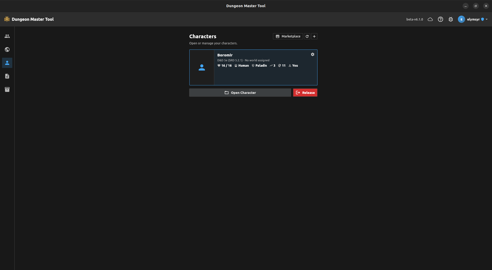
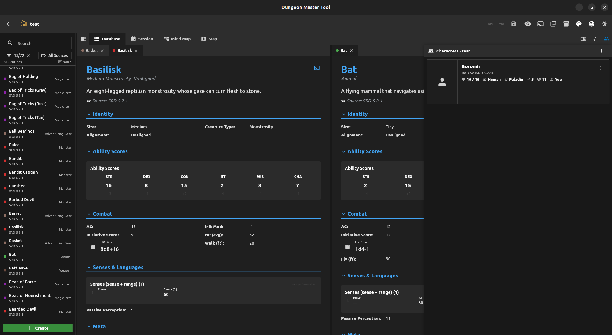
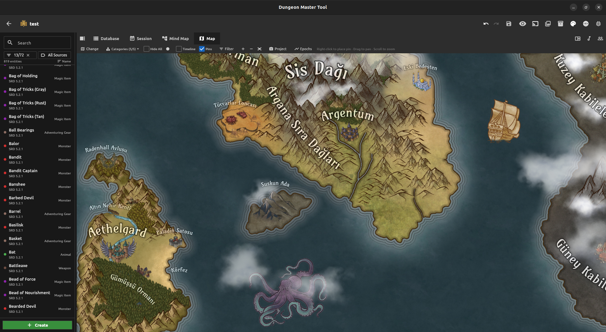
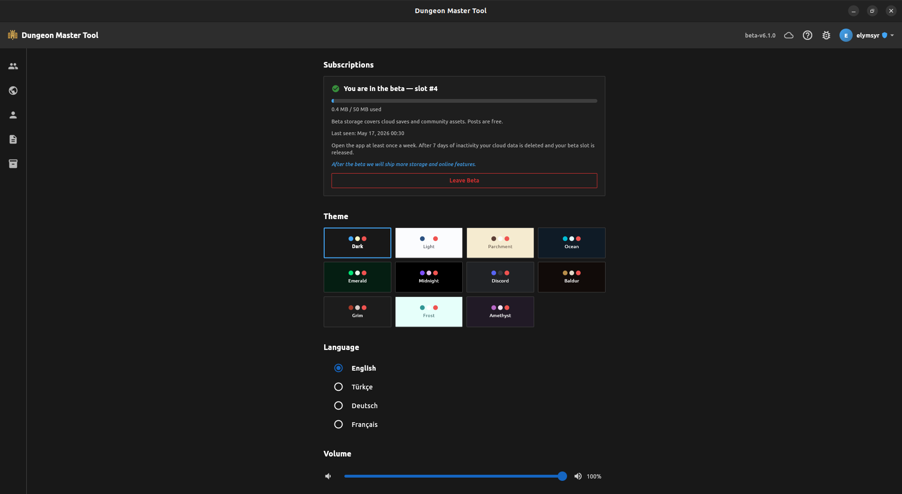
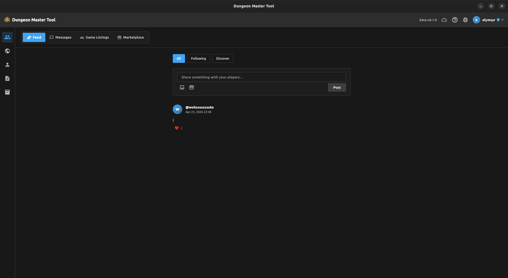
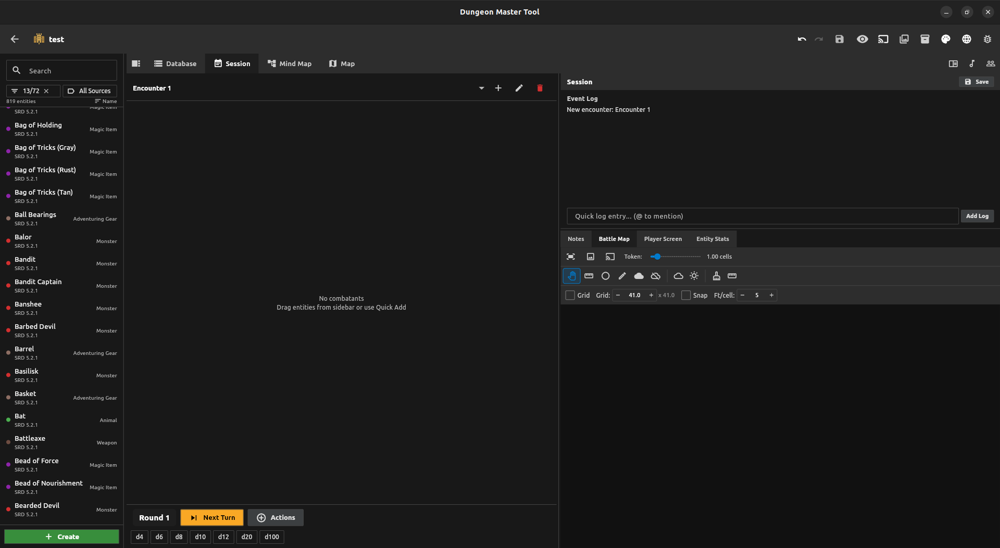
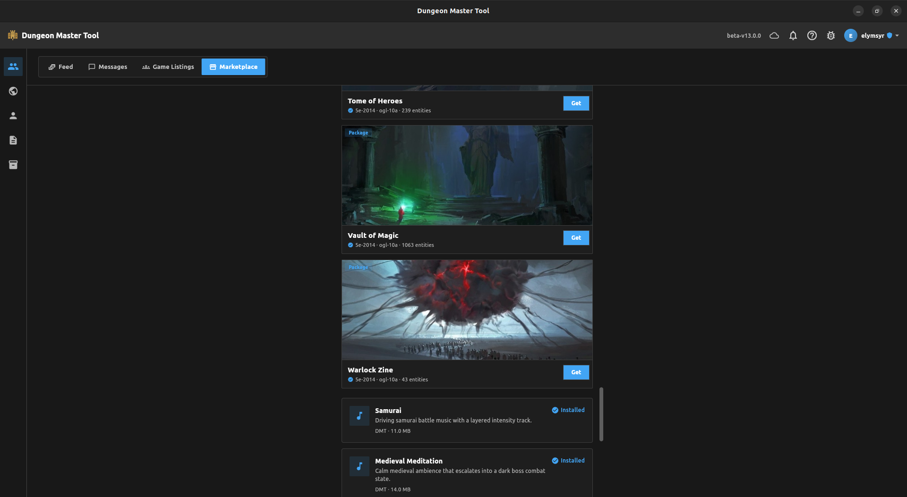
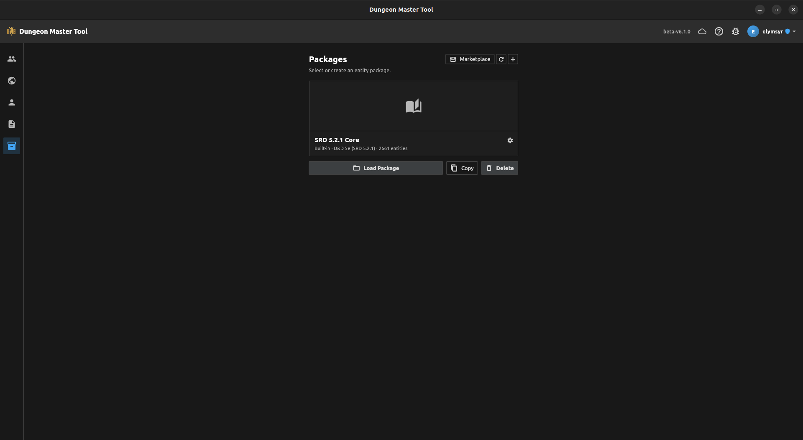

# Dungeon Master Tool

<p align="center">
  <b>A portable, offline-first DM tool.</b><br>
  <i>Build worlds, run sessions, play together — all in one app.</i>
</p>

<p align="center">
  <a href="https://elymsyr.github.io/"><b>Website</b></a> ·
  <a href="https://github.com/elymsyr/dungeon-master-tool/releases/latest"><b>Releases</b></a> ·
  <a href="https://github.com/elymsyr/dungeon-master-tool/issues"><b>Report a Bug</b></a>
</p>

<p align="center">
  
  
  
  
</p>

<p align="center">
  <b>Platforms:</b> Android · iOS · Windows · Linux · macOS &nbsp;|&nbsp;
  <b>Languages:</b> EN · TR · DE · FR
</p>

<h3 align="center">Download</h3>

<p align="center">
  <a href="https://github.com/elymsyr/dungeon-master-tool/releases/latest"></a>
  <a href="https://github.com/elymsyr/dungeon-master-tool/releases/latest"></a>
  <a href="https://github.com/elymsyr/dungeon-master-tool/releases/latest"></a>
  <a href="https://github.com/elymsyr/dungeon-master-tool/releases/latest"></a>
  <a href="https://github.com/elymsyr/dungeon-master-tool/releases/latest"></a>
</p>

<p align="center">
  <a href="https://www.patreon.com/elymsyr"></a>
  <a href="https://thanks.dev/u/gh/elymsyr"></a>
  <a href="https://groupfinder.eu/library/dungeon-master-tool"></a>
</p>

---

<p align="center">
  Fully <b>offline-first</b> — build worlds, run sessions and play together without an account, on Android, iOS, Windows, Linux &amp; macOS.
</p>

<p align="center">
  🗺️ <b>Worldbuilding</b> with time-aware maps &nbsp;·&nbsp; ⚔️ <b>Battle Maps</b> &amp; combat tracker &nbsp;·&nbsp; 🎲 <b>Character wizard</b> &nbsp;·&nbsp; 📦 19 one-tap content packs
</p>

<p align="center">
  📡 <b>Local Sync (LAN)</b> — move worlds, packages &amp; characters between your own devices over Wi-Fi, without the cloud.<br>
  🖥️ <b>Second Screen</b> — project the session onto a TV, a projector, or every connected player's app.
</p>

## Worldbuilding 🗺️

Build a setting offline, then bring it to the table.

- **Mind Map** — Infinite canvas with Bezier links, workspaces, undo/redo.
- **World Map** — Image base with linked pins, grid + scale, freehand drawing, fog of war.
- **Nested Maps** — Walk into any pin for its own map (districts, dungeons, taverns), as deep as you like.
- **Era Timeline** — Time-aware maps: each era keeps its own pins, timeline and background; timeline pins link to entities, sessions and events.
- **Entities** — Schema-driven cards with 16 field widget types; every reference on a card is a tappable link.
- **Templates & Packages** — Built-in D&D 5e schema, custom templates, import/export, package links, update notifications.

## Dungeon Mastering ⚔️

- **Combat Tracker** — Initiative, HP, conditions, turn management, event log.
- **Battle Map (VTT)** — 6-layer canvas with draw tools, persistent rulers, fog of war, creature-sized tokens, 5e diagonal rules, AoE templates, reusable location maps.
- **Sessions & Campaigns** — Notes, timeline tracking, encounters, state saved between sessions.
- **Soundpad** — Layered audio with gapless loops, fades and ready-made soundpacks.
- **PDF Library** — PDFs copied into the world, up to 10 tabs (50 MB each), shareable with players.
- **Dice Roller** — d4 through d100.
- **Second Screen** — Pop out a window, cast to a nearby device, or project into every player's app with per-player controls and a late-joiner manifest.

## Players 🎲

- **Character Creation Wizard** — SRD-driven: species, class, subclass, background, ability scores, skills, equipment, traits; Open5e packs feed in.
- **Level-Up Planner** — Auto HP/PB/hit dice; ASI, feats, subclass and spell picks queue as pending choices.
- **Multiclass & Spell Slots** — Full SRD prereq checks and multiclass slot math; editable slot grid.
- **Weapon Mastery** — Slots granted per class/subclass, taking the max across feats.
- **Online Play** — Join a DM's world, claim a character, see live updates, drop marks on the projected map.

## Online & Offline

Everything core works **fully offline** — no account needed to start. An account is required only for playing online, publishing to the marketplace, or downloading other users' content.

- **Local Sync (LAN)** — Move worlds, packages and characters between your own devices over Wi-Fi; QR or IP+PIN pairing, nothing goes online.
- **Share a World** — Publish a world, players join with a revocable invite code.
- **Roles & Ownership** — Player/DM roles with row-level security; claim or release world characters.
- **Media Safety** — Images are copied into the world folder, so they keep working offline; portraits/covers sync free of quota.

### Marketplace

Publish worlds, templates, packages and characters as versioned, immutable snapshots with previews, browse/download by filter, and official first-party content. **19 bundled packs** install with one tap — Monstrous Menagerie, Tome of Beasts (3 editions), Creature Codex, Black Flag SRD, Tome of Heroes, Vault of Magic, Deep Magic, Adventurer's Guide, and more, spanning thousands of monsters, spells, items and full chargen data.

### Social & Community

Public profiles, follow system, activity feed, realtime DMs and group chats, user discovery, game listings with applications.

---

## Screenshots

<p align="center">
  <table align="center">
    <tr>
      <td align="center"></td>
      <td align="center"></td>
    </tr>
    <tr>
      <td align="center"></td>
      <td align="center"></td>
    </tr>
    <tr>
      <td align="center"></td>
      <td align="center"></td>
    </tr>
    <tr>
      <td align="center"></td>
      <td align="center"></td>
    </tr>
  </table>
</p>

---

## Installation

- **Android** — Install `DungeonMasterTool-Android.apk` from the [latest release](https://github.com/elymsyr/dungeon-master-tool/releases/latest); allow unknown sources if prompted.
- **Windows** — Extract `DungeonMasterTool-Windows.zip` and run `dungeon_master_tool.exe`.
- **Linux** — Extract `DungeonMasterTool-Linux.zip`, then `cd bundle && ./dungeon_master_tool`.
- **macOS** — Extract `DungeonMasterTool-MacOS.zip`, drag the app into Applications, and run `sudo xattr -rd com.apple.quarantine /Applications/dungeon_master_tool.app`.
- **iOS** — Builds are unsigned; sideload `DungeonMasterTool-iOS.ipa` via Xcode or AltStore.

---

## Development

```bash
cd flutter_app
flutter pub get
dart run build_runner build --delete-conflicting-outputs
flutter run
```

See [flutter_app/README.md](flutter_app/README.md) for full developer docs and [CONTRIBUTING.md](CONTRIBUTING.md) for contribution guidelines.

---

## License & Contact

Licensed under [CC BY-NC 4.0](LICENSE). Bugs: [GitHub Issues](https://github.com/elymsyr/dungeon-master-tool/issues) · Instagram [@erenorhun](https://www.instagram.com/erenorhun) · LinkedIn [Orhun Eren Yalcinkaya](https://www.linkedin.com/in/orhuneren) · Email orhun868@gmail.com