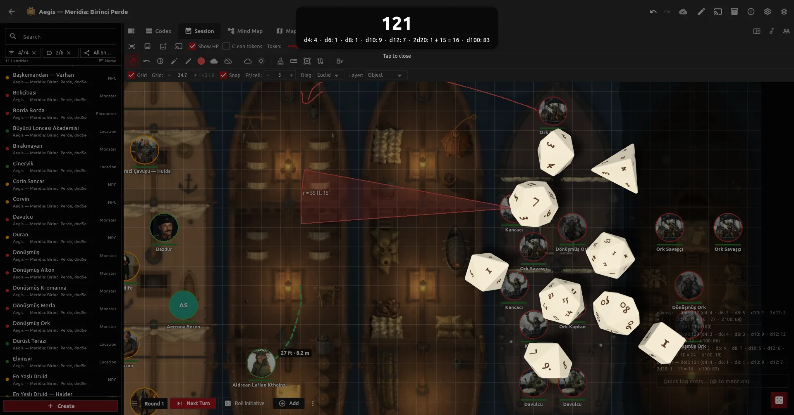
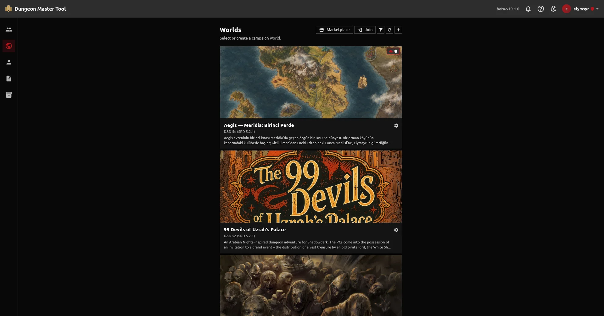
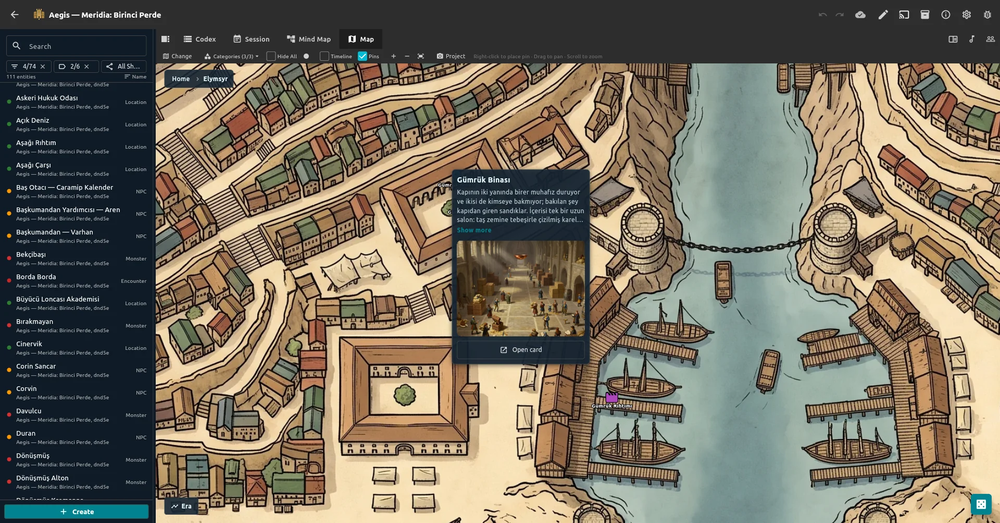
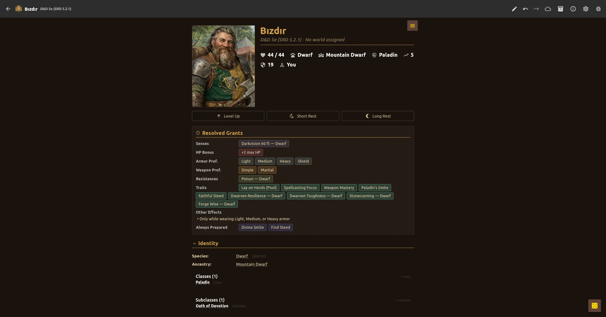
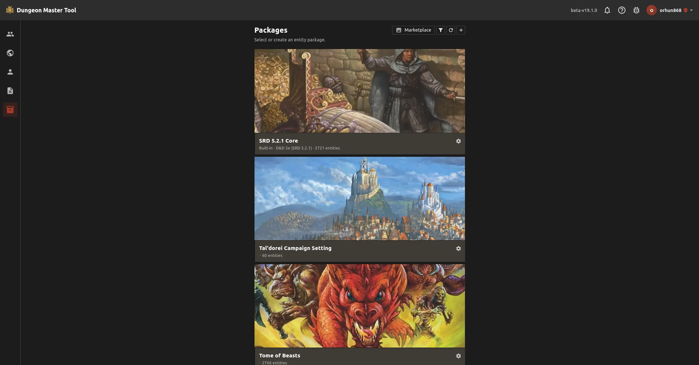
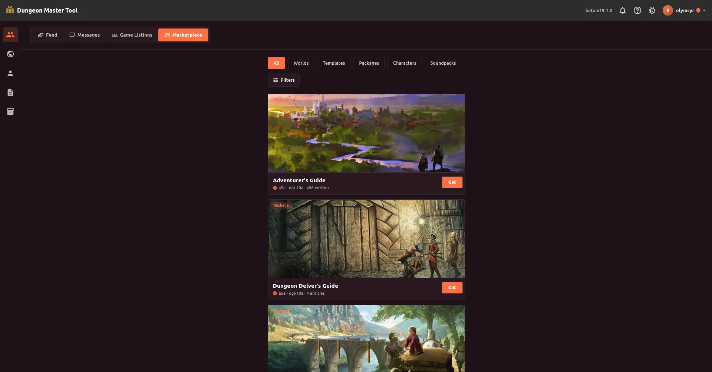
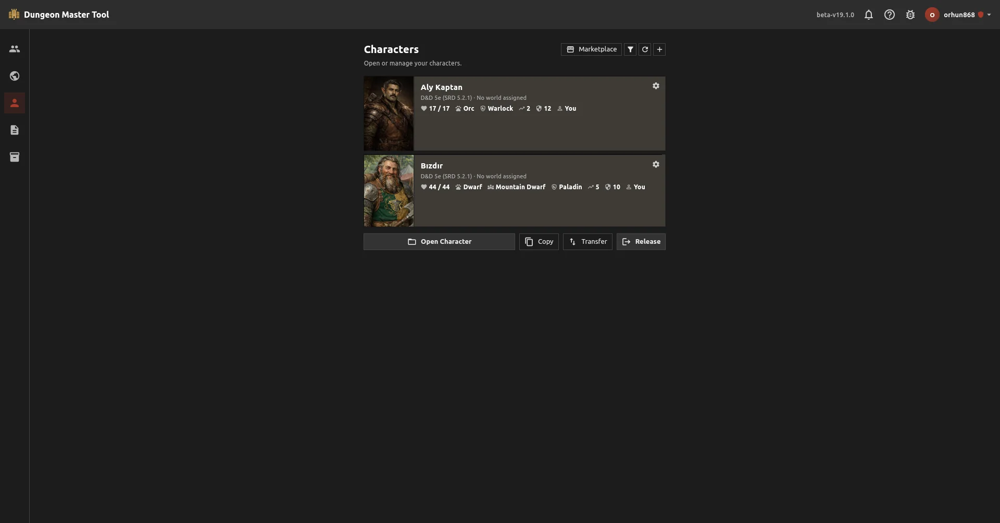

# Dungeon Master Tool

<p align="center">
  <b>A portable, offline-first DM and Worldbuilng tool.</b><br>
  <i>Build worlds, run sessions, share with others, play together — all in one app.</i>
  <br><i>Not a VTT app.</i>
</p>

<p align="center">
  <a href="https://elymsyr.github.io/"><b>Website</b></a> ·
  <a href="https://github.com/elymsyr/dungeon-master-tool/releases/latest"><b>Releases</b></a> ·
  <a href="https://github.com/elymsyr/dungeon-master-tool/issues"><b>Report a Bug</b></a>
</p>

<p align="center">
  
</p>

<p align="center">
  
  
  
  
</p>

<p align="center">
  <b>Platforms:</b> Android · iOS · Windows · Linux · macOS &nbsp;|&nbsp;
  <b>Languages:</b> EN · TR · DE · FR
</p>

<p align="center">
  <a href="https://github.com/elymsyr/dungeon-master-tool/releases/latest"></a>
  <a href="https://github.com/elymsyr/dungeon-master-tool/releases/latest"></a>
  <a href="https://github.com/elymsyr/dungeon-master-tool/releases/latest"></a>
  <a href="https://github.com/elymsyr/dungeon-master-tool/releases/latest"></a>
  <a href="https://github.com/elymsyr/dungeon-master-tool/releases/latest"></a>
</p>

<p align="center">
  <a href="https://www.patreon.com/elymsyr"></a>
  <a href="https://thanks.dev/u/gh/elymsyr"></a>
  <a href="https://groupfinder.eu/library/dungeon-master-tool"></a>
</p>

---

Everything core works **without an account**. You need one only to play online, publish to the marketplace, or download other users' content.

## Worldbuilding 🗺️

- **Era Timeline** — Split your world's history into eras on a timeline bar and move between them. Each era keeps its own map, pins, nested location maps and day-by-day timeline pins linked to cards and sessions — the same city before the war and after it.
- **Templates & Packages** — Every world is built on a template (the D&D 5e template is built in) and pulls content from packages: bundles of cards you install into any world, link to other packages, or share on the marketplace. *Custom templates are coming.*
- **Codex** — Schema-driven cards for NPCs, monsters, spells, items, locations and more. Every reference is a tappable link; pin cards to the top, preview any card with a long press, and search by name, tag, category or text.
- **World Map** — Pins, grid and scale, drawing, fog of war, and nested maps you can walk into (districts, dungeons, taverns).
- **Mind Map** — Infinite canvas with linked nodes, workspaces, freehand drawing and undo/redo.

## Running the Session ⚔️

- **Second Screen** — Give the table its own view: pop out a window onto a second monitor, cast to a TV or projector, or project into every connected player's app. Battle maps, images, cards and PDFs go out the way you choose; fog of war and hidden tokens stay hidden.
- **Battle Map** — The session screen *is* the map: encounter panel and event log sit on top. Layers, fog of war, AoE templates, 5e diagonal rules, creature-sized tokens, shapes and text, a DM-only layer, hidden tokens, movement trails for the round, and two maps joined into one.
- **Combat Tracker** — Initiative, HP (with hit-dice rolls), conditions, turn order and an event log; right-click a token to add a condition or remove it.
- **3D Dice** — Dice roll across the screen with named styles; skills and saving throws roll from the character sheet with one tap.
- **Soundpad** — Layered ambience with gapless loops, fades and ready-made soundpacks.
- **PDF Library** — PDFs kept inside the world, opened in tabs, shareable with players.

## Characters 🎲

- **Full 5e rules** — Species, class, subclass, background and feats fold into one sheet: senses, resistances, proficiencies, traits and always-prepared spells, each showing where it came from. Multiclass prerequisites and spell slots, class resources (Rage, Bardic Inspiration, sorcery points…), weapon mastery, short and long rests.
- **Character Builder** — Species, class, subclass, background, ability scores, skills, starting equipment and feats from the SRD and any installed pack.
- **Level-Up** — Automatic HP, proficiency bonus and hit dice; ASIs, feats, subclass and spell picks wait as pending choices.
- **Sheet** — Jump to any section; import a character from another world.

## Playing Online 🌐

- **Online worlds** — Put a world, package or character online and it stays the same on every device you sign in on. A multiplayer world's pictures live in the cloud, so players see them even when the DM is offline.
- **Players** — Join with a revocable invite code, claim a character, move your own token on your turn, and send dice rolls to the DM's log. Shared cards update when the DM edits them.
- **`.dmtz` files** — Export a world, package or character to one file and import it anywhere, no account or network needed.

## Content 📦

- **SRD 5.2.1** — Built in and available offline; optional when you create a world. SRD text can be shown in **Turkish**, with its own language setting.
- **19 one-tap packs** — Tome of Beasts (1–3, 2023), Creature Codex, Monstrous Menagerie, Black Flag SRD, Deep Magic, Tome of Heroes, Vault of Magic, Tal'Dorei and more.
- **Ready-made worlds** — *99 Devils of Uzrah's Palace* (Shadowdark), *Army of the Damned*, *The Cold Bounty*, and our own Turkish campaign *Aegis Act 1*.
- **Marketplace** — Publish worlds, templates, packages and characters as versioned snapshots with content previews, an official filter and an 18+ rating.
- **Social** — Profiles, follows, activity feed, direct and group chats, game listings with applications.

---

## Screenshots

<p align="center">
  
</p>

<p align="center">
   
   
  
</p>

---

## Installation

- **Android** — Install `DungeonMasterTool-Android.apk` from the [latest release](https://github.com/elymsyr/dungeon-master-tool/releases/latest); allow unknown sources if prompted.
- **Windows** — Extract `DungeonMasterTool-Windows.zip` and run `dungeon_master_tool.exe`.
- **Linux** — Extract `DungeonMasterTool-Linux.zip`, then `cd bundle && ./dungeon_master_tool`.
- **macOS** — Extract `DungeonMasterTool-MacOS.zip`, drag the app into Applications, and run `sudo xattr -rd com.apple.quarantine /Applications/dungeon_master_tool.app`.
- **iOS** — Builds are unsigned; sideload `DungeonMasterTool-iOS.ipa` via Xcode or AltStore.

## Development

```bash
cd flutter_app
flutter pub get
dart run build_runner build --delete-conflicting-outputs
flutter run
```

See [flutter_app/README.md](flutter_app/README.md) for developer docs and [CONTRIBUTING.md](CONTRIBUTING.md) for contribution guidelines. Release history: [docs/RELEASE_NOTES.md](docs/RELEASE_NOTES.md).

## License & Contact

Licensed under [CC BY-NC 4.0](LICENSE). Bugs: [GitHub Issues](https://github.com/elymsyr/dungeon-master-tool/issues) · Instagram [@erenorhun](https://www.instagram.com/erenorhun) · LinkedIn [Orhun Eren Yalcinkaya](https://www.linkedin.com/in/orhuneren) · Email orhun868@gmail.com
