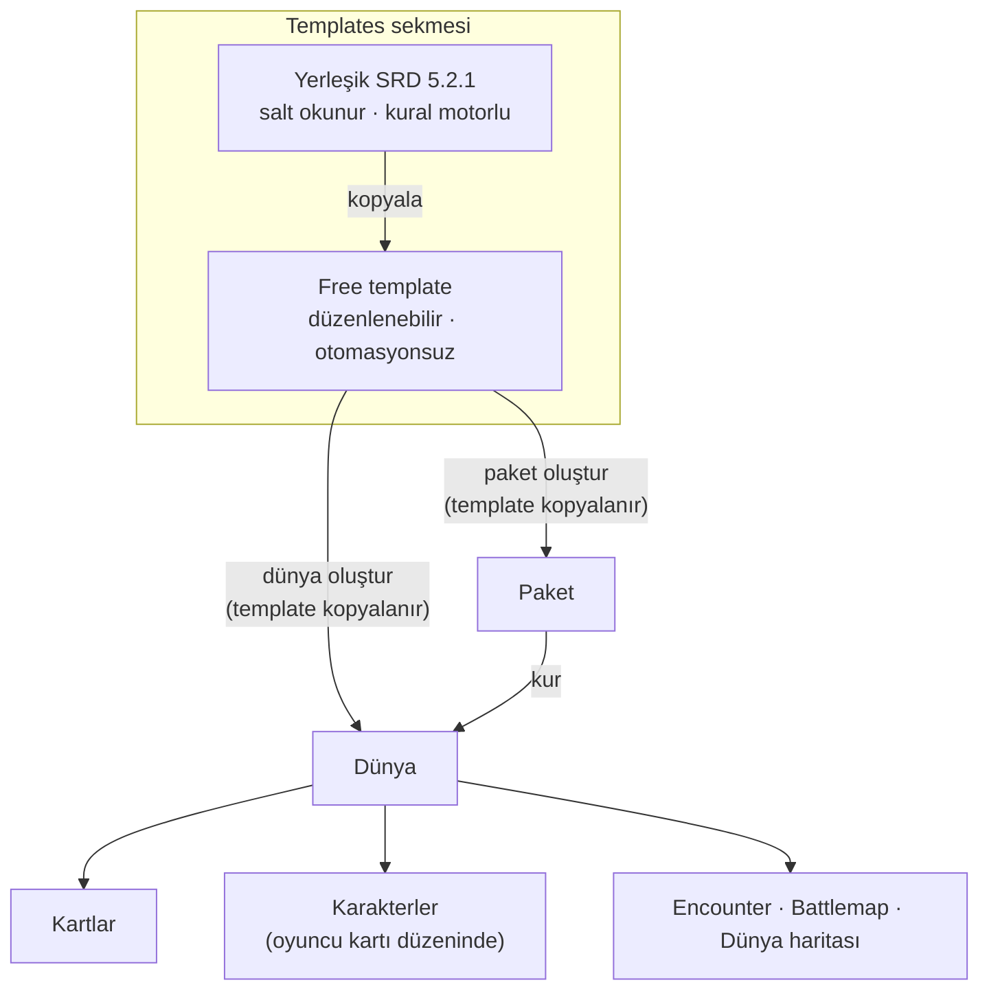
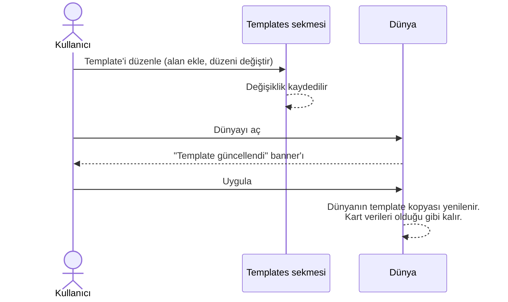
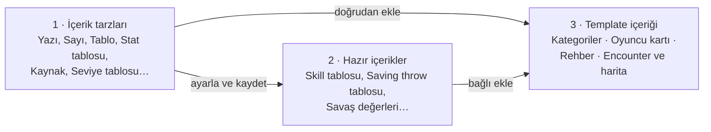
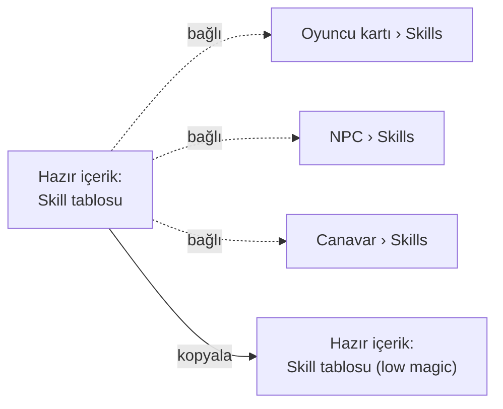
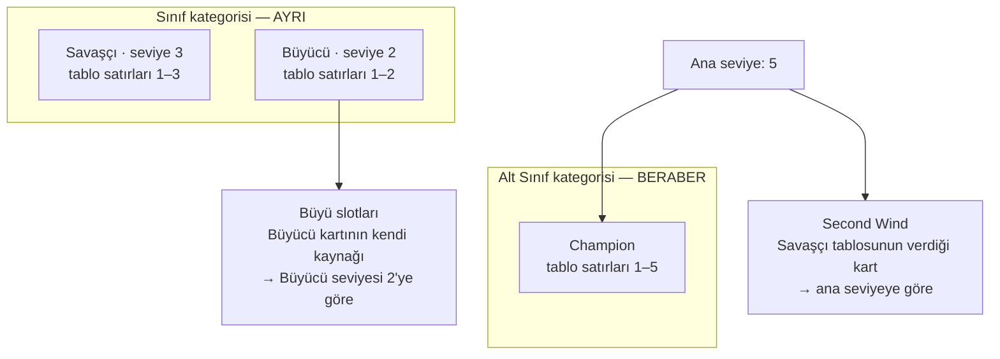
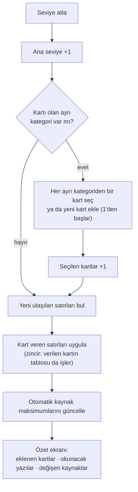
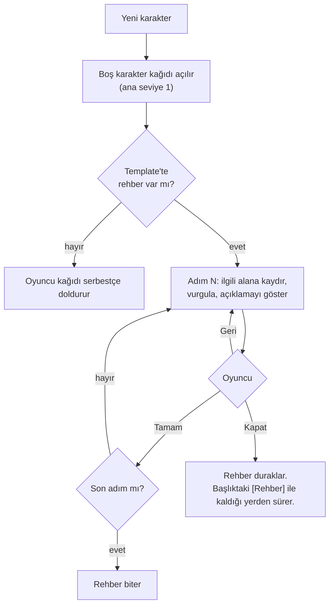
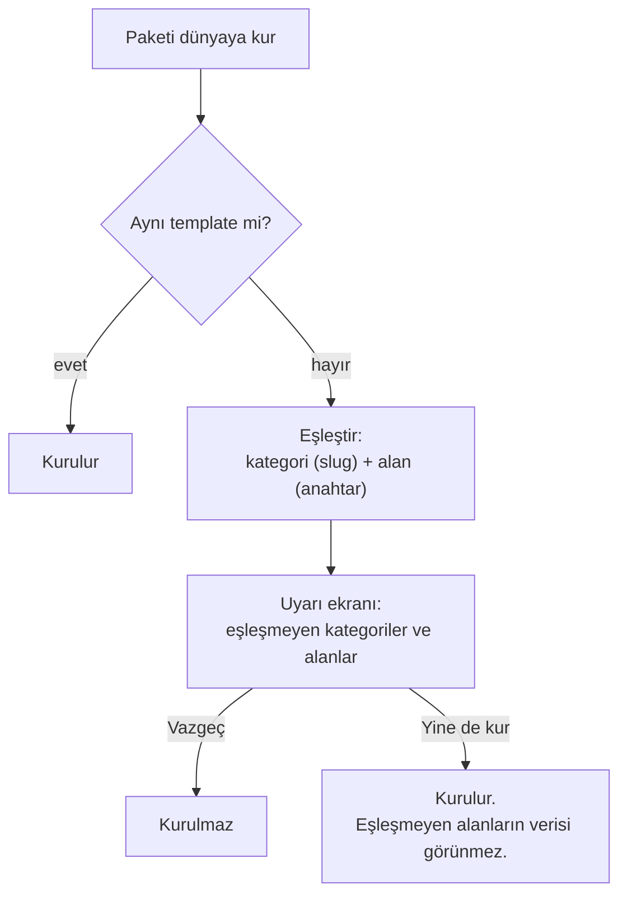

# Free Template — Sistem Tasarımı

> **Tek cümlelik hedef:** Kullanıcı kendi oyun sistemini kurabilsin. Kategorileri, alanları ve
> düzeni serbestçe tasarlayabilsin, karakterler bu tasarımla oluşturulsun. Kurallar ise otomatik
> uygulanmasın, okunarak uygulansın.

- **Durum:** Taslak. Tasarım onayı bekliyor (2026-10-09).
- **Branch:** `feature/free-template`
- **Kapsam:** Sadece offline. Online oyun ve paylaşım sonraki fazlarda.
- **Bu doküman neyi anlatır:** Sistemin ne yaptığını, nasıl davrandığını ve neden öyle olduğunu.
  Kod tasarımı (sınıflar, tablolar, dosyalar) uygulama planında ayrıca yazılacak. Burada sadece
  §18'de özet olarak var.
- **Geçersiz kıldığı plan:** [vault/20-Systems/Template-System.md](../../vault/20-Systems/Template-System.md)
  2026-06-10'da kural mantığını template'e taşımayı öneriyordu. Bu doküman tam tersini seçiyor:
  free template'te kural motoru yok.

---

## İçindekiler

1. [Neden?](#1-neden)
2. [Temel ilkeler](#2-temel-ilkeler)
3. [Kararlar](#3-kararlar)
4. [Sözlük](#4-sözlük)
5. [Büyük resim](#5-büyük-resim)
6. [Template'in yaşam döngüsü](#6-templatein-yaşam-döngüsü)
7. [Template editörü](#7-template-editörü)
8. [İçerik tarzları](#8-içerik-tarzları)
9. [Hazır içerikler](#9-hazır-içerikler)
10. [Oyuncu kartı ve karakter kağıdı](#10-oyuncu-kartı-ve-karakter-kağıdı)
11. [Seviye sistemi](#11-seviye-sistemi)
12. [Kaynaklar ve dinlenme](#12-kaynaklar-ve-dinlenme)
13. [Karakter oluşturma rehberi](#13-karakter-oluşturma-rehberi)
14. [Encounter ve harita ayarları](#14-encounter-ve-harita-ayarları)
15. [Paketler](#15-paketler)
16. [SRD 5.2.1 kopyası](#16-srd-521-kopyası)
17. [Mevcut sistemi bozmama](#17-mevcut-sistemi-bozmama)
18. [Teknik dokunma noktaları](#18-teknik-dokunma-noktaları)
19. [Fazlar](#19-fazlar)
20. [Sonraya bırakılanlar](#20-sonraya-bırakılanlar)
21. [Varsayımlar — onay bekleyenler](#21-varsayımlar--onay-bekleyenler)

---

## 1. Neden?

Bugün uygulamada tek bir template var: yerleşik **D&D 5e (SRD 5.2.1)**. Hub'daki Templates sekmesi
onu sadece gösteriyor, düzenletmiyor. Üstelik bu template'in arkasında D&D'ye özel büyük bir kural
motoru çalışıyor:

- `CharacterResolver` AC, HP, skill toplamları ve büyü slotlarını hesaplıyor.
- Karakter oluşturma sihirbazı var.
- Seviye atlama planlayıcısı var.
- Kartlar "grant" alanlarıyla karaktere etki ediyor. Örneğin bir trait karaktere duyu, yeterlilik
  ya da direnç veriyor.

Bu motor D&D için çok güçlü. Ama kendi sistemini kurmak isteyen bir kullanıcı için duvar gibi:
motor her alanın ne anlama geldiğini bildiği için hiçbir alan serbestçe değiştirilemiyor.

**Free template** bu duvarı kaldırıyor. Template bir oyun sistemini temsil eder: template ile paket
birleşince ortaya tam bir sistem çıkar. SRD 5.2.1 template'i ve SRD paketi buna örnek. Kullanıcı
kendi template'ini kurabilir. Bu template'te otomasyon yoktur, kurallar okunur ve oyuncu ya da DM
tarafından uygulanır.

---

## 2. Temel ilkeler

| # | İlke | Anlamı |
|---|---|---|
| **İ1** | **Template = oyun sistemi.** | Kategoriler, alanlar, düzen, oyuncu kartı, encounter ayarları ve karakter oluşturma rehberi template'e aittir. |
| **İ2** | **Otomasyon yok; kural okunur.** | Bir kart karaktere kendiliğinden etki etmez. "Darkvision verir" yazıyorsa oyuncu okur ve kendisi ekler. |
| **İ3** | **Sadece dört istisna var.** | (a) Seviye tablosu kart verir ve kaynak maksimumu belirler (§11, §12). (b) Stat tablosu değiştiriciyi hesaplar (§8.2). (c) Dinlenme butonları kaynakları doldurur ya da boşaltır (§12). (d) Karakter oluşturma rehberi ilgili alana kaydırır (§13). Bunun dışında hesaplanan değer yoktur. |
| **İ4** | **Her şey temel tarzlardan kurulur.** | "Skill tablosu" ile "saving throw tablosu" aynı tarzdır (Tablo), sadece içerikleri farklıdır. Sisteme özel alan tipi yoktur. |
| **İ5** | **Mevcut sistem bozulmaz.** | En önemli kural. Yerleşik SRD template'i, ona bağlı dünyalar, karakterler, paketler ve kural motoru bugün nasıl çalışıyorsa öyle çalışmaya devam eder (§17). |
| **İ6** | **Mobil ve desktop'ta kolay.** | Editör, karakter kağıdı ve rehber telefonda tek elle, desktop'ta geniş ekranla rahat kullanılır. |
| **İ7** | **Serbestlik önce gelir.** | Bir şeyi kısıtlamak ile kullanıcıya bırakmak arasında seçim varsa, kullanıcıya bırakılır. |
| **İ8** | **Önce offline.** | İlk fazların hepsi yerel. Online oyunda şemanın paylaşılması sonraya kalır. |

---

## 3. Kararlar

Kullanıcıyla netleşmiş kararlar aşağıda. Hepsinin tarihi 2026-10-09. Bu tablodaki bir şeyi
değiştirmek kullanıcı onayı ister. Benim varsaydığım ama henüz onaylanmamış noktalar §21'de ayrıca
listeli.

| # | Karar |
|---|---|
| **D1** | Template bir oyun sistemini temsil eder; template ile paket birleşince tam sistem oluşur. Free template modu buna izin verir. |
| **D2** | Free template'te otomatik alan yoktur. Trait'ler ve diğer kartlar karaktere ne doğrudan ne de oyuncuya sorarak etki eder. Kural okunur. |
| **D3** | Template'in kullandığı yapılar temel tarzlara indirgenir. Örneğin saving throw ve skill tabloları aynı tarzdır, içerikleri farklıdır. |
| **D4** | Kategori eklenip silinebilir. Kategorinin içeriği ve düzeni (gruplar; 2, 3 ya da daha fazla kolon) serbestçe kurulur. Farklı alan şekilleri sunulur. |
| **D5** | İlk hedef: kullanıcı mevcut SRD 5.2.1 template'indeki alanların içeriğini ve düzenini istediği gibi değiştirebilsin. Mobil ve desktop'ta kolay kullanım çok önemli. |
| **D6** | SRD template'inin kopyası otomatik olarak free template olur. Kural motoru, grant'ler, sihirbaz ve seviye atlama otomasyonu kopyada kapalıdır. |
| **D7** | Her template'te özel bir **oyuncu kartı** kategorisi vardır. Oyuncunun hangi alanlara sahip olacağını template sahibi belirler. |
| **D8** | Bir kartın seviye tablosundaki satır (a) "N. seviyede şu kartı otomatik ver" olabilir; verilen kart oyuncunun o kategoriyi hedefleyen liste alanına girer. Ya da (b) düz yazı olabilir; sayı ya da yazı fark etmez, oyuncu kendisi uygular. Verilen kartın da seviye tablosu varsa o da işler (zincir). |
| **D9** | Seviye modu **kategori başına** seçilir: **ayrı** ya da **beraber**. |
| **D10** | Beraber kategoriye sonradan eklenen kart mevcut seviyeden başlar: o seviyeye kadarki satırların hepsi işler. |
| **D11** | Bir paket, oluşturulduğu template'ten farklı bir template'le kullanılırsa aynı adlı alanlarla açılır; eksik alanlardaki bilgi görünmez. Kurmadan önce kullanıcı uyarılır. |
| **D12** | STR, DEX, CON gibi statların tutulduğu ve +/− hesaplayan alan özel bir tarzdır (**stat tablosu**). Etiketleri, temel değeri (D&D'de 10 = +0) ve kaç puanda bir ±1 alınacağını template belirler. Başka hesaplanan değer sonra değerlendirilir. |
| **D13** | Editör üç bölümdür: **tüm içerik tarzları**, **hazır içerikler**, **template içeriği** (kategoriler, oyuncu kartı, encounter ve battlemap ayarları vb.). Kategori içinde sürükle-bırak ile düzenlenir. |
| **D14** | "Şunlardan birini seç" gibi seçim satırları otomatik değildir. Düz yazı olarak sunulur, oyuncu okuyup kendisi seçer. |
| **D15** | Dinlenme butonları sabittir: **Kısa** ve **Uzun**. Kullanıcı yeni dinlenme türü tanımlayamaz. Sadece kaynak tarzındaki içerikte her butonun ne yapacağı seçilir. |
| **D16** | Template hub'daki Templates sekmesinde düzenlenir. Değişiklik dünyalara mevcut "template güncellemesi" banner'ıyla gider. |
| **D17** | Silinen alanın verisi kartta saklanır, sadece gösterilmez. Tip değişikliği sadece uyumlu tipler arasında serbesttir. |
| **D18** | Öncelik sadece offline. Online çok daha sonra. Bunlar yapılırken bugün çalışan sistemleri bozmamak çok ama çok önemli. |
| **D19** | Bir dünya hangi template ile oluşturulduysa o template'de kalır, içindeki paketler değişebilir. Eski yerleşik template dünyalarını free template'e dönüştürmek yoktur. |
| **D20** | Ayrı mod kategori içinde işler. A ve B kategorileri ayrıysa, seviye atlanınca A'dan bir kart ve B'den bir kart seçilir; seçilen iki kart da seviye atlar. |
| **D21** | Hazır içerik kategorilere **bağlı** gider. Hazır içerik kopyalanabilir de. |
| **D22** | SRD'nin özel alanları tamamen özelleştirilebilir tarzlara dönüşür. Tablo bir tarzdır. Başlangıç ekipmanı ve "N tane seç" düz yazı olur, CR hesaplayıcı çıkar, büyü slot ızgarası kaynağa dönüşür. Kartların karaktere kaynak eklemesi bugünkü mantıkla kalır. |
| **D23** | Template'in encounter ve battlemap ayarlarında encounter'a hangi kategorilerin eklenebileceği ve encounter tablosunda hangi alanların gösterileceği seçilir. Serbestlik önemli. |
| **D24** | Karakter oluşturma sihirbazı yoktur. Oyuncuya boş karakter kağıdı verilir. Template'te adım adım bir **karakter oluşturma rehberi** yazılır (`1- <alan: a> açıklama…`). Her adımda ilgili alana otomatik kaydırılır ve açıklama gösterilir; oyuncu "Tamam" deyince sonraki adıma geçilir. |
| **D25** | Karakterde **tek bir ana seviye** alanı vardır ve asıl alan odur. Seviye tablolarından gelenler bu seviyeyi izler. |
| **D26** | İstisna: büyü slotları gibi kaynaklar doğrudan ayrı bir kartın (örneğin Büyücü kartının) üzerindeyse o kartın seviyesini izler. |
| **D27** | Kaynak maksimumu şimdilik **sadece seviye tablosundan** gelir. Formül gerekiyorsa düz yazıyla belirtilir. |
| **D28** | Encounter: bir sıra alanı seçilir ve tablo ona göre sıralanır. DM sürükleyerek sırayı değiştirebilir; alan zar tipindeyse zar atılabilir. Mevcut/maks kolonlarında +/− butonları olur. Her savaşçının değeri ayrı tutulur. Oyuncu kartından gelen değerler karakter kağıdına geri yazılır. |
| **D29** | Encounter kolonu bir alan anahtarına karşılık gelir. Aynı alanı birden fazla kategoriye koymanın yolu hazır içeriktir. |
| **D30** | Seviye tablosu olmayan kaynakta maksimumu oyuncu girer. |
| **D31** | Seviye atlama rehberi ve DM'in bir oyuncunun kaynağını elle düzenlemesi sonraya kalır. |

---

## 4. Sözlük

| Terim | Anlamı |
|---|---|
| **Template** | Bir oyun sistemi tanımı: kategoriler, alanlar, düzen, oyuncu kartı, rehber, encounter ayarları. |
| **Yerleşik template** | Uygulamayla gelen SRD 5.2.1 template'i (`builtin-dnd5e-default-v2`). Salt okunurdur; kural motoru onunla çalışır. |
| **Free template** | Kullanıcının oluşturduğu ya da yerleşik template'ten kopyaladığı, düzenlenebilir ve otomasyonsuz template. |
| **Kategori** | Bir kart türü: Sınıf, Büyü, Canavar, Eşya… Her kategorinin kendi alanları ve düzeni vardır. |
| **Kart** | Bir kategorinin tek bir kaydı: "Fireball", "Goblin", "Savaşçı". |
| **Alan** | Kartta bir veri yeri: "Seviye", "Hasar zarı", "Skills". Her alanın bir **tarzı** vardır. |
| **Alan anahtarı** | Alanın değişmeyen kimliği (örneğin `skills`). Etiket değişse de anahtar aynı kalır. Eşleştirmeler anahtarla yapılır. |
| **İçerik tarzı** | Bir alanın şekli: Yazı, Sayı, Tablo, Kaynak… (§8). |
| **Hazır içerik** | Bir tarzdan üretilip ayarlanmış, adı olan, birden fazla kategoriye bağlı eklenebilen içerik (§9). |
| **Grup** | Kart içinde başlıklı bir bölüm. Kolon sayısı ayarlanabilir. |
| **Oyuncu kartı** | Her template'te bulunan, silinemeyen özel kategori. Karakter kağıdı bu kategorinin düzeniyle çizilir (§10). |
| **Ana seviye** | Karakterin tek, asıl seviyesi (D25). |
| **Seviye tablosu** | Kartın seviye seviye ne verdiğini yazan tablo. Satır = seviye + düz yazı + verilen kartlar (§8.4). |
| **Seviye tablolu kategori** | Alanlarında bir seviye tablosu bulunan kategori. Sadece bunların seviye modu vardır. |
| **Seviye modu** | Ayrı ya da beraber (§11.2). |
| **Kaynak** | Mevcut/maks sayaç: HP, büyü slotu, Ki… (§8.3). |
| **Kaynak verme** | Bir kartın karaktere otomatik eklediği kaynaklar ve seviyeye göre maksimumları (§8.5). |
| **Otomatik kaynaklar** | Oyuncu kartında kartlardan gelen kaynakların göründüğü sabit alan. |
| **Rehber** | Template'teki adım adım karakter oluşturma dokümanı (§13). |
| **Paket** | Bir template ile oluşturulmuş, dünyalara kurulabilen kart koleksiyonu. |
| **Dünya** | Bir template ile oluşturulmuş oyun dünyası. Template'in kendi kopyasını taşır. |

---

## 5. Büyük resim



Dört temel fikir:

1. **Template bir kalıptır.** Dünya ve paket oluşturulurken template'in o anki hali kopyalanıp
   içlerine yazılır. Bugün de böyle: dünyanın şeması kendi ayarlarında duruyor.
2. **Template değişince** dünyalar kendiliğinden değişmez. Dünya açılınca bir banner çıkar,
   kullanıcı "uygula" deyince dünyanın kopyası yenilenir (§6.4).
3. **Dünya template'ini değiştirmez** (D19). Bir dünya "SRD kopyam" ile kurulduysa hep o
   template'in soyunda kalır.
4. **Yerleşik yol ile free yol yan yana çalışır.** Yerleşik template'le kurulmuş her şey bugünkü
   kural motoruyla, free template'le kurulmuş her şey otomasyonsuz çalışır (§17).

---

## 6. Template'in yaşam döngüsü

### 6.1 İki template türü

| | Yerleşik SRD 5.2.1 | Free template |
|---|---|---|
| Düzenlenebilir mi? | Hayır | Evet |
| Kural motoru | Açık (resolver, sihirbaz, seviye atlama planlayıcısı) | Yok |
| Karakter oluşturma | Sihirbaz | Boş kağıt + rehber |
| Nereden gelir? | Uygulamayla gelir | Kopyalanarak ya da boş oluşturularak |
| Kimlik | `builtin-dnd5e-default-v2` | Her kopya için yeni ve benzersiz kimlik |

### 6.2 Free template nasıl oluşur?

- **Yerleşik template'i kopyala** (D6). 75 kategori, 928 alan, gruplar ve düzen kopyalanır. D&D'ye
  özel tipler temel tarzlara dönüştürülür (§16). Kopya yeni bir kimlik alır. Eski kimlikte kalsaydı
  uygulama, kullanıcının sildiği SRD kategorilerini dünyaya geri eklerdi.
- **Boş template oluştur.** Sadece oyuncu kartıyla başlar. Kartta iki sabit alan vardır, ana
  seviye ve otomatik kaynaklar (§10). Gerisini kullanıcı kurar.
- **Bir free template'i kopyala.** Örneğin "SRD kopyam"dan "SRD kopyam — low magic" türetilir.

Her kopya **soyunu** hatırlar, yani hangi template'ten türediğini bilir. Uyumluluk kontrolü (§15)
ve "SRD içeriğini ekle" seçeneği (§16.5) bunu kullanır.

### 6.3 Nerede düzenlenir?

Hub'daki **Templates** sekmesinde (D16). Sekme tüm template'leri listeler:

- Yerleşik template'te sadece "İncele" ve "Kopyala" vardır.
- Free template'lerde ayrıca "Düzenle", "Yeniden adlandır" ve "Sil" vardır.

Dünyanın içinden template düzenlemek sonraya kalır (§20).

### 6.4 Değişiklikler dünyalara nasıl gider?



- Banner bugün de var: dünyanın template içeriği template'in güncel halinden farklıysa çıkıyor.
- Güncelleme kart verisine dokunmaz. Silinen bir alanın verisi kartta kalır ama gösterilmez (D17).
  Alan geri eklenirse veri geri gelir.
- Kullanıcı güncellemeyi uygulamayabilir. Dünya eski kopyasıyla çalışmaya devam eder.

### 6.5 Template silinir ya da yeniden adlandırılırsa

Dünyalar ve paketler template'in kendi kopyalarını taşıdığı için çalışmaya devam eder. Sadece
banner ile güncelleme alamazlar. *(V2)*

### 6.6 Alan silme ve tip değişikliği

| Değişiklik | Sonuç |
|---|---|
| Alan silindi | Veri kartta saklanır, gösterilmez. Aynı anahtarla geri eklenirse görünür (D17). |
| Etiket değişti | Anahtar aynı kalır, veri etkilenmez. *(V3)* |
| Uyumlu tip değişikliği | Veri olduğu gibi okunur. |
| Uyumsuz tip değişikliği | Önce uyarı çıkar. Onaylanırsa eski alan silinmiş sayılır (verisi gizli kalır) ve yeni anahtarla yeni alan oluşur. *(V4)* |
| Kategori silindi | Dünyadaki kartları silinmez, görünmez olur. Kategori geri eklenirse görünür. *(V5)* |

Uyumlu tip değişiklikleri:

| Şuradan | Şuraya |
|---|---|
| Yazı, Uzun yazı, Markdown | Birbirine serbestçe |
| Tam sayı | Ondalık sayı |
| Seçim | Yazı |
| Tek kart bağlantısı | Kart bağlantısı listesi |
| Kart bağlantısı listesi | Tek kart bağlantısı (uyarıyla: ilk kart kalır) |
| Herhangi bir basit tarz | Aynı tarzın listesi |

---

## 7. Template editörü

### 7.1 Üç bölüm (D13)



1. **İçerik tarzları:** Eklenebilecek her şeyin listesi, yani palet (§8). Bir tarz doğrudan bir
   kategoriye eklenebilir ya da önce ayarlanıp hazır içerik olarak kaydedilir.
2. **Hazır içerikler:** Bir kez kurulup birçok yerde kullanılan içerikler (§9). Örneğin "Skill
   tablosu" bir kez tanımlanır, oyuncu kartına, NPC'ye ve canavara bağlı eklenir.
3. **Template içeriği:** Template'in kendisi. Aşağıdaki başlıkları içerir:
   - **Bilgiler:** ad, açıklama, sürüm.
   - **Kategoriler:** ekle, sil, sırala, düzenle.
   - **Oyuncu kartı:** özel kategori (§10).
   - **Karakter oluşturma rehberi** (§13).
   - **Encounter ve harita** (§14).

### 7.2 Kategori ayarları

| Ayar | Açıklama |
|---|---|
| Ad, ikon, renk | Renk, kenar çubuğunda ve battlemap token kenarlığında kullanılır. |
| Sıra | Kenar çubuğundaki sıra. Sürükle-bırak ile değişir. |
| Filtre alanları | Kart listesinde filtre olarak sunulacak alanlar. Örneğin büyüde "Seviye" ve "Okul". |
| Göründüğü bölümler | Dünya haritasına iğnelenebilir mi, mind map'e eklenebilir mi, projeksiyonda gösterilebilir mi. Encounter ayrı ayarlanır (§14). |
| Seviye modu | Sadece seviye tablolu kategorilerde çıkar: **Ayrı / Beraber** (§11.2). |
| Ortak alanlar | Her kartta bugünkü gibi ad, açıklama, görseller, etiketler ve DM notları bulunur; bunlar kategoriden bağımsızdır. |

### 7.3 Alan ayarları

| Ayar | Açıklama |
|---|---|
| Etiket | Ekranda görünen ad. |
| Anahtar | Alan oluşturulurken etiketten üretilir ve bir daha değişmez. Salt okunur gösterilir. *(V3)* |
| Tarz | §8'deki tarzlardan biri. Değişikliği §6.6'ya tabidir. |
| Liste | Basit tarzlarda "birden fazla değer tutsun" seçeneği. Örneğin etiket listesi, görsel listesi. |
| Yardım metni | Alanın altında görünen kısa açıklama. |
| Varsayılan değer | Yeni kartta alanın başlangıç değeri. |
| Zorunlu | Boş bırakılınca uyarı verilir, kaydetme engellenmez. |
| Görünürlük | Herkes, sadece DM ya da özel. Bugünkü üç seçenek aynen kalır. |
| Genişlik | Alanın grubun içinde kaç kolon kaplayacağı. |
| Grup | Alanın bulunduğu grup. Gruba konmayan alanlar "Özellikler" başlığı altında görünür (bugünkü gibi). |
| Tarza özel ayarlar | Tablonun kolonları, stat tablosunun etiketleri, kaynağın dinlenme davranışı… (§8). |
| Bağlı olduğu hazır içerik | Varsa gösterilir; yanında "Bağı kopar" butonu olur (§9). |

### 7.4 Düzen: gruplar ve kolonlar

Bir grubun ayarları ad, kolon sayısı ve "kapalı başlasın" seçeneğidir. Alanlar kolonlara soldan
sağa, satır satır yerleşir. Genişliği 2 olan bir alan iki kolon kaplar.

```
Grup "Kimlik" — 3 kolon
┌──────────────┬──────────────┬──────────────┐
│ Tür          │ Sınıf        │ Geçmiş       │
├──────────────┴──────────────┼──────────────┤
│ Hizalanma (genişlik 2)      │ XP           │
├─────────────────────────────┴──────────────┤
│ Görünüm (genişlik 3, markdown)             │
└────────────────────────────────────────────┘
```

- **Sürükle-bırak:** alanlar grup içinde, gruplar arasında ve gruplar kendi aralarında
  sürüklenir. Kategoriler de kenar çubuğunda sürüklenerek sıralanır.
- **Telefon:** bugünkü gibi her grup tek kolon gösterilir. İstenirse gruba ayrıca "telefonda kolon
  sayısı" ayarı eklenebilir; örneğin para grubu telefonda da 5 kolon kalsın. *(V22)*
- **Bugünkü kod:** düzen modelinin kendisi (grup, kolon sayısı, genişlik, sıra) zaten var ve kart
  ekranı ona göre çiziliyor. Eksik olan onu düzenleyecek editör.

### 7.5 Desktop görünümü

Desktop'ta üç panel yan yana durur; altta bir ekleme şeridi vardır.

```
┌─────────────────────────────────────────────────────────────────────────────────────┐
│ ← Templates   SRD 5.2.1 (kopyam)                          [Önizle]  [Kapat]         │
├───────────────────┬────────────────────────────────────────┬────────────────────────┤
│ TEMPLATE          │ Oyuncu kartı                           │ ALAN: Skills           │
│  Bilgiler         │ ┌ Kimlik ─────────────── 2 kolon ─ ⋮ ┐ │ Etiket  [Skills      ] │
│  Oyuncu kartı     │ │ ≡ Tür            │ ≡ Sınıf    [Sv] │ │ Anahtar skills         │
│  Rehber           │ │ ≡ Alt sınıf [Sv] │ ≡ Geçmiş        │ │ Tarz    Tablo          │
│  Encounter, harita│ └──────────────────────────────────┘ │ Bağlı   Skill tablosu  │
│                   │ ┌ Savaş ──────────────── 2 kolon ─ ⋮ ┐ │         [Bağı kopar]   │
│ KATEGORİLER    +  │ │ ≡ HP (kaynak)    │ ≡ AC            │ │ Genişlik ○ 1  ● 2      │
│  ≡ Sınıf     [Sv] │ │ ≡ Skills (genişlik 2)              │ │ Görünür  Herkes ▾      │
│  ≡ Alt Sınıf [Sv] │ └──────────────────────────────────┘ │ Yardım  [            ] │
│  ≡ Tür            │ + Grup ekle                            │                        │
│  ≡ Büyü           │                                        │ [Alanı sil]            │
│  …                │                                        │                        │
├───────────────────┴────────────────────────────────────────┴────────────────────────┤
│ EKLE ▸ Tarzlar: Yazı · Markdown · Sayı · Onay · Seçim · Zar · Kart · Tablo · Stat ·   │
│          Kaynak · Seviye tablosu · Kaynak verme   │  Hazır: Skill tablosu · Saves · … │
└─────────────────────────────────────────────────────────────────────────────────────┘
   ≡ = sürükleme tutamacı    [Sv] = seviye tablolu kategori / bu kategoriye giden alan
```

- **Sol panel:** template içeriği ve kategoriler.
- **Orta panel:** seçilen kategorinin düzeni; gruplar ve alanlar sürüklenebilir kutular halinde.
- **Sağ panel:** seçilen alanın, grubun ya da kategorinin ayarları.
- **Alttaki şerit:** palet. Tarzlar ve hazır içerikler buradan orta panele sürüklenir; tıklanınca
  seçili gruba eklenir.
- **[Önizle]:** orta paneli gerçek kart görünümüne çevirir. Kullanıcı sonucu oyuncunun göreceği
  şekilde görür. *(V27)*

### 7.6 Telefon görünümü

Telefonda ekranlar iç içe açılır; her ekran tek bir işe odaklanır.

```
┌──────────────────┐  ┌──────────────────┐  ┌──────────────────┐
│ ← SRD (kopyam)   │  │ ← Oyuncu kartı   │  │ Alan: Skills   ✕ │
│──────────────────│  │──────────────────│  │──────────────────│
│ Bilgiler       › │  │ ▾ Kimlik 2 kol  ⋮│  │ Etiket  Skills   │
│ Oyuncu kartı   › │  │   ≡ Tür          │  │ Tarz    Tablo    │
│ Rehber         › │  │   ≡ Sınıf   [Sv] │  │ Bağlı   Skill t. │
│ Encounter      › │  │ ▾ Savaş  2 kol  ⋮│  │ Genişlik ○1 ●2   │
│──────────────────│  │   ≡ HP           │  │ Görünür Herkes ▾ │
│ KATEGORİLER    + │  │   ≡ AC           │  │ …                │
│ ≡ Sınıf    [Sv]› │  │   ≡ Skills       │  │ [Bağı kopar]     │
│ ≡ Alt Sınıf[Sv]› │  │                  │  │ [Alanı sil]      │
│ ≡ Tür          › │  │  [ + Ekle ]      │  │                  │
└──────────────────┘  └──────────────────┘  └──────────────────┘
  1. Template           2. Kategori düzeni     3. Alan ayarları
                                               (alttan açılan sayfa)
```

- **"+ Ekle":** alttan bir sayfa açar; sekmeleri "Tarzlar" ve "Hazır içerikler"dir.
- **Sıralama:** tutamaçtan (≡) basılı tutup sürüklenir.
- **Grup ayarları:** grubun başlığındaki ⋮ menüsünden açılır. Menüde ad, kolon sayısı, sil ve
  "alanları başka gruba taşı" bulunur.

### 7.7 Kaydetme

- Editördeki değişiklikler otomatik kaydedilir. *(V26)*
- Silme işlemleri (alan, grup, kategori, hazır içerik) her zaman onay sorar.
- Dünyalar değişikliği ancak banner ile uygulandığında görür (§6.4). Yarım kalmış bir düzenleme
  açık bir oyunu etkilemez.

---

## 8. İçerik tarzları

Free template'te bir alan aşağıdaki tarzlardan biri olur. D&D'ye özel tarz yoktur (D3, D22).

### Basit tarzlar

| Tarz | Ne tutar | Tarza özel ayarlar | Örnek |
|---|---|---|---|
| **Yazı** | Tek satır metin | Yer tutucu, en fazla uzunluk | Fraksiyon |
| **Uzun yazı** | Çok satır düz metin | — | Kısa not |
| **Markdown** | Biçimli metin; @ ile kart bağlantısı, görsel | — | Geçmiş hikayesi, kural metni |
| **Tam sayı** | Tam sayı | En az / en çok | XP, AC |
| **Ondalık sayı** | Ondalıklı sayı | En az / en çok | Ağırlık |
| **Onay kutusu** | Evet / hayır | — | Konsantrasyon |
| **Seçim** | Sabit seçeneklerden biri | Seçenek listesi | Boyut |
| **Tarih** | Tarih | — | Doğum günü |
| **Etiketler** | Serbest etiket listesi | — | "kötü", "lider" |
| **Zar** | Zar ifadesi (`2d6+3`) | — | Hasar zarı |
| **Görsel** | Görsel | — | Portre |
| **Dönem görseli** | Dünya haritası dönemlerine göre görsel | — | Bir şehrin dönem haritası |
| **Dosya / PDF** | Ek dosya | İzinli uzantılar | Handout |
| **Kart bağlantısı** | Başka kart(lar)a bağlantı | Hedef kategori(ler), tek ya da liste | Sınıf, Envanter |

Her basit tarz "liste" olarak da kullanılabilir (§7.3).

### Birleşik tarzlar

| Tarz | Ne tutar | Bölüm |
|---|---|---|
| **Tablo** | Kolonları kullanıcı tanımlı satırlar | §8.1 |
| **Stat tablosu** | Etiketli değerler ve değiştiricileri | §8.2 |
| **Kaynak** | Mevcut/maks sayaç ve dinlenme davranışı | §8.3 |
| **Seviye tablosu** | Seviyeye göre düz yazı ve verilen kartlar | §8.4 |
| **Kaynak verme** | Kartın karaktere eklediği kaynaklar | §8.5 |

### 8.1 Tablo

Tablo, kolonlarını template sahibinin tanımladığı satırlardan oluşur. Skills, saving throws,
duyular, büyü etkileri gibi bütün "satır listesi" alanları bu tarzdan kurulur (D3).

**Kolon türleri:** yazı, sayı, onay kutusu, seçim, zar, kart bağlantısı.

**Satır modu:**

- **Sabit satırlar:** Satırları template belirler, kart sadece değerleri doldurur. Skill tablosu
  böyledir: 18 skill'in adı ve bağlı olduğu stat template'te yazılıdır. Bu hücreler kartta salt
  okunurdur. Oyuncu sadece "Yetkin", "Uzman", "Ek" ve "Toplam" kolonlarını doldurur.
- **Serbest satırlar:** Satırları kart ekler ve siler. Örneğin duyular: Darkvision 60, Blindsight
  10.

**Örnek: Skill tablosu (sabit satırlar)**

| Skill *(template)* | Stat *(template)* | Yetkin | Uzman | Ek | Toplam |
|---|---|---|---|---|---|
| Acrobatics | DEX | ☐ | ☐ | 0 | +2 |
| Athletics | STR | ☑ | ☐ | 0 | +5 |
| Stealth | DEX | ☑ | ☑ | 0 | +6 |

**Örnek: Duyular (serbest satırlar)**

| Duyu *(kart bağlantısı)* | Mesafe *(sayı)* |
|---|---|
| Darkvision | 60 |

> **Hesaplanan kolon yok (İ3).** "Toplam"ı oyuncu yazar. Tablo içinde hesaplama (stat
> değiştiricisi + yeterlilik bonusu gibi) ileride değerlendirilecek (D12, §20).

### 8.2 Stat tablosu

Free template'te hesap yapan tek tarz budur (D12).

| Ayar | Açıklama | D&D 5e değeri |
|---|---|---|
| Etiketler | Statların adları ve sırası | STR, DEX, CON, INT, WIS, CHA |
| Temel değer | Değiştiricinin 0 olduğu değer | 10 |
| Adım | Kaç puanda bir ±1 alınacağı | 2 |
| Değiştiriciyi göster | Kapalıysa sadece değerler tutulur | Açık |

**Hesap:** değiştirici = ⌊ (değer − temel) ÷ adım ⌋. Sonuç her zaman **aşağı** yuvarlanır.

| Değer | 7 | 8 | 9 | 10 | 11 | 12 | 15 | 20 |
|---|---|---|---|---|---|---|---|---|
| D&D (temel 10, adım 2) | −2 | −1 | −1 | 0 | 0 | +1 | +2 | +5 |
| Başka bir sistem (temel 0, adım 3) | +2 | +2 | +3 | +3 | +3 | +4 | +5 | +6 |

- **Değiştirici kapalı kullanım:** "değiştiriciyi göster" kapalı stat tablosu, ırk ya da feat
  kartındaki stat bonuslarını tutmak için kullanılır (örneğin STR +2). Bu bonuslar karaktere
  kendiliğinden eklenmez, oyuncu okur ve uygular (D2).
- **Yerleşik template'teki hata:** bugünkü stat bloğu değiştiriciyi sıfıra doğru yuvarlıyor. Bu
  yüzden 9 için +0, 7 için −1 gösteriyor; doğrusu −1 ve −2
  ([field_widget_factory.dart:1562](../../flutter_app/lib/presentation/widgets/field_widgets/field_widget_factory.dart#L1562)).
  Kural motoru doğru hesaplıyor, hata sadece bu gösterimde. Free template'in stat tablosu aşağı
  yuvarlar. Yerleşik template'teki hata ayrı bir düzeltme olarak ele alınabilir.

### 8.3 Kaynak

Bir mevcut/maks sayacıdır. HP, hit dice, Heroic Inspiration, büyülü eşya yükü gibi alanlar bu
tarzdır.

| Ayar | Seçenekler |
|---|---|
| Görünüm | Sayı (`31 / 38`) ya da kutucuk (`●●●○○`) |
| Kısa dinlenmede | Doldur · Boşalt · Dokunma |
| Uzun dinlenmede | Doldur · Boşalt · Dokunma |
| Maksimum | Kartta elle girilir |

- **Doldur:** mevcut = maks. **Boşalt:** mevcut = 0. **Dokunma:** değişmez.
- Mevcut değer her zaman elle değiştirilebilir (+/− ya da doğrudan yazarak).
- "Kısa dinlenmede bir tane geri gelir" gibi kurallar ifade edilmez. Oyuncu açıklamayı okur ve
  elle uygular (İ2).

### 8.4 Seviye tablosu

Bir kartın seviye seviye ne verdiğini anlatır. Karakterler bu tabloyla seviye atlar (§11).

| Kolon | İçerik |
|---|---|
| Seviye | 1, 2, 3… |
| Yazı | Markdown. Oyuncunun okuyup uygulayacağı her şey: "+1d10 HP", "Alt sınıfını seç", "Bir stat'ı 2 artır" (D8-b, D14). |
| Verilen kartlar | Bu seviyede otomatik verilen kartlar. Her biri isteğe bağlı bir **hedef liste** taşır (§11.6). |

**Örnek: Savaşçı (kısaltılmış)**

| Seviye | Yazı | Verilen kartlar |
|---|---|---|
| 1 | HP: 10 + CON değiştiricisi. Bir Fighting Style feat'i seç. | Second Wind → *Özellikler* · Weapon Mastery → *Özellikler* |
| 2 | — | Action Surge → *Özellikler* |
| 3 | Bir Savaşçı alt sınıfı seç. | — |
| 4 | Bir stat'ı 2 artır ya da bir feat al. | — |
| 5 | — | Extra Attack → *Eylemler* |

- **Bir kategoride en fazla bir seviye tablosu** bulunur. *(V9)* Seviye tablosu olan kategori
  "seviye tablolu kategori" sayılır ve kategori ayarlarında seviye modu seçeneği çıkar.
- **Oyuncu kartında seviye tablosu olmaz.** Oyuncunun seviyesi ana seviye alanındadır (§10).

### 8.5 Kaynak verme

Bir kartın karaktere otomatik eklediği kaynakları tanımlar (D22). Bugünkü "resource pool grants"
mantığının sadeleşmiş halidir.

| Kolon | İçerik |
|---|---|
| Kaynak adı | "Rage", "1. seviye slot", "Focus Points" |
| Açıklama | Markdown. Formül gerekiyorsa burada düz yazıyla belirtilir (D27): "Kullanım sayısı = CHA değiştiricisi (en az 1)". |
| Kısa dinlenmede | Doldur · Boşalt · Dokunma |
| Uzun dinlenmede | Doldur · Boşalt · Dokunma |
| Seviye → maks tablosu | `{1: 2, 3: 3, 6: 4, 12: 5, 17: 6}` gibi. Boş bırakılabilir (§12.2). |

**Örnek: Rage**

| Seviye | 1 | 3 | 6 | 12 | 17 |
|---|---|---|---|---|---|
| Maks | 2 | 3 | 4 | 5 | 6 |

Kısa dinlenmede "Dokunma", uzun dinlenmede "Doldur". Kısa dinlenmede bir kullanım geri gelir;
bunu oyuncu açıklamadan okuyup kendisi uygular.

---

## 9. Hazır içerikler

Hazır içerik, bir tarzdan üretilip ayarlanmış ve adı olan içeriktir. Bir kez kurulur, birçok
kategoriye eklenir (D13, D21).



| Davranış | Açıklama |
|---|---|
| **Ne olabilir?** | Tek bir alan (Skill tablosu) ya da birden fazla alandan oluşan bir grup ("Savaş değerleri": HP, AC, İnisiyatif, Hız). *(V6)* |
| **Bağlı ekleme** | Kategoriye eklenen alan hazır içeriğe bağlı kalır. Hazır içerik değişince (örneğin skill tablosuna "Denizcilik" satırı eklenince) bağlı olduğu her yer güncellenir (D21). |
| **Ne bağlıdır?** | Sadece yapı: kolonlar, satırlar, etiketler, ayarlar. Kartlardaki değerler bağlı değildir. Bir oyuncunun "Athletics: Yetkin" işareti kendisinde kalır. |
| **Bağı kopar** | Kategorideki alan bağımsız bir kopyaya dönüşür ve o andan sonra ayrı düzenlenir. |
| **Kopyala** | Hazır içerikten yeni, bağımsız bir hazır içerik üretir (D21). |
| **Silme** | Bağlı alanlar silinmez, bağımsız kopyalara dönüşür. Veri kaybı olmaz. *(V7)* |
| **Anahtarlar** | Bağlı alanın anahtarı hazır içerikten gelir. Bu yüzden aynı hazır içerik bir kategoriye bir kez eklenebilir. *(V8)* |
| **Nereye ait?** | Template'e. Template kopyalanınca hazır içerikleri de gelir. Template'ler arası ortak kütüphane sonraya kalır (§20). |

**Encounter için önemli bir kullanım:** Aynı hazır içerik (örneğin "Savaş değerleri") hem canavara
hem oyuncu kartına eklenirse iki kategoride de aynı anahtarlar olur. Encounter tablosu bu
anahtarlarla kolon kurar (§14.2, D29).

---

## 10. Oyuncu kartı ve karakter kağıdı

### 10.1 Oyuncu kartı kategorisi

- Her template'te **tam olarak bir** oyuncu kartı kategorisi vardır ve silinemez (D7). Adı ve ikonu
  değiştirilebilir.
- Alanlarını ve düzenini template sahibi belirler, diğer kategorilerdeki gibi.
- İçinde iki **sabit alan** vardır. Silinemez, tarzları değişmez, yerleri ve grupları serbesttir.
  *(V14)*
  - **Seviye:** ana seviye (D25).
  - **Otomatik kaynaklar:** kartlardan gelen kaynakların listesi (§12).
- Kart bağlantısı listeleri (Sınıf, Feat'ler, Özellikler, Envanter…) oyuncunun kartlarını tutar.
  Seviye tablolu kategoriye giden listeler editörde **[Sv]** etiketiyle gösterilir.

### 10.2 Karakter kağıdı

Karakter kağıdı oyuncu kartının düzeniyle çizilir. Başlıkta şu butonlar bulunur:

```
┌──────────────────────────────────────────────┐
│ ← Aria              Seviye 5                 │
│ [Seviye atla] [Kısa dinlenme] [Uzun] [Rehber]│
│──────────────────────────────────────────────│
│ ▾ Kimlik                                     │
│ ▾ Statlar                                    │
│ ▾ Savaş                                      │
│ ▾ Kaynaklar   Rage ●●●○   1. sv slot ●●○○     │
│ …                                            │
└──────────────────────────────────────────────┘
```

- **[Seviye atla]** §11.4'teki akışı başlatır.
- **[Kısa dinlenme] / [Uzun]** §12.3'teki gibi kaynakları günceller.
- **[Rehber]** karakter oluşturma rehberini açar ya da kaldığı yerden sürdürür (§13).
- **Yerleşik template'e özel parçalar çıkmaz.** "Çözülen grant'ler" kartı, sınıf kaynak takipçisi
  ve gizli alan davranışları free kağıtta yoktur. Gizli davranışlara örnek: `extra_hp`'nin HP'yi
  değiştirmesi, AC'nin üzerine yazılması.

### 10.3 Karakterin sakladıkları

| Veri | Açıklama |
|---|---|
| Alan değerleri | Oyuncu kartındaki her alanın değeri. |
| Ana seviye | Tek sayı. |
| Kart seviyeleri | Ayrı kategorilerdeki her kartın kendi seviyesi, örneğin Savaşçı → 3, Büyücü → 2. |
| Verilen kart etiketleri | Hangi kartın hangi karttan ve hangi seviyede geldiği (§11.6). |
| Kaynakların mevcut değerleri | Hem kaynak alanları hem otomatik kaynaklar için. |
| Rehber ilerlemesi | Rehberde hangi adımda kalındığı. |

---

## 11. Seviye sistemi

### 11.1 Parçalar

- **Ana seviye:** karakterin tek ve asıl seviyesi (D25).
- **Seviye tablolu kategoriler:** Sınıf, Alt Sınıf… gibi seviye tablosu olan kategoriler.
- **Seviye modu:** her seviye tablolu kategori için template'te seçilir (D9).

### 11.2 Ayrı ve beraber

| | **Ayrı** | **Beraber** |
|---|---|---|
| Kartın seviyesi | Her kartın kendi seviyesi vardır. | Kart ana seviyeyi izler. |
| Seviye atlarken | Bu kategoriden **bir** kart seçilir ve o kart +1 olur (D20). | Kategorideki bütün kartlar ana seviyeyle birlikte artar. |
| Sonradan eklenen kart | **1. seviyeden** başlar. | **Ana seviyeden** başlar; 1'den ana seviyeye kadar bütün satırlar işler (D10). |
| SRD örneği | Sınıf (multiclass) | Alt Sınıf, Tür |

Birden fazla ayrı kategori olabilir. Seviye atlarken **her ayrı kategoriden ayrı ayrı** bir kart
seçilir (D20). Her seviye atlamada her ayrı kategoriden bir kart arttığı için bir ayrı kategorideki
kart seviyelerinin toplamı ana seviyeye eşit kalır. Bunun koşulu, o kategoride her seviye atlamada
bir kart seçilmiş olmasıdır.

### 11.3 Neyin seviyesi nereden gelir?

> **Kural:** Ayrı bir kategoride oyuncunun doğrudan aldığı bir kartın **kendi üzerindekiler**
> (seviye tablosu satırları ve kaynak verme tabloları) o kartın seviyesine bakar (D20, D26).
> Bunun dışındaki her şey **ana seviyeye** bakar (D25).



| Ne? | Hangi seviyeye bakar? | Örnekte |
|---|---|---|
| Ayrı kartın tablo satırları | Kartın kendi seviyesi | Savaşçı 1–3, Büyücü 1–2 |
| Ayrı kartın kendi kaynak verme tabloları | Kartın kendi seviyesi | Büyücü slotları → 2 |
| Beraber kartın tablo satırları ve kaynakları | Ana seviye | Champion 1–5 |
| Tablonun verdiği kart ve onun satırları ve kaynakları | Ana seviye | Second Wind → 5 |

- **Verilen kartlar her zaman ana seviyeyi izler.** Ayrı bir kategoriye düşseler bile seviye
  atlamada seçilmezler. *(V11)*
- **Bilinen sonuç:** Savaşçı 3 / Büyücü 4 bir karakter, beraber modda Champion'ın 7. seviye
  satırını alır. Kullanıcı bunu bilerek seçti; amaç tek bir ana seviye ile basit bir model (D25).

### 11.4 Seviye atlama akışı



- **Tek kartlı kategori:** ayrı bir kategoride tek kart varsa o kart kendiliğinden seçili gelir.
  *(V13)*
- **Kartsız kategori:** hiç kartı olmayan ayrı kategori atlanır. Oyuncu isterse o kategoriye yeni
  bir kart ekleyebilir.
- **Doğrulama yok.** "Bu sınıfa geçmek için STR 13 gerekir" gibi kuralları oyuncu okur (İ2).

**Seviye atlama ekranı (telefon):**

```
┌ Seviye 5 → 6 ─────────────────────────┐
│ Sınıf: hangi kart seviye atlasın?     │
│   ○ Savaşçı   3 → 4                   │
│   ● Büyücü    2 → 3                   │
│   ○ + Yeni sınıf ekle                 │
│                         [Devam]       │
└───────────────────────────────────────┘
┌ Seviye 6 — özet ──────────────────────┐
│ Eklenen kartlar                       │
│   (bu seviyede yok)                   │
│ Okunacaklar                           │
│   • Büyücü 3: Alt sınıfını seç…       │
│ Kaynaklar                             │
│   2. seviye slot   0 → 2              │
│                         [Tamam]       │
└───────────────────────────────────────┘
```

### 11.5 Seviye tablolu bir kart eklendiğinde

Oyuncu seviye tablolu bir kartı listesine kendisi eklerse, örneğin karakter oluştururken sınıf
seçerse:

- **Ayrı kategori:** kart 1. seviyeden başlar ve 1. satırı işler.
- **Beraber kategori:** 1'den ana seviyeye kadar bütün satırlar işler (D10).
- Ardından seviye atlamadakiyle aynı özet ekranı çıkar.

### 11.6 Verilen kartlar

- **Hedef liste** *(V10)*:
  1. Satırda bir hedef liste seçildiyse kart oraya girer. Örneğin "Action Surge → *Özellikler*",
     "Extra Attack → *Eylemler*". Oyuncu kartında aynı kategoriyi hedefleyen birden fazla liste
     varsa bu gerekir; SRD'de Eylemler, Bonus eylemler ve Tepkiler aynı kategoriyi hedefler.
  2. Seçilmediyse kart, oyuncu kartında o kartın kategorisini hedefleyen **ilk** listeye girer.
  3. Hiç uygun liste yoksa kart eklenmez ve özet ekranında "bu kartın gideceği liste yok" uyarısı
     çıkar.
- **Kaynak etiketi:** verilen kart listede **"Savaşçı'dan · seviye 2"** gibi bir etiketle durur.
  *(V12)*
- **Tekrar yok:** kart listede zaten varsa yeniden eklenmez.
- **Zincir:** verilen kartın kendi seviye tablosu varsa o da işler (D8). Ana seviyeye bakar (§11.3).
- **Döngü koruması:** bir zincirde aynı kart ikinci kez işlenmez. A, B'yi; B de A'yı veriyorsa
  sonsuz döngü olmaz.
- **Oyuncu yönetir:** oyuncu verilen kartı silebilir. Etiket sadece bilgi içindir.

### 11.7 Geri alma *(V12)*

- **Kaynak kart çıkarılırsa:** listeden bir kart (örneğin Büyücü) çıkarılırsa onun etiketiyle
  gelmiş kartların da çıkarılması önerilir. Oyuncu onaylar.
- **Seviye elle düşürülürse:** ana seviye ya da bir kartın seviyesi elle azaltılırsa, artık
  ulaşılmayan satırlardan etiketle gelmiş kartların çıkarılması önerilir.
- **Düz yazı satırları geri alınmaz.** Oyuncu kendisi uyguladığı için kendisi geri alır.

### 11.8 Düz yazı satırları

- Seviye atlamada ve kart eklemede özet ekranının "Okunacaklar" bölümünde gösterilir.
- Kartın kendi görünümünde seviye tablosu durur. Karakter kağıdından açılan bir kartta karakterin
  ulaştığı satırlar işaretli gösterilir.
- "Şunlardan birini seç" satırları da düz yazıdır (D14). Oyuncu seçtiği kartı listesine kendisi
  ekler.

### 11.9 Baştan sona bir örnek

Template: "Sınıf" ayrı, "Alt Sınıf" beraber. Oyuncu Aria'yı oluşturuyor.

| Adım | Ana seviye | Sınıf seviyeleri | Ne oldu? |
|---|---|---|---|
| Karakter oluşturuldu | 1 | — | Boş kağıt. |
| Sınıf listesine **Savaşçı** eklendi | 1 | Savaşçı 1 | Savaşçı 1. satır: Second Wind ve Weapon Mastery *Özellikler*'e eklendi. "HP: 10 + CON" okunacaklarda. |
| Seviye atla | 2 | Savaşçı 2 | Tek sınıf olduğu için Savaşçı otomatik seçildi. Action Surge eklendi. |
| Seviye atla, **Büyücü** eklendi | 3 | Savaşçı 2 · Büyücü 1 | Yeni kart 1'den başladı. Büyücü 1. satır işledi. Büyücü'nün slot tablosu Büyücü seviyesi 1'e göre: 1. seviye slot = 2. |
| Seviye atla, Savaşçı seçildi | 4 | Savaşçı 3 · Büyücü 1 | Savaşçı 3: "Alt sınıf seç" okunacaklarda. Oyuncu Champion'ı Alt Sınıf listesine ekledi. Champion beraber olduğu için 1–4. satırları işledi. |

---

## 12. Kaynaklar ve dinlenme

### 12.1 İki tür kaynak

| | Kaynak alanı | Otomatik kaynak |
|---|---|---|
| Nereden gelir? | Template sahibi oyuncu kartına koyar (örneğin HP). | Bir kartın kaynak verme alanı ekler (örneğin Rage). |
| Nerede görünür? | Konduğu grupta. | Oyuncu kartındaki "Otomatik kaynaklar" alanında. |
| Maksimum | Oyuncu girer. | Seviye tablosundan gelir (§12.2). |
| Dinlenme davranışı | Alanın ayarında. | Kaynak verme satırında. |

### 12.2 Otomatik kaynağın maksimumu

1. **Seviye:** kaynağın bulunduğu kartın seviyesi kullanılır. Ayrı kartın kendi kaynağıysa o
   kartın seviyesi, değilse ana seviye (§11.3, D26).
2. **Tablo:** o seviyeye eşit ya da küçük **en yüksek** satırın değeri alınır. Örneğin Rage
   tablosunda seviye 8 için 6. seviye satırı geçerlidir, sonuç 4.
3. **Tablo yoksa:** maksimumu oyuncu girer. Gereken kural açıklamada yazar (D27, D30).
4. **Aynı isimli iki kaynak:** iki kart aynı isimli kaynağı veriyorsa büyük olan geçerli olur
   (bugünkü mantık, D22).
5. **Tablolu kaynağın maksimumu elle değiştirilmez.** DM'in elle düzenlemesi sonraki fazda (D31).

> **Bilinen sınır:** Wizard 3 / Cleric 3 gibi iki büyücü sınıfı aynı isimli "1. seviye slot"
> kaynağını veriyorsa büyük olan geçerli olur. D&D'nin çok sınıflı birleşik slot tablosu
> uygulanmaz. DM'in elle düzenlemesi gelene kadar bu bilinçli bir sınırdır. *(V25)*

### 12.3 Dinlenme butonları

- İki buton sabittir: **Kısa dinlenme** ve **Uzun dinlenme** (D15).
- Buton, oyuncu kartındaki her kaynak alanına ve her otomatik kaynağa o dinlenmenin davranışını
  uygular: doldur, boşalt ya da dokunma.
- Başka hiçbir şeye dokunmaz.

**Örnek ayarlar (SRD kopyası):**

| Kaynak | Kısa | Uzun |
|---|---|---|
| HP | Dokunma | Doldur |
| Hit Dice | Dokunma | Doldur *(yerleşik template yarısını geri veriyor; kural farklıysa oyuncu düzeltir)* |
| Heroic Inspiration | Dokunma | Dokunma |
| Rage | Dokunma | Doldur |
| Focus Points | Doldur | Doldur |
| 1.–9. seviye slotlar | Dokunma | Doldur |
| Pact slotları (Warlock) | Doldur | Doldur |

### 12.4 Free kağıtta olmayanlar

Yerleşik template'te kısa dinlenme hit dice zarını atıp CON ekleyerek HP iyileştiriyor. Uzun
dinlenme de hit dice'ın yarısını geri veriyor. Free kağıtta bunlar yoktur, oyuncu okuyup elle
uygular (İ2).

---

## 13. Karakter oluşturma rehberi

### 13.1 Neden sihirbaz yok?

Sihirbaz her adımda neyin seçileceğini bilmek zorunda; bu da template'in anlamını bilmek demek.
Free template'te sistem alanların anlamını bilmez. Bu yüzden oyuncuya **boş karakter kağıdı**
verilir ve template sahibinin yazdığı bir **rehber** adım adım yol gösterir (D24).

### 13.2 Rehberi yazmak

Rehber, template içeriğinde bir adım listesidir:

```
1- <alan: Tür>        Bir tür seç. Türünün özelliklerini oku; stat bonuslarını sonra uygulayacaksın.
2- <alan: Sınıf>      Bir sınıf seç. Sınıfın 1. seviye özellikleri otomatik eklenir.
3- <alan: Statlar>    15, 14, 13, 12, 10, 8 değerlerini statlarına dağıt. Tür bonuslarını ekle.
4- <alan: HP>         Maks HP = sınıfının hit die en yüksek değeri + CON değiştiricisi.
5- <alan: Skills>     Sınıfının ve geçmişinin verdiği skill'leri işaretle.
6- (alansız)          Karakterinin geçmişini ve kişiliğini düşün.
```

- **Adım içeriği:** her adımda bir alan ve bir açıklama (markdown) vardır. Alan seçmek isteğe
  bağlıdır; alansız adım sadece yazı gösterir. *(V16)*
- **Alan seçici:** oyuncu kartının alanlarını gruplarıyla listeler. Seviye tablolu kategoriye
  giden alanlar **[Sv]** etiketiyle görünür, böylece template sahibi bunları başa koyabilir.
- **Sıralama:** adımlar sürükle-bırak ile sıralanır.
- **Rehber yoksa:** template'te rehber yazılmamışsa kağıttaki [Rehber] butonu gizlenir.

### 13.3 Oyuncunun deneyimi



**Telefonda:** açıklama ekranın altında bir panelde durur. İlgili alan panelin üstünde kalacak
şekilde kaydırılır ve vurgulanır.

```
┌────────────────────────────┐
│ ← Yeni karakter    Sv 1    │
│ ┌ Kimlik ────────────────┐ │
│ │ Ad     [ Aria        ] │ │
│ │ Tür    [ Elf         ] │ │
│ │╔══════════════════════╗│ │
│ │║ Sınıf  [ + ekle    ] ║│ │ ← vurgulanan alan
│ │╚══════════════════════╝│ │
│ └────────────────────────┘ │
│════════════════════════════│
│ Adım 2 / 6                 │
│ Bir sınıf seç. Sınıfın     │
│ 1. seviye özellikleri      │
│ otomatik eklenir.          │
│ [Geri]   [Kapat]   [Tamam] │
└────────────────────────────┘
```

**Desktop'ta:** açıklama vurgulanan alanın yanında küçük bir panelde durur. Kağıdın geri kalanı
görünür kalır.

**Rehberin kuralları:**

- **Doğrulama yok.** Rehber açıkken bütün alanlar düzenlenebilir; "Tamam" alanın dolu olmasını
  şart koşmaz. Oyuncu kurallara kendisi uyar (D24).
- **Kart eklemenin etkisi:** rehber sırasında seviye tablolu bir kart eklenirse §11.5'teki gibi
  satırlar işler ve özet ekranı çıkar.
- **Başlangıç seviyesi:** yeni karakter seviye 1'de başlar. Daha yüksek seviyeli bir karakter
  için oyuncu rehberden sonra seviye atlar. *(V15)*
- **Rehber kapanınca:** rehber kapatılınca ya da bitince kağıt normal haline döner.

### 13.4 Seviye atlama rehberi

Aynı yapıda bir seviye atlama rehberi, örneğin `1- <alan: HP> hit die'ını at, sonucu ekle`,
sonraya kaldı (D31).

---

## 14. Encounter ve harita ayarları

Template içeriğindeki "Encounter ve harita" bölümü (D23).

### 14.1 Encounter'a girebilen kategoriler

Bir onay listesidir. SRD kopyasında bugünkü gibi Canavar, Hayvan, NPC, Oyuncu kartı, Encounter ve
Tuzak seçili gelir.

### 14.2 Kolonlar

| Ayar | Açıklama |
|---|---|
| Etiket | Kolon başlığı: "HP", "AC", "İnis." |
| Alan(lar) | Kolonun gösterdiği alan anahtarı (D29). Birden fazla anahtar verilebilir; her satırda kategoride **ilk bulunan** gösterilir. Hiçbiri yoksa hücre boştur. *(V17)* |
| Genişlik | Kolon genişliği. |
| Düzenlenebilir | DM hücreyi değiştirebilir mi. |
| +/− butonları | Sayaç gibi davranır (D28). |

**Neden birden fazla anahtar?** SRD'de canavarın HP'si `hp_average`, oyuncununki `hp` anahtarında.
SRD paketinin verisini bozmadan ikisini aynı "HP" kolonunda göstermenin yolu bu. Yeni bir template
kuran kullanıcı için kolay yol, hazır içerikle iki kategoriye aynı anahtarları koymaktır (§9).

### 14.3 Sıralama

- **Sıra kolonu:** template kolonlardan birini sıra kolonu seçer ve yönünü belirler (büyükten küçüğe
  ya da tersi). Tablo bu kolona göre sıralanır (D28).
- **DM sürüklemesi:** DM satırları sürükleyerek sırayı elle değiştirebilir.
- **Zar at:** *(V18)*
  - Sıra kolonunun alanı Zar tarzındaysa o zar atılır.
  - Sayıysa, template'te bir zar ifadesi tanımlanabilir (örneğin `1d20`). Atılan zar alanın
    değerine eklenir.
  - İkisi de yoksa "zar at" butonu çıkmaz.

### 14.4 Değerler ve geri yazma

- **Savaşçı başına değer:** bir kart encounter'a eklenince gösterilen alanların değerleri o
  savaşçıya kopyalanır. 3 goblin eklenirse 3 ayrı HP tutulur (D28).
- **+/− butonları:**
  - Kolondaki alan **Kaynak** tarzındaysa mevcut değeri değiştirir ve maks gösterilir.
  - Alan **sayı** ise savaşçıya eklenirken bu sayı hem maks hem mevcut olur. Örneğin canavarın
    `hp_average` değeri.
- **Oyuncu kartı satırları:** buradaki değişiklik karakter kağıdına geri yazılır. Encounter'da
  hasar alan oyuncunun kağıdındaki HP de düşer (D28; bugün de böyle).

### 14.5 Durumlar

Encounter tablosundaki "Durumlar" kolonu bugünkü gibi kalır. Durum listesi template'te seçilen bir
kategoriden gelir; SRD kopyasında bu kategori Condition'dır. *(V19)*

### 14.6 Harita ayarları

| Ayar | Açıklama |
|---|---|
| Battlemap görselleri | Hangi kategorinin hangi görsel alanlarından battlemap seçileceği. SRD kopyasında bugünkü gibi: Location › `battlemaps`, `map`, `map_per_era`. |
| Dünya haritası | Hangi kategorilerin dünya haritasına iğnelenebileceği (kategori ayarlarında, §7.2). |
| Token kenarlığı | Kategori rengi (bugünkü gibi). |
| Hareket izi rengi | Oyuncu kartı yeşil, diğerleri kategori rengi. Bugün NPC ve canavar renkleri koda sabit yazılı. *(V20)* |

### 14.7 Encounter tablosu

```
 İnis. ↓ │ Ad             │ Sv │ AC │ HP                │ Durumlar
 ────────┼────────────────┼────┼────┼───────────────────┼─────────
    18   │ Aria (oyuncu)  │  5 │ 16 │ [−]  31 / 38  [+] │ —
    14   │ Goblin 1       │  — │ 15 │ [−]   7 / 7   [+] │ Prone
    11   │ Goblin 2       │  — │ 15 │ [−]   3 / 7   [+] │ —
                                                     [Zar at]  [+ Ekle]
```

---

## 15. Paketler

### 15.1 Paket ve template

- Paket bir template ile oluşturulur ve o template'in kopyasını taşır.
- **Bugünkü durum:** paket kayıtlı template'ini yok sayıyor ve her zaman yerleşik template ile
  açılıyor ([package_repository_impl.dart:461](../../flutter_app/lib/data/repositories/package_repository_impl.dart#L461)).
- **Free template'te:** paket kendi template'iyle açılmalı. Yerleşik template ile oluşturulmuş
  paketler bugünkü gibi davranır (§17).

### 15.2 Farklı template'li bir dünyaya kurmak (D11)



- **Eşleştirme:** kategoriler slug'la, alanlar **anahtarla** eşleşir. Bugünkü uyumluluk kontrolü
  alan etiketlerini karşılaştırıyor; free template'te etiket serbestçe değişebildiği için anahtara
  geçilir.
- **Uyarı ekranı:** kurmadan önce şunları listeler: eşleşmeyen kategoriler (kartları dünyada
  görünmez) ve eşleşmeyen alanlar (verileri görünmez). Ekran bugün de var:
  [import_package_dialog.dart](../../flutter_app/lib/presentation/dialogs/import_package_dialog.dart).
- **Paketin kendisi değişmez.** Görünmeyen veri pakette durur; paket kendi template'li bir dünyaya
  kurulunca hepsi görünür.
- **Aynı anahtar, farklı şekil:** anahtar aynı ama değer okunamıyorsa (örneğin alan tarzı farklı)
  alan boş görünür. SRD verisi için özel okuyucular vardır (§16.3).

---

## 16. SRD 5.2.1 kopyası

SRD kopyası, kullanıcının ilk hedefinin (D5) somut halidir: SRD template'ini kopyalar, alanların
içeriğini ve düzenini istediği gibi değiştirir.

### 16.1 Ne kopyalanır?

- 75 kategori, 928 alan, bütün gruplar, kolon sayıları ve sıralar.
- `player-character` kategorisi **oyuncu kartı** olur. `class_levels` alanı kalkar; yerine ana
  seviye ve kart seviyeleri gelir (§10.3).
- Encounter ayarları: kategoriler ve kolonlar (Sv, İnis., AC, HP).
- Hazır içerikler: Skill tablosu, Saving throw tablosu ve Stat tablosu (STR–CHA) baştan hazır
  gelir ve ilgili kategorilere bağlıdır.

### 16.2 Tip dönüşüm tablosu

| SRD tipi | Nerede | Kopyada |
|---|---|---|
| `statBlock` | Canavar, Hayvan, NPC, Oyuncu › `stat_block` | **Stat tablosu** (STR–CHA, temel 10, adım 2, değiştirici açık) |
| `statBlock` | Tür, Alt tür, Feat, Büyülü eşya, Trait › `ability_bonuses` | **Stat tablosu**, değiştirici kapalı |
| `combatStats` | Oyuncu, NPC › `combat_stats` | Savaş grubunda **ayrı alanlara** bölünür: HP (Kaynak), AC (Tam sayı), Hız (Yazı), İnisiyatif (Tam sayı); NPC'de ayrıca CR, XP. *(V23)* |
| `proficiencyTable` | Canavar, Hayvan, NPC, Oyuncu › skills / saves | **Tablo**, Skill ve Saving throw hazır içeriklerine bağlı |
| `classFeatures` | Sınıf, Alt sınıf › `features` | **Seviye tablosu** (§16.3) |
| `spellsAtLevel` | Tür, Alt tür, Feat, Büyülü eşya, Trait | **Seviye tablosu**: "N. seviyede büyü kartı ver → Büyüler". Günlük kullanım varsa ayrıca **Kaynak verme** satırı. Bu kategoriler beraber modda seviye tablolu olur. *(V24)* |
| `resourcePoolGrants` | Tür, Alt tür, Feat, Trait | **Kaynak verme** (§16.3) |
| `spellSlotProgression` + sınıfın büyücü türü | Sınıf | Sınıf kartında **Kaynak verme**: "1. seviye slot" … "9. seviye slot", uzun dinlenmede doldur. Warlock'ta pact slotları kısa dinlenmede de doldur. Sınıf ayrı olduğu için sınıf seviyesini izler (D26). |
| `spellSlotGrid` | Oyuncu › `spell_slots` | Kalkar. Slotlar otomatik kaynaklarda görünür. |
| `levelTable` | Sınıf › bilinen cantrip, hazırlanan büyü; çeşitli › extra attack; Paket › içerik miktarları | **Tablo** (Seviye · Değer) |
| `levelTextTable` | Büyü › `at_higher_levels_text` | **Tablo** (Seviye · Yazı) |
| `rangedSenseList` | Tür, Alt tür, Feat, Büyülü eşya, Trait, Canavar, Hayvan › duyular | **Tablo**, serbest satırlar (Duyu · Mesafe) |
| `spellEffectList` | Büyü, Yaratık eylemi › `effects` | **Tablo**, serbest satırlar (Tür · Zar · Hasar türü · Kurtarma · Etki) |
| `equipmentChoiceGroups` | Sınıf, Geçmiş | **Markdown**. SRD verisi metne çevrilerek gösterilir (D22). |
| `playerChoices` | Tür, Alt tür, Feat, Trait | **Markdown**, aynı şekilde (D14, D22) |
| `subspeciesOptions` | Tür | **Markdown**, aynı şekilde |
| `crCalculator` | Canavar, Hayvan | **Kaldırılır** (D22) |
| `slot` | — | **Kaynak** (kutucuk görünümü) |
| Diğerleri | Yazı, sayı, zar, görsel, kart bağlantısı, etiket, tarih, dosya | Aynen kalır |

**Grant alanları** (feat, trait, tür vb. üzerindeki `granted_senses`, `granted_skill_proficiencies`,
direnç listeleri…) kopyada sıradan kart bağlantısı listeleri olarak kalır. Karta bakan "bu trait
Darkvision verir" diye okur, ama karaktere bir şey eklenmez (D2).

### 16.3 SRD verisi kopyada nasıl okunur?

SRD paketinin verisi değişmez; `builtin/` altındaki içeriğe dokunulmaz (§17). Kopyadaki
yeni tarzlar SRD'nin mevcut veri şekillerini **okurken** dönüştürür:

- **Sınıf özellikleri → seviye tablosu satırı:**
  - `level` → Seviye.
  - `name` ve `description` → Yazı.
  - `granted_*_refs` listeleri → verilen kartlar. Her listenin hedefi şu tablodaki gibidir.

  | SRD listesi | Kopyada hedef liste (oyuncu kartı) |
  |---|---|
  | `granted_feat_refs` | Feat'ler (`feats`) |
  | `granted_trait_refs` | Özellikler (`trait_refs`) |
  | `granted_action_refs` | Eylemler (`action_refs`) |
  | `granted_bonus_action_refs` | Bonus eylemler (`bonus_action_refs`) |
  | `granted_reaction_refs` | Tepkiler (`reaction_refs`) |
  | `always_prepared_spell_refs` | Büyüler (`spells_known`) |
  | `granted_senses` | Duyular (`senses`) |
  | `granted_languages` | Diller (`languages`) |
  | `granted_damage_resistances` | Dirençler (`resistance_refs`) |
  | `granted_damage_immunities` | Hasar bağışıklıkları (`damage_immunity_refs`) |
  | `granted_condition_immunities` | Durum bağışıklıkları (`condition_immunity_refs`) |

- **Kaynak havuzları → kaynak verme:**
  - `count_by_level` → seviye tablosu.
  - Sabit `count` → tek satırlı tablo `{1: count}`.
  - Seviyeye bağlı formüller tabloya çevrilir: `monk_level`, `sorcerer_level`, `paladin_level_x5`,
    `pb`.
  - Stat'a bağlı formüller tabloya çevrilemez: `cha_mod_min_1`, `wis_mod_min_1`; SRD'de 4 kaynak.
    Bunlar açıklamaya düz yazı olarak girer, maksimumu oyuncu girer (D27, D30).
  - `recharge: short_rest` → kısa ve uzun dinlenmede doldur. `long_rest` → uzun dinlenmede doldur.
- **Büyücü türü → slot tabloları:** sınıfın tam, yarım, üçte bir ya da pact büyücü türü, bugünkü
  slot tablolarından "N. seviye slot" kaynak verme satırlarına çevrilir.
- **Yapılı listeler → metin:** başlangıç ekipmanı, oyuncu seçimleri ve alt tür seçenekleri okunaklı
  markdown'a çevrilerek gösterilir.

### 16.4 Kopyada oyuncunun elle yaptıkları

Yerleşik template'te kural motorunun yaptığı ama SRD kopyasında oyuncunun okuyup yapacağı işler:

| İş | Yerleşik template'te | SRD kopyasında |
|---|---|---|
| AC | Zırh, kalkan ve DEX'ten hesaplanır | Oyuncu yazar |
| Maks HP | Sınıf ve CON'dan hesaplanır | Oyuncu yazar (rehber anlatır) |
| Yeterlilik bonusu | Seviyeden hesaplanır | Oyuncu yazar |
| Skill ve save toplamları | Hesaplanır | Oyuncu yazar |
| Pasif algı, büyü DC'si, büyü atak bonusu | Hesaplanır | Oyuncu yazar |
| Trait ve feat etkileri (duyu, direnç, yeterlilik…) | Karaktere eklenir | Oyuncu okur ve ekler |
| Alt sınıf, Fighting Style, "N tane seç" | Sihirbaz ve bekleyen seçimler sorar | Oyuncu okur ve listesine ekler |
| Başlangıç ekipmanı | Sihirbaz sorar | Oyuncu okur ve envanterine ekler |
| ASI ve stat artışı | Seviye atlama sorar | Oyuncu okur ve uygular |
| Dinlenmede hit dice ile iyileşme | Otomatik | Oyuncu elle |
| Çok sınıflı büyü slotları | Birleşik tablo | Büyük olan geçer; oyuncu ya da DM düzeltir (§12.2) |
| Stat bonusları (tür, feat) | Uygulanır | Oyuncu okur ve uygular |
| Sınıf seviyesi, alt sınıf satırları, verilen kartlar | Resolver | **Seviye tablosu ile otomatik kalır** (§11) |

### 16.5 Diğer notlar

- **"SRD içeriğini ekle":** bugün dünya oluştururken sadece yerleşik template'te çıkıyor. SRD
  soyundan gelen kopyalarda da çıkar, böylece SRD kopyasıyla kurulan dünyaya SRD paketi
  eklenebilir. *(V28)*
- **Türkçe çeviri:** SRD'nin Türkçe görüntü çevirisi İngilizce etiketle eşleşiyor. Kopyada
  yeniden adlandırılan bir etiketin çevirisi kaybolur ve kullanıcının yazdığı etiket görünür. Bu
  kabul edilebilir bir sonuç.

---

## 17. Mevcut sistemi bozmama

Bu, işin en önemli kuralıdır (D18, İ5).

| Taahhüt | Nasıl? |
|---|---|
| Yerleşik template değişmez | `builtin/` altındaki şema ve SRD içeriğine dokunulmaz. `srdCorePackVersion` artmaz. |
| Yerleşik dünyalar ve karakterler aynı çalışır | Kural motoru, sihirbaz, seviye atlama, dinlenme ve "çözülen grant'ler" yerleşik template'te bugünkü kod yolundan geçer. Free yol, template'in "free" olup olmadığına bakarak **ayrı bir dal** açar. |
| Mevcut paketler aynı çalışır | Yerleşik template'le oluşturulmuş paketler bugünkü gibi yerleşik template ile açılır. |
| Veritabanı bozulmaz | Free template depolaması mevcut tablolara dokunmaz. Mümkünse Drift şema sürümü artmaz. Bugünkü yan tablo yaklaşımı (`beforeOpen` içinde idempotent DDL) tercih edilir. |
| Online güvenli | Free template'li dünyada "online yap" ilk fazda kapalıdır. Oyuncular bugün DM'in şemasını almıyor ve yerleşik şemaya düşüyor; free dünyayı online açmak oyunculara bozuk kağıt gösterir. *(V21)* |
| Testler yeşil kalır | Mevcut test seti değişmeden geçmeli. Free yol için yeni testler eklenir. Kural motoru sözleşme testleri (`grant_contract_test`, `grant_field_isolation_test`) dokunulmadan geçer. |
| `.dmtz` | Dünya dosyası şemasını taşıyor gibi görünüyor. Free template'li dünya ve paketlerin `.dmtz` ile taşınması Faz 1'de doğrulanır. Desteklenmiyorsa dışa aktarmada açık bir uyarı çıkar. |

---

## 18. Teknik dokunma noktaları

Kod tasarımı uygulama planında yazılacak. Aşağıda sadece bugünkü kodun free template'i nerede
engellediği özetleniyor.

| Konu | Bugün | Free template'te |
|---|---|---|
| Template listesi | `allTemplatesProvider` sadece yerleşik template'i döndürüyor ([template_provider.dart](../../flutter_app/lib/application/providers/template_provider.dart)) | Kullanıcı template'leri yerel bir depodan eklenir. |
| Template editörü | Salt okunur inceleyici ([template_editor_screen.dart](../../flutter_app/lib/presentation/screens/templates/template_editor_screen.dart)). Eski düzenlenebilir editör `781b8bd7` commit'inde silinmiş; sadece referans olarak bakılabilir. | §7'deki editör. |
| Karakter kağıdının şeması | Global template listesinden `character.templateId` ile okunuyor | Dünyanın ya da karakterin kendi template'inden okunur. |
| Kopya kimliği | Yerleşik kimlikteki dünyalarda eksik SRD kategorileri geri ekleniyor (`_overlayMissingBuiltinCategories`) | Kopya yeni kimlik alır. |
| Paket şeması | Kayıtlı şema yok sayılıyor, her paket yerleşik template ile açılıyor | Paket kendi template'iyle açılır. |
| Uyumluluk kontrolü | Alan etiketleri karşılaştırılıyor ([template_compatibility_service.dart](../../flutter_app/lib/application/services/template_compatibility_service.dart)) | Anahtarlar karşılaştırılır. |
| Sabit slug ve anahtarlar | `player-character` (5 dosya), `combat_stats` (~9 dosya), `location` / `battlemaps`, `npc` / `monster` iz rengi, `condition` slug'ı | Free yolda template ayarlarından okunur (§10, §14). |
| Kenar çubuğu | Kategoriler yerleşik slug listelerine göre Tier 0/1/2 gruplanıyor | Template sırasıyla düz liste. |
| Kart ekranı | Bazı grup adları ortalama için koda sabit yazılı (`_shouldCenterGroup`) | Free yolda kullanılmaz ya da grup ayarı olur. |
| Kural motoru | Resolver, sihirbaz, seviye atlama planlayıcısı, bekleyen seçimler, "çözülen grant'ler" kartı, sınıf kaynak takipçisi | Free yolda çağrılmaz. |
| Alan tipi | `FieldType` 30 değer, D&D'ye özel olanlar dahil | Yeni tarzlar (Tablo, Kaynak, Seviye tablosu, Kaynak verme) eklenir; eskiler yerleşik template için kalır. |

---

## 19. Fazlar

Her faz kendi içinde çalışır halde biter. Bir sonraki faz başlamadan önceki faz kullanılabilir
olur. Sıralama öneridir.

| Faz | İçerik | Çıkış kriteri |
|---|---|---|
| **1 — Template editörü** | Template deposu ve Templates sekmesi (kopyala, düzenle, sil). SRD kopyası (§16.1–16.2). Editörün üç bölümü: tarzlar, hazır içerikler, kategoriler; gruplar, kolonlar, sürükle-bırak; mobil ve desktop. Temel tarzlar, Tablo ve Stat tablosu. Free dünya oluşturma, banner ile güncelleme. Free dünyada karakter oluşturma bu fazda kapalıdır (kağıt Faz 2'de gelir). Paketlerin kendi template'iyle açılması ve anahtar bazlı uyumluluk uyarısı. | Kullanıcı SRD'yi kopyalar, alanları ve düzeni değiştirir, bu template'le dünya kurar. SRD paketinin kartları kopyada doğru görünür. Yerleşik dünyalar hiçbir değişiklik olmadan çalışır. |
| **2 — Oyuncu kartı ve kağıt** | Oyuncu kartı kategorisi ve sabit alanlar. Free karakter kağıdı. Kaynak tarzı, Kısa ve Uzun dinlenme. | Free dünyada karakter oluşturulur, kağıt template düzeniyle görünür, dinlenme kaynakları günceller. |
| **3 — Seviye sistemi** | Seviye tablosu ve kaynak verme tarzları. Ayrı ve beraber modlar. Seviye atlama akışı. Verilen kartlar, etiketler, zincir. SRD verisinin okunması (§16.3). | Aria örneği (§11.9) baştan sona çalışır. |
| **4 — Rehber** | Rehber editörü ve oyuncu deneyimi. | Oyuncu rehberle boş kağıttan karakter oluşturur. |
| **5 — Encounter ve harita** | Encounter kategorileri, kolonlar, sıralama, zar, +/−, geri yazma. Battlemap görsel kaynağı, iz rengi. | Free dünyada canavar ve oyuncu aynı encounter'da doğru kolonlarla oynanır. |

---

## 20. Sonraya bırakılanlar

| Konu | Neden sonra? |
|---|---|
| Online oyun: DM şemasının oyunculara gitmesi | D18. Bugün oyuncular yerleşik şemaya düşüyor; şemayı göndermek bir paylaşım kararı. |
| Template paylaşımı (marketplace, `.dmtz` ile tek başına template) | Önce offline. |
| Seviye atlama rehberi | D31 |
| DM'in bir oyuncunun kaynağını ya da maksimumunu elle düzenlemesi | D31 |
| Tabloda ve kaynaklarda hesaplanan değerler (formüller) | D12, D27 |
| Template'ler arası ortak hazır içerik kütüphanesi | §9 |
| Dünyanın içinden template düzenleme | §6.3 |
| Markdown ve bağlantı geliştirmeleri (kural metinlerinde kartlara daha zengin bağlantı, önizleme) | İlk istekte "belki" olarak geçti; kapsamı ayrıca konuşulacak. |
| Kullanıcının kendi dinlenme türleri | D15 ile kapatıldı; ileride istenirse. |

---

## 21. Varsayımlar — onay bekleyenler

Aşağıdakiler tasarımı tamamlamak için benim seçtiğim noktalar. Kullanıcı açıkça onaylamadı ama
itiraz da etmedi. Biri yanlışsa ilgili bölüm değişir.

| # | Varsayım | Bölüm |
|---|---|---|
| V1 | Boş template sadece oyuncu kartıyla (ve iki sabit alanıyla) başlar. | §6.2 |
| V2 | Template silinirse ya da yeniden adlandırılırsa dünyalar ve paketler kendi kopyalarıyla çalışmaya devam eder. | §6.5 |
| V3 | Alan anahtarı etiketten üretilir ve bir daha değişmez. Eşleştirmeler anahtarla yapılır. | §6.6, §7.3 |
| V4 | Uyumsuz tip değişikliği = eski alan silinir (veri gizli kalır) + yeni anahtarla yeni alan. | §6.6 |
| V5 | Silinen kategorinin kartları dünyada silinmez, görünmez olur. | §6.6 |
| V6 | Hazır içerik tek alan ya da alan grubu olabilir. | §9 |
| V7 | Hazır içerik silinirse bağlı alanlar bağımsız kopyaya dönüşür. | §9 |
| V8 | Aynı hazır içerik bir kategoriye bir kez eklenebilir. | §9 |
| V9 | Bir kategoride en fazla bir seviye tablosu olur. | §8.4 |
| V10 | Verilen kartın hedefi: satırda seçilen liste; yoksa o kategoriyi hedefleyen ilk liste; o da yoksa uyarı. | §11.6 |
| V11 | Verilen kartlar ayrı bir kategoriye düşse bile ana seviyeyi izler ve seviye atlamada seçilmez. | §11.3 |
| V12 | Verilen kart kaynak etiketiyle yazılır. Kaynak kart çıkarılırsa ya da seviye elle düşürülürse etiketli kartların çıkarılması önerilir. | §11.6, §11.7 |
| V13 | Ayrı kategoride tek kart varsa seviye atlamada kendiliğinden seçilir; kartı olmayan ayrı kategori atlanır. | §11.4 |
| V14 | Ana seviye ve otomatik kaynaklar oyuncu kartında silinemez sabit alanlardır. | §10.1 |
| V15 | Yeni karakter seviye 1'de başlar; daha yüksek seviye için seviye atlanır. | §13.3 |
| V16 | Rehber adımı bir alana bağlı ya da alansız olabilir. | §13.2 |
| V17 | Encounter kolonu birden fazla alan anahtarı alabilir; satırda ilk bulunan gösterilir. | §14.2 |
| V18 | Sıra kolonunda zar: alan Zar tarzıysa o atılır; sayıysa template'teki zar ifadesi + değer. | §14.3 |
| V19 | Durum listesi template'te seçilen kategoriden gelir. | §14.5 |
| V20 | Hareket izi rengi: oyuncu kartı yeşil, diğerleri kategori rengi. | §14.6 |
| V21 | Free template'li dünyada "online yap" ilk fazda kapalıdır. | §17 |
| V22 | Telefonda gruplar tek kolon; isteğe bağlı "telefonda kolon sayısı" ayarı. | §7.4 |
| V23 | `combat_stats` kopyada ayrı alanlara bölünür. | §16.2 |
| V24 | `spellsAtLevel` kopyada seviye tablosuna çevrilir; o kategoriler beraber modda seviye tablolu olur. | §16.2 |
| V25 | Aynı isimli tablolu kaynaklarda büyük olan geçer; çok sınıflı birleşik slot tablosu yoktur. | §12.2 |
| V26 | Editör değişiklikleri otomatik kaydeder; dünyalara banner ile gider. | §7.7 |
| V27 | Editörde gerçek kart görünümüyle önizleme vardır. | §7.5 |
| V28 | "SRD içeriğini ekle" seçeneği SRD soyundan gelen kopyalarda da çıkar. | §16.5 |
