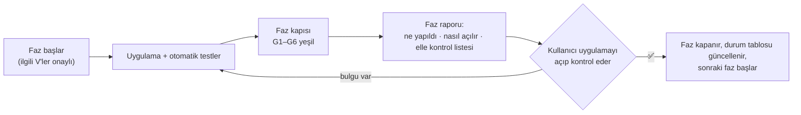

# Free Template — Yol Haritası

> **Tek cümlelik hedef:** [DESIGN.md](DESIGN.md)'deki free template sistemini, her biri kendi başına
> çalışan ve **uygulama açılarak elle kontrol edilen** küçük fazlarla, bugün çalışan hiçbir şeyi
> bozmadan uygulamak.

- **Tasarım:** [DESIGN.md](DESIGN.md) (kararlar D1–D31, varsayımlar V1–V28). Bu doküman *ne
  zaman ve hangi sırayla* sorusunu cevaplar; *ne ve neden* DESIGN.md'dedir.
- **Branch:** `feature/free-template` · **Başlangıç (base):** `1d3eba6b` — 2026-10-09
- **Durum:** Taslak, onay bekliyor (2026-10-09). Henüz hiçbir faz başlamadı.

| Faz | Konu | Boyut | Durum |
|---|---|---|---|
| 0 | Güvenlik ağı | S | ⏳ |
| 1 | Template deposu ve Templates sekmesi | M | ⏳ |
| 2 | Template editörü: kategoriler ve düzen | L | ⏳ |
| 3 | Free dünya ve template güncellemesi | M | ⏳ |
| 4 | Tablo, Stat tablosu, hazır içerikler | L | ⏳ |
| 5 | Paketler | M | ⏳ |
| 6 | Oyuncu kartı, karakter kağıdı, kaynak, dinlenme | L | ⏳ |
| 7 | Seviye sistemi | L | ⏳ |
| 8 | Karakter oluşturma rehberi | M | ⏳ |
| 9 | Encounter ve harita ayarları | M | ⏳ |
| 10 | Kapanış | S | ⏳ |

---

## İçindekiler

1. [Nasıl çalışıyoruz?](#1-nasıl-çalışıyoruz)
2. [Kesin kurallar](#2-kesin-kurallar)
3. [Faz kapısı](#3-faz-kapısı)
4. [Kodda bulunanlar: tasarımla farklar](#4-kodda-bulunanlar-tasarımla-farklar)
5. [Tasarım fazlarıyla eşleşme](#5-tasarım-fazlarıyla-eşleşme)
6. [SRD tiplerinin dönüşüm takvimi](#6-srd-tiplerinin-dönüşüm-takvimi)
7. [Fazlar](#7-fazlar)
8. [Yol haritası kararları — onay bekleyenler](#8-yol-haritası-kararları--onay-bekleyenler)

---

## 1. Nasıl çalışıyoruz?



- **Bir faz, kullanıcı elle kontrol edip onaylamadan kapanmaz.** Sonraki faza onaysız geçilmez.
- **Bulgular aynı fazda düzeltilir.** Düzeltme sonrası sadece ilgili kontrol maddeleri ve R turu
  tekrarlanır.
- **Her fazın başında** o fazın dayandığı varsayımlar (V…) kullanıcıya hatırlatılır. Biri
  değişirse faz başlamadan DESIGN.md güncellenir.
- **Commit ve push** sadece kullanıcı isteyince yapılır. Öneri: her faz kendi commit(ler)iyle
  kapanır, böylece faz bazında geri dönülebilir.

### 1.1 Faz raporu

Her fazın sonunda kullanıcıya şu yapıda bir rapor verilir:

```
Faz N — <konu>
  Yapılanlar        : madde madde, kullanıcının göreceği şekilde
  Otomatik kapı     : G1–G6 sonuçları (komut çıktısıyla)
  Nasıl açılır      : komut (§1.2)
  Elle kontrol      : fazın E listesi + R turu
  Bilinen sınırlar  : bu fazda bilerek eksik bırakılanlar ve hangi fazda geldikleri
```

### 1.2 Uygulamayı açmak

```bash
cd flutter_app
~/flutter-3.47/bin/flutter pub get
~/flutter-3.47/bin/dart run build_runner build --delete-conflicting-outputs
DM_DATA_ROOT=$HOME/dmt-free-test ~/flutter-3.47/bin/flutter run -d linux
```

- **Ayrı veri klasörü:** `DM_DATA_ROOT` ile branch, gerçek verinden
  (`~/Documents/DungeonMasterTool`) ayrı bir kopyada çalışır. Kopya Faz 0'da bir kez alınır
  (§7, Faz 0). Böylece yarım bir faz gerçek dünyalarına dokunamaz.
- **Hesapla kullanıyorsan** her zamanki `--dart-define` değerlerini de ekle; yoksa uygulama
  offline açılır ve hesaba bağlı veri klasörünü görmez.
- **Telefon görünümü (desktop'ta):** pencereyi kısa kenarı 600 px'in altında kalacak şekilde
  daralt (ör. 420 × 860). Uygulama bunu telefon sayar
  ([screen_type.dart](../../flutter_app/lib/core/utils/screen_type.dart)).
- **Gerçek dokunmatik:** basılı tutup sürükleme gibi hareketler için Android cihaz ya da emülatör:
  `~/flutter-3.47/bin/flutter run -d <cihaz>`. Bu kontrol Faz 2, 6 ve 7'de istenir.

---

## 2. Kesin kurallar

Pazarlığa açık değildir. Biri ihlal ediliyorsa iş durur, kullanıcıya sorulur.

| # | Kural | Neden |
|---|---|---|
| **K1** | `flutter_app/lib/domain/entities/schema/builtin/` altında hiçbir dosya değişmez. `srdCorePackVersion` artmaz. | DESIGN §17. Yerleşik template ve SRD içeriği dokunulmazdır. |
| **K2** | **Yerleşik şemanın JSON çıktısı değişmez.** Modellere (`WorldSchema`, `EntityCategorySchema`, `FieldGroup`, `FieldSchema`) eklenen her yeni alan nullable olur ve `@JsonKey(includeIfNull: false)` taşır. Yeni `FieldType` değerleri eklenebilir; mevcut değerlerin adı ve JSON değeri değişmez. | Yeni alan JSON'a girerse yerleşik dünyalarda kayıtlı şema ile üretilen şema ayrışır. Faz 0'daki koruma testi bunu yakalar. |
| **K3** | **Free yol ayrı bir daldır.** Tek kapı: `isFreeTemplate(schema)`. Yerleşik kod yolunun içine free mantığı yazılmaz; sadece çağrı noktasında dallanılır. Büyük yerleşik ekranlara (ör. 4040 satırlık [character_editor_screen.dart](../../flutter_app/lib/presentation/screens/characters/character_editor_screen.dart)) dal eklemek yerine free için ayrı ekran yazılır. | İ5 / D18. Yerleşik davranışın değişmediğini göstermenin en kolay yolu o koda dokunmamaktır. |
| **K4** | Kural motoruna dokunulmaz: `CharacterResolver`, sihirbaz, seviye atlama planlayıcısı, bekleyen seçimler. `grant_contract_test` ve `grant_field_isolation_test` dokunulmadan geçer. | DESIGN §17. Seviye sistemi (Faz 7) resolver'ı kullanmaz; kendi küçük ve saf fonksiyonunu kullanır. |
| **K5** | Drift `schemaVersion` artmaz. Yeni depolar `beforeOpen` içinde idempotent DDL'li yan tablo olur (bugünkü `asset_refs` / `sync_tombstones` gibi). Veritabanı erişimi DAO'dan geçer. | DESIGN §17, CLAUDE.md. |
| **K6** | Free template'li dünyada "online yap" kapalıdır. Free template'ler hiçbir senkron, paylaşım ya da marketplace yoluna girmez. | V21, D18. |
| **K7** | Kullanıcıya görünen her metin `app_en.arb` → `app_tr.arb`, `app_de.arb`, `app_fr.arb` sırasıyla eklenir. | CLAUDE.md. |
| **K8** | Repo kuralları: CRLF dosyalarda satır sonu korunur; mevcut dosyalara `dart format` çalıştırılmaz; `~/flutter-3.47/bin/flutter` kullanılır; anotasyonlu sınıf değişince `build_runner` çalıştırılır. | Repo hafızası. |
| **K9** | Mimari açıdan önemli her yeni dosyanın `vault/10-Files/<alan>/` altında notu olur; davranışı değişen dosyanın notu güncellenir; her faz `vault/90-Meta/Vault-Changelog.md`'ye bir satır ekler. | CLAUDE.md, vault SOP. |

---

## 3. Faz kapısı

Her faz, en küçük düzeltme dahil, bu listeden geçmeden "bitti" sayılmaz.

### 3.1 Otomatik kapı

```
[ ] G1  Yerleşik template dokunulmadı:
        git diff --stat 1d3eba6b -- flutter_app/lib/domain/entities/schema/builtin/   → BOŞ
[ ] G2  Yerleşik şema donmuş (Faz 0'da eklenen koruma testi):
        flutter test test/domain/entities/schema/builtin_schema_frozen_test.dart      → PASS
[ ] G3  Kural motoru sözleşmeleri:
        flutter test test/domain/services/grant_contract_test.dart \
                     test/domain/services/grant_field_isolation_test.dart              → PASS
[ ] G4  flutter analyze                                                                → yeni uyarı yok
[ ] G5  Fazın kendi testleri + dokunulan dosyaların testleri                           → PASS
[ ] G6  Tam test seti, Faz 0'daki temel çizgiyle karşılaştırılır                       → yeni kırmızı yok
```

### 3.2 R turu — her fazda tekrarlanan regresyon kontrolü

Yerleşik template'le çalışan her şeyin aynı kaldığını gösterir. Faz 0'da bir kez **referans**
olarak yapılır; sonraki her fazda Faz 0'daki gözlemle karşılaştırılır.

| # | Kontrol | Beklenen |
|---|---|---|
| R1 | Mevcut yerleşik bir dünyayı aç. Kenar çubuğuna, bir büyüye (Fireball), bir canavara (Goblin) ve bir sınıfa (Fighter) bak. | Kenar çubuğu Tier gruplu; kartlar Faz 0'daki gibi. |
| R2 | Mevcut bir karakteri aç. | AC, HP, skill toplamları ve "çözülen grant'ler" kartı Faz 0'daki gibi. |
| R3 | Yerleşik template'le yeni karakter oluştur. | Sihirbaz baştan sona çalışır. |
| R4 | Bu karakterle seviye atla, sonra kısa ve uzun dinlen. | Seviye atlama planlayıcısı ve dinlenme Faz 0'daki gibi. |
| R5 | Bir encounter kur: bir canavar ve bir oyuncu. İnisiyatif at, HP'yi +/− ile değiştir. | Faz 0'daki gibi; oyuncunun HP'si kağıda yazılır. |
| R6 | Packages sekmesinde mevcut bir paketi aç ve bir kartına bak. | Faz 0'daki gibi. |
| R7 | "SRD içeriğini ekle" açık yeni bir yerleşik dünya oluştur. | SRD kartları gelir. |
| R8 | Templates sekmesinde yerleşik template'i incele. | Salt okunur; düzenleme yok. |

---

## 4. Kodda bulunanlar: tasarımla farklar

Yol haritası hazırlanırken kod okundu. DESIGN.md'nin varsaydığı ama kodda farklı olan noktalar:

| # | Bulgu | Etkisi | Faz |
|---|---|---|---|
| B1 | **Template güncelleme diyaloğu ölü kod.** DESIGN §6.4 "banner bugün de var" diyor; ama diyaloğu açan servis (`TemplateSyncService`, `pendingTemplateUpdateProvider`) `781b8bd7`'de silinmiş. Diyalog [worlds_tab.dart](../../flutter_app/lib/presentation/screens/hub/worlds_tab.dart) içinde `_showPreOpenTemplateDialogDead` adıyla duruyor. `applyTemplateUpdate` / `dismissTemplateUpdate` / `muteTemplateUpdates` ise [campaign_provider.dart](../../flutter_app/lib/application/providers/campaign_provider.dart) içinde çalışır halde. | Değişiklik kontrolü yeniden yazılır, diyalog canlandırılır. Eski servis `git show 781b8bd7^:flutter_app/lib/application/services/template_sync_service.dart` ile referans alınabilir. | 3 |
| B2 | **Yerleşik şemanın hash'i her açılışta değişir.** `generateBuiltinDnd5eV2Schema()` her kategori ve alana `DateTime.now()` yazıyor; `computeWorldSchemaContentHash` kategorileri zaman damgalarıyla birlikte hash'liyor. | Değişiklik kontrolü sadece **free template'li dünyalarda** çalışır. Yerleşik dünyada açılırsa her açılışta sahte "güncelleme var" çıkar. Faz 0'daki koruma testi zaman damgalarını çıkarıp hash'ler. | 0, 3 |
| B3 | `allTemplatesProvider` bugün sadece yerleşik template'i döndürdüğü için tüketicileri buna güveniyor: sihirbaz, paket oluşturma, dünya oluşturma, karakter ekranı, global etiketler. | Free template'ler listeye girince sihirbaz ve paket oluşturma onları **görmemeli** (ilgili fazlar gelene kadar). Faz 1'de her tüketici tek tek ele alınır. | 1 |
| B4 | Eski kullanıcı template'leri `cache/templates/*.json` dosyalarında tutuluyordu (`781b8bd7^`). Cache klasörü silinebilir bir yer. | Yeni depo kullanıcı başına veritabanında yan tablo olur (K5). | 1 |
| B5 | SRD içeriği altı yerde `templateId == builtinDnd5eV2SchemaId` ile kapılı: [world_repository_impl.dart](../../flutter_app/lib/data/repositories/world_repository_impl.dart) (171, 567, 605), worlds_tab.dart (572), [srd_core_bootstrap.dart](../../flutter_app/lib/application/services/srd_core_bootstrap.dart) (27), [world_join_service.dart](../../flutter_app/lib/application/services/world_join_service.dart) (132). | SRD soyundan gelen kopyalarda SRD paketinin kurulabilmesi (V28) için kapı genişletilir. `_overlayMissingBuiltinCategories` (605) **genişletilmez**: kopyada silinen SRD kategorileri geri gelmemeli. | 3 |
| B6 | Mevcut `FieldType.levelTable` adı zaten kullanılıyor (`Map<int,int>`). | Yeni "Seviye tablosu" tarzı başka bir enum adı alır (K2). Adlar fazında seçilir. | 7 |

---

## 5. Tasarım fazlarıyla eşleşme

DESIGN §19'daki beş faz, elle kontrol edilebilecek büyüklükte parçalara bölündü:

| DESIGN §19 | Bu yol haritası |
|---|---|
| 1 — Template editörü | 0 · 1 · 2 · 3 · 4 · 5 |
| 2 — Oyuncu kartı ve kağıt | 6 |
| 3 — Seviye sistemi | 7 |
| 4 — Rehber | 8 |
| 5 — Encounter ve harita | 9 |
| — | 10 (kapanış) |

---

## 6. SRD tiplerinin dönüşüm takvimi

SRD kopyası dönüştürücüsü (DESIGN §16.2) fazlarla büyür. Bir tip, hedef tarzının geldiği fazda
dönüşür. O zamana kadar kopyada **eski tipiyle** kalır: bugünkü widget'la gösterilir, paletten
eklenemez, editörde sadece etiket, grup, genişlik ve görünürlüğü değişir, yanında "SRD tipi"
rozeti olur.

| SRD tipi | Kopyada | Faz |
|---|---|---|
| `crCalculator` | Kaldırılır | 1 |
| Yazı, sayı, zar, görsel, kart bağlantısı, etiket, tarih, dosya | Aynen kalır | 1 |
| `statBlock` | Stat tablosu (değiştirici açık / kapalı) | 4 |
| `proficiencyTable` | Tablo, Skill / Saving throw hazır içeriğine bağlı | 4 |
| `levelTable`, `levelTextTable` | Tablo (Seviye · Değer / Seviye · Yazı) | 4 |
| `rangedSenseList`, `spellEffectList` | Tablo, serbest satırlar | 4 |
| `equipmentChoiceGroups`, `playerChoices`, `subspeciesOptions` | Markdown (SRD verisi okunurken metne çevrilir) | 4 |
| `combatStats` | Ayrı alanlar: HP (Kaynak), AC, Hız, İnisiyatif; NPC'de CR, XP | 6 |
| `slot` | Kaynak (kutucuk) | 6 |
| `spellSlotGrid`, `class_levels` | Kaldırılır | 6 |
| `classFeatures` | Seviye tablosu | 7 |
| `resourcePoolGrants` | Kaynak verme | 7 |
| `spellSlotProgression` + büyücü türü | Sınıf kartında Kaynak verme | 7 |
| `spellsAtLevel` | Seviye tablosu (+ günlük kullanım için Kaynak verme) | 7 |

> **Önemli:** Bir fazda yeni dönüşüm eklenince önceki fazlarda oluşturulmuş test kopyaları eski
> haliyle kalır. Kontrol listeleri bu yüzden "SRD'yi yeniden kopyala" adımıyla başlar. Fazlar
> arası template geçiş kodu yazılmaz (§8, Y1).

---

## 7. Fazlar

Her faz aynı yapıdadır: **Amaç · Onay gereken varsayımlar · Yapılacaklar · Dokunulan yerler ·
Kapsam dışı · Otomatik testler · Elle kontrol · Çıkış kriteri.**

---

### Faz 0 — Güvenlik ağı

**Amaç:** Hiçbir davranış değişmeden önce, "bozmadık" demeyi mümkün kılan ölçümleri kurmak.

**Yapılacaklar:**

1. **Test temel çizgisi:** temiz ağaçta tam `flutter test` çalıştırılır. Kırmızı testlerin listesi
   bu dokümana (§7, Faz 0 sonucu) yazılır. G6 bununla karşılaştırır.
2. **Yerleşik şema koruma testi** (`test/domain/entities/schema/builtin_schema_frozen_test.dart`):
   `generateBuiltinDnd5eV2Schema().schema.toJson()` çıktısından `createdAt` / `updatedAt`
   çıkarılır, kanonik JSON'un SHA-256'sı sabit bir değerle karşılaştırılır. Kategori sayısı (75)
   ve alan sayısı (928) da ayrıca doğrulanır. Bu test K1 ve K2'nin otomatik bekçisidir.
3. **Test veri klasörü:** `cp -a ~/Documents/DungeonMasterTool ~/dmt-free-test` (§1.2). Bundan
   sonra branch hep bu klasörle açılır.

**Dokunulan yerler:** sadece yeni test dosyası. Uygulama kodu değişmez.

**Otomatik testler:** koruma testi yeşil; `builtin/` altında tek satır değiştirilince kırmızı
olduğu bir kez elle denenip geri alınır.

**Elle kontrol:**

| # | Kontrol | Beklenen |
|---|---|---|
| E0.1 | Uygulamayı test klasörüyle aç (§1.2). | Gerçek verinle aynı dünyalar, karakterler, paketler görünür. |
| E0.2 | R turunu (§3.2) baştan sona yap; her maddede gördüğünü kısaca not et (gerekirse ekran görüntüsü). | Bu notlar sonraki fazların **referansıdır**. |

**Çıkış kriteri:** temel çizgi kayıtlı, koruma testi yeşil, R turu referansı alınmış.

**Faz 0 sonucu:** *(faz bitince doldurulur: kırmızı test listesi, koruma hash'i)*

---

### Faz 1 — Template deposu ve Templates sekmesi

**Amaç:** Kullanıcı SRD'yi kopyalayabilsin, kopyalarını listeleyip yeniden adlandırabilsin ve
silebilsin. Kopyalar uygulama kapanıp açılınca kalır. Henüz düzenleme ve dünya yok.

**Onay gereken varsayımlar:** V1 (boş template sadece oyuncu kartıyla başlar), V2 (template
silinirse dünyalar kendi kopyalarıyla sürer).

**Yapılacaklar:**

1. **Model:** `WorldSchema`'ya free bilgisi (free mi + soy kökü, yani hangi template'ten
   türediği) ve `EntityCategorySchema`'ya "oyuncu kartı mı" bilgisi eklenir. İkisi de nullable,
   `includeIfNull: false` (K2). Tek kapı `isFreeTemplate(schema)` yazılır.
2. **Depo:** `user_templates` yan tablosu (`beforeOpen` DDL, K5) + DAO + repository: listele,
   getir, kaydet, sil. Kaydederken `originalHash` ilk kayıtta dondurulur.
3. **SRD kopyası dönüştürücüsü (v1):** saf bir domain fonksiyonu. Yeni benzersiz kimlik, ad
   "… (kopya)", free işareti, soy kökü = yerleşik template, `player-character` → oyuncu kartı
   işareti, `crCalculator` alanları kaldırılır (§6). Kopyadaki `isBuiltin` bayraklarının nerede
   okunduğu kontrol edilir; kopyayı yerleşik saymaya yol açan bir okuma varsa kopyada kapatılır.
4. **Boş template:** sadece oyuncu kartı kategorisiyle başlar. Sabit alanları (Seviye, Otomatik
   kaynaklar) Faz 6'da gelir.
5. **Free'den free kopya:** soy kökü korunur (SRD → kopyam → kopyam-low-magic hepsi SRD soyunda).
6. **Sağlayıcı:** `allTemplatesProvider` = yerleşik + kullanıcı template'leri. Tüketiciler (B3):
   - Sihirbaz ve karakter oluşturma → sadece yerleşik (Faz 6'ya kadar).
   - Paket oluşturma → sadece yerleşik (Faz 5'e kadar).
   - Dünya oluşturma → sadece yerleşik (Faz 3'e kadar).
   - Karakter ekranı ve global etiketler → olduğu gibi (kimlikle arama yapıyorlar).
7. **Templates sekmesi:** yerleşikte "İncele" ve "Kopyala"; free'de "İncele", "Yeniden adlandır",
   "Kopyala" ve "Sil" (onaylı). "Boş template oluştur" butonu. "Düzenle" Faz 2'de gelir.

**Dokunulan yerler:** [world_schema.dart](../../flutter_app/lib/domain/entities/schema/world_schema.dart),
[entity_category_schema.dart](../../flutter_app/lib/domain/entities/schema/entity_category_schema.dart),
[app_database.dart](../../flutter_app/lib/data/database/app_database.dart) (yan tablo DDL),
yeni DAO + repository, [template_provider.dart](../../flutter_app/lib/application/providers/template_provider.dart),
[templates_tab.dart](../../flutter_app/lib/presentation/screens/hub/templates_tab.dart),
[worlds_tab.dart](../../flutter_app/lib/presentation/screens/hub/worlds_tab.dart),
[packages_tab.dart](../../flutter_app/lib/presentation/screens/hub/packages_tab.dart),
[character_creation_wizard_screen.dart](../../flutter_app/lib/presentation/screens/characters/wizard/character_creation_wizard_screen.dart),
`.arb` dosyaları.

**Kapsam dışı:** düzenleme, dünya, paket, karakter.

**Otomatik testler:** dönüştürücü (yeni kimlik, soy, oyuncu kartı işareti, CR yok, 75 kategori,
diğer alanlar aynen); depo (kaydet → getir → sil; ikinci açılışta liste aynı); sağlayıcı
filtreleri (sihirbazın ve paket oluşturmanın listesinde free yok).

**Elle kontrol:**

| # | Kontrol | Beklenen |
|---|---|---|
| E1.1 | Templates sekmesi → yerleşik template → **Kopyala**. | "D&D 5e (SRD 5.2.1) (kopya)" listede belirir. |
| E1.2 | Kopyayı **İncele**. | Kategoriler ve alanlar yerleşikle aynı; canavarda CR hesaplayıcı yok. |
| E1.3 | Kopyayı **yeniden adlandır**: "SRD kopyam". | Yeni ad listede. |
| E1.4 | "SRD kopyam"dan bir kopya daha al, sonra onu **Sil**. | Silmeden önce onay sorulur; silinen listeden kalkar. |
| E1.5 | **Boş template oluştur**, incele. | Tek kategori: oyuncu kartı. |
| E1.6 | Uygulamayı kapat ve aç. | Template'ler, adları ve sıraları duruyor. |
| E1.7 | Yeni dünya, yeni karakter ve yeni paket diyaloglarını aç. | Üçünde de free template **görünmüyor**. |
| E1.8 | Telefon görünümünde Templates sekmesi. | Butonlar sığıyor, taşma yok. |
| E1.9 | R turu. | Faz 0 referansıyla aynı. |

**Çıkış kriteri:** SRD kopyalanır, kopya kalıcıdır; yerleşik akışların hiçbirinde free template
görünmez.

---

### Faz 2 — Template editörü: kategoriler ve düzen

**Amaç:** DESIGN'ın ilk hedefi (D5): kullanıcı SRD kopyasında kategorileri, grupları, kolonları ve
alanları istediği gibi düzenleyebilsin. Mobil ve desktop'ta rahat.

**Onay gereken varsayımlar:** V3 (anahtar etiketten üretilir, değişmez), V4 (uyumsuz tip
değişimi = yeni anahtar), V5 (silinen kategori), V22 (telefonda tek kolon), V26 (otomatik kayıt),
V27 (önizleme).

**Yapılacaklar:**

1. **Editör ekranı** (free için yeni; yerleşik için mevcut inceleyici aynen kalır, R8):
   - Desktop: üç panel (template · kategori düzeni · ayarlar) + altta palet şeridi (DESIGN §7.5).
   - Telefon: iç içe ekranlar + alttan açılan "Ekle" sayfası (DESIGN §7.6).
   - Silinmiş eski editör (`git show 781b8bd7^:flutter_app/lib/presentation/screens/hub/template_editor.dart`)
     sadece referans olarak okunur; kopyalanmaz.
2. **Template içeriği:** Bilgiler (ad, açıklama, sürüm) ve Kategoriler (ekle, sil, sürükleyerek
   sırala). Oyuncu kartı silinemez (adı ve ikonu değişir).
3. **Kategori ayarları** (DESIGN §7.2): ad, ikon, renk, filtre alanları, göründüğü bölümler.
   Seviye modu Faz 7'de gelir.
4. **Gruplar:** ekle, sil, yeniden adlandır; kolon sayısı; "kapalı başlasın"; sürükleyerek sırala;
   ⋮ menüsünden "alanları başka gruba taşı".
5. **Alanlar:**
   - Paletten basit tarzlar (DESIGN §8, basit tarzlar tablosu) eklenir: sürükle-bırak ya da
     tıklayınca seçili gruba.
   - Grup içinde ve gruplar arasında sürüklenir.
   - Alan ayarları (DESIGN §7.3): etiket, anahtar (salt okunur), liste, yardım metni, varsayılan,
     zorunlu, görünürlük, genişlik, grup ve tarza özel ayarlar (seçenek listesi, en az / en çok,
     hedef kategori, izinli uzantılar).
   - Tip değişikliği DESIGN §6.6'daki uyumlu tip tablosuna göre. Uyumsuzsa uyarı, onaylanırsa
     yeni anahtarla yeni alan.
   - Eski SRD tipleri rozetle görünür, sınırlı ayarla (§6).
6. **Otomatik kayıt** (gecikmeli). Silmeler her zaman onay sorar.
7. **Önizle:** orta panel, gerçek kart görünümüyle örnek bir kart çizer. Bu, Faz 3'teki kart
   ekranının free'de doğru çizdiğinin de ilk kontrolüdür.

**Dokunulan yerler:** yeni editör ekranı ve widget'ları (`lib/presentation/screens/templates/`
altında), [templates_tab.dart](../../flutter_app/lib/presentation/screens/hub/templates_tab.dart)
("Düzenle"), router, `.arb` dosyaları. Kart çizimi için
[entity_card.dart](../../flutter_app/lib/presentation/screens/database/entity_card.dart) okunur;
free'de `_shouldCenterGroup` gibi yerleşik sabitleri devre dışı bırakan kapı burada eklenir.

**Kapsam dışı:** Tablo, Stat tablosu, Kaynak, Seviye tablosu tarzları; hazır içerikler; rehber;
encounter ayarları; dünyaya yansıma.

**Otomatik testler:** editör işlemlerinin saf mantığı ayrı tutulur ve test edilir: alan ekle,
taşı, sil; grup sil → alanların taşınması; anahtar üretimi (etiketten, çakışmada ek; bir daha
değişmez); uyumlu / uyumsuz tip kararı; oyuncu kartının silinememesi. Editör için birkaç widget
testi: telefonda ve desktop'ta açılıyor, taşma yok.

**Elle kontrol:**

| # | Kontrol | Beklenen |
|---|---|---|
| E2.1 | "SRD kopyam" → **Düzenle** → Oyuncu kartı. | Mevcut gruplar ve alanlar düzen halinde görünür. |
| E2.2 | "Kimlik" adında grup ekle, 3 kolon yap; Tür, Sınıf ve Geçmiş'i içine sürükle. | Üçü yan yana durur. |
| E2.3 | Bir alanın genişliğini 2 yap. | İki kolon kaplar (DESIGN §7.4'teki çizim). |
| E2.4 | **Önizle.** | Oyuncunun göreceği kart görünümü; değişiklikler orada. |
| E2.5 | "Fraksiyon" kategorisi ekle: Yazı, Seçim (3 seçenek), NPC'ye giden Kart bağlantısı listesi ve Markdown alanları. Kategoriyi listede yukarı sürükle. | Kategori ve alanlar yerinde. |
| E2.6 | Bir Yazı alanını Markdown'a çevir. Sonra Seçim → Tam sayı dene. | İlki uyarısız; ikincisi uyarı verir, onaylanınca yeni alan oluşur. |
| E2.7 | Bir alanın etiketini değiştir. | Anahtar aynı kalır (ayarlarda salt okunur görünür). |
| E2.8 | Oyuncu kartını silmeyi dene. | Mümkün değil. |
| E2.9 | Bir grubu sil. | Onay sorar; içindeki alanlar silinmez, "Özellikler" altına geçer ya da seçilen gruba taşınır. |
| E2.10 | Uygulamayı kapat ve aç, editörü yeniden aç. | Bütün değişiklikler duruyor. |
| E2.11 | Aynı işleri telefon görünümünde (dar pencere) tekrarla: ekle, ayarla, sırala. | Ekranlar tek işe odaklı, taşma yok, alttan açılan sayfalar çalışıyor. |
| E2.12 | Android'de basılı tutup sürükleyerek alan ve kategori sırala. | Tek elle rahat. |
| E2.13 | R turu (özellikle R8). | Yerleşik template hâlâ salt okunur. |

**Çıkış kriteri:** kullanıcı SRD kopyasının alanlarını ve düzenini değiştirebilir; telefonda ve
desktop'ta rahat; değişiklikler kalıcı.

---

### Faz 3 — Free dünya ve template güncellemesi

**Amaç:** Free template'le dünya kurulsun; SRD paketinin kartları kopyanın düzeniyle görünsün;
template değişikliği dünyaya banner ile gitsin.

**Onay gereken varsayımlar:** V2, V5, V21, V28.

**Yapılacaklar:**

1. **Dünya oluşturma:** diyalog free template'leri de listeler. Dünya, template'in kopyasını ve
   kimliğini zaten saklıyor (`settings_json` içinde `_world_schema`).
2. **SRD soyu (V28, B5):** SRD soyundaki kopyalarda "SRD içeriğini ekle" çıkar; SRD paketi ve
   Tier-0 içerik kurulur. `_overlayMissingBuiltinCategories` free'de çalışmaz (silinen
   kategoriler geri gelmesin).
3. **Kenar çubuğu:** free'de Tier gruplaması yerine template sırasıyla düz liste.
4. **Kart ekranı:** free'de yerleşik sabitler devre dışı (Faz 2'de eklenen kapı). Silinen alan
   gösterilmez. **Kartı kaydetmek şemada olmayan anahtarları silmemeli** (D17); bu doğrulanır,
   siliyorsa free yolda düzeltilir. Silinen kategorinin kartları görünmez (V5).
5. **Template güncellemesi (B1, B2):** dünya açılınca, free template'li dünyalar için template'in
   güncel hash'i dünyanınkiyle karşılaştırılır. Fark varsa mevcut diyalog canlandırılır:
   Güncelle / Yoksay / Bu dünya için bir daha gösterme. Kayıt `applyTemplateUpdate` ile yapılır.
   Template silinmişse hiçbir şey sorulmaz (V2). Yerleşik dünyalarda bu kontrol **çalışmaz**.
6. **Free dünyada kapalı olanlar:** yeni karakter (Faz 6'ya kadar, açıklamalı), "online yap"
   (V21, açıklamalı), kural ayarları diyaloğu (`RuleConfigDialog`).
7. **`.dmtz`:** free dünya dışa aktarılıp içe aktarılır. Template dosyaya girmez; içe aktarılan
   dünya kendi kopyasıyla açılır. Template olmadığı için güncelleme sorulmaz.

**Dokunulan yerler:** [worlds_tab.dart](../../flutter_app/lib/presentation/screens/hub/worlds_tab.dart),
[world_repository_impl.dart](../../flutter_app/lib/data/repositories/world_repository_impl.dart),
[srd_core_bootstrap.dart](../../flutter_app/lib/application/services/srd_core_bootstrap.dart),
[campaign_provider.dart](../../flutter_app/lib/application/providers/campaign_provider.dart),
[entity_sidebar.dart](../../flutter_app/lib/presentation/widgets/entity_sidebar.dart),
[entity_card.dart](../../flutter_app/lib/presentation/screens/database/entity_card.dart),
[save_sync_indicator.dart](../../flutter_app/lib/presentation/widgets/save_sync_indicator.dart)
("online yap"), [main_screen.dart](../../flutter_app/lib/presentation/screens/main_screen.dart),
yeni değişiklik kontrolü servisi.

**Kapsam dışı:** karakter, paket oluşturma, yeni birleşik tarzlar, free encounter ayarları.
Encounter bu fazda kopyanın bugünkü `encounterConfig`'iyle olduğu gibi çalışır (§8, Y5).

**Otomatik testler:** değişiklik kontrolü (free'de fark → istem; aynı → yok; yerleşik → hiç
çalışmaz; template silinmiş → yok); bilinmeyen anahtarların kayıtta korunması; SRD soyu kapısı
(kopya → SRD kurulur; boş template → kurulmaz); `_overlayMissingBuiltinCategories`'in free'de
çalışmaması.

**Elle kontrol:**

| # | Kontrol | Beklenen |
|---|---|---|
| E3.1 | "SRD kopyam" ile, "SRD içeriğini ekle" açık, "Deneme" dünyasını kur. | Dünya açılır. |
| E3.2 | Kenar çubuğu. | Template sırasıyla düz liste; Faz 2'de eklenen "Fraksiyon" var. |
| E3.3 | Fireball, Goblin ve Fighter kartlarını aç. | SRD verisi görünür; Faz 2'deki düzen uygulanmış. Eski SRD tipleri bugünkü gibi çizilir. |
| E3.4 | Bir "Fraksiyon" kartı oluştur, alanlarını doldur. | Kalıcı. |
| E3.5 | Template'te Fraksiyon'un bir alanını sil. Dünyayı aç. | "Template güncellendi" diyaloğu çıkar. |
| E3.6 | **Güncelle.** | Alan kartta görünmüyor. |
| E3.7 | Alanı aynı etiketle geri ekle, dünyayı aç, güncelle. | Eski değer geri gelir (D17). |
| E3.8 | Template'te bir değişiklik yap, dünyayı aç, **Yoksay**. Dünyayı kapatıp yeniden aç. | Aynı değişiklik için bir daha sorulmaz. Yeni bir değişiklikte yine sorulur. |
| E3.9 | Yeni karakter oluşturmayı ve "online yap"ı dene. | İkisi de kapalı ve nedeni yazıyor. |
| E3.10 | "Deneme" dünyasını `.dmtz` olarak dışa aktar, kopya olarak içe aktar, aç. | Aynı düzen ve kartlarla açılır. |
| E3.11 | Boş template'le dünya kur. | "SRD içeriğini ekle" çıkmaz; sadece oyuncu kartı kategorisi var. |
| E3.12 | R turu + yerleşik dünyayı birkaç kez açıp kapat. | Yerleşik dünyada güncelleme diyaloğu **hiç** çıkmıyor. |

**Çıkış kriteri:** DESIGN §19 Faz 1'in çıkış kriterinin dünya kısmı: kullanıcı SRD'yi kopyalar,
düzenler, bu template'le dünya kurar; SRD kartları kopyada doğru görünür; yerleşik dünyalar
değişmeden çalışır.

---

### Faz 4 — Tablo, Stat tablosu ve hazır içerikler

**Amaç:** Skill, saving throw, duyular gibi "satır listesi" alanlarının tek bir genel tarzla
(Tablo), statların hesap yapan tek tarzla (Stat tablosu) kurulması; bunların hazır içerikle
birden fazla kategoriye bağlı eklenmesi.

**Onay gereken varsayımlar:** V6 (hazır içerik tek alan ya da grup), V7 (silinirse bağlılar
bağımsızlaşır), V8 (bir kategoriye bir kez).

**Yapılacaklar:**

1. **Tablo tarzı** (DESIGN §8.1): kolon türleri (yazı, sayı, onay, seçim, zar, kart bağlantısı);
   sabit ya da serbest satırlar; sabit satırlarda template hücreleri kartta salt okunur.
   Editörde kolon ve satır ayarları.
2. **Stat tablosu** (DESIGN §8.2): etiketler, temel değer, adım, "değiştiriciyi göster".
   Değiştirici = ⌊(değer − temel) ÷ adım⌋, **aşağı** yuvarlanır. Yerleşik stat bloğunun yuvarlama
   hatası (DESIGN §8.2) bu fazda **düzeltilmez**.
3. **Hazır içerikler** (DESIGN §9): editörün 2. bölümü. Oluştur, bağlı ekle, bağı kopar,
   kopyala, sil. Bağlı alanlar sadece yapıyı paylaşır; kart değerleri bağlı değildir.
4. **SRD kopyası dönüştürücüsü (v2):** §6'da Faz 4 satırları. Skill tablosu, Saving throw tablosu
   ve Stat tablosu hazır içerikleri kopyayla birlikte gelir ve ilgili kategorilere bağlıdır.
5. **SRD verisi okuyucuları** (DESIGN §16.3): SRD paketinin bugünkü veri şekilleri (ör.
   `proficiencyTable` değerleri, `rangedSenseList` satırları, ekipman seçimleri) yeni tarzlarda
   okunurken dönüştürülür. Paket verisi değişmez (K1).

**Dokunulan yerler:** [field_schema.dart](../../flutter_app/lib/domain/entities/schema/field_schema.dart)
(yeni `FieldType` değerleri, belgelenmiş değer şekilleriyle),
[field_widget_factory.dart](../../flutter_app/lib/presentation/widgets/field_widgets/field_widget_factory.dart)
/ [structured_list_field_widgets.dart](../../flutter_app/lib/presentation/widgets/field_widgets/structured_list_field_widgets.dart),
editör, dönüştürücü, yeni okuyucular.

**Kapsam dışı:** Kaynak, Seviye tablosu, Kaynak verme; karakter kağıdı.

**Otomatik testler:** stat hesabı (DESIGN §8.2'deki iki satırlık tablo birebir); tablo değer
şekli okuma / yazma; hazır içerik bağı (yapı değişince bütün bağlılar güncellenir, değerler
korunur; bağı kopar; sil → bağımsız kopyalar); SRD okuyucuları (gerçek SRD satırlarıyla örnek
testler); dönüştürücü v2.

**Elle kontrol:**

| # | Kontrol | Beklenen |
|---|---|---|
| E4.1 | SRD'yi **yeniden kopyala** (§6), adını "SRD kopyam 2" yap, onunla dünya kur. | — |
| E4.2 | Editörde Oyuncu kartı → Skills. | Tablo; 18 satır; skill adı ve stat salt okunur; bağlı olduğu hazır içerik görünür. |
| E4.3 | Goblin kartı. | Skills, saving throw ve duyular SRD verisiyle dolu; statlar ve değiştiricileri doğru. |
| E4.4 | Bir NPC kartında Stat tablosuna 7, 9, 10, 15 gir. | −2, −1, 0, +2. |
| E4.5 | Editörde stat tablosunu temel 0, adım 3 yap; aynı kartta 7 ve 20'ye bak. | +2 ve +6. |
| E4.6 | "Skill tablosu" hazır içeriğine "Denizcilik" satırı ekle; dünyayı güncelle. | Oyuncu kartı, NPC ve canavarın hepsinde yeni satır var; mevcut işaretler duruyor. |
| E4.7 | NPC'deki Skills alanında **Bağı kopar**, sonra hazır içeriğe bir satır daha ekle. | NPC değişmez, diğerleri değişir. |
| E4.8 | Bir tür ya da feat kartında stat bonusu tablosu. | Değiştirici kapalı; sadece değerler. |
| E4.9 | Fighter kartında başlangıç ekipmanı. | Okunaklı metin olarak görünür. |
| E4.10 | Serbest satırlı bir "Duyular" tablosuna satır ekle ve sil. | Çalışır, kalıcı. |
| E4.11 | Telefon görünümünde geniş bir tabloya bak. | Okunur; yatay taşma kontrollü. |
| E4.12 | R turu. | Yerleşik stat bloğu eskisi gibi (yuvarlama hatası dahil). |

**Çıkış kriteri:** SRD kopyasındaki bütün tablo ve stat alanları yeni tarzlarla çalışır; hazır
içerik bağı doğru.

---

### Faz 5 — Paketler

**Amaç:** Free template'le paket oluşturulsun, paket kendi template'iyle açılsın; farklı
template'li dünyaya kurarken eşleşmeyenler anahtarla bulunup kullanıcı uyarılsın (D11).

**Yapılacaklar:**

1. **Paket oluşturma:** free template'ler listeye girer; paket template'in kopyasını saklar.
2. **Açılış** ([package_repository_impl.dart:461](../../flutter_app/lib/data/repositories/package_repository_impl.dart#L461)):
   kayıtlı template kimliği yerleşikse bugünkü yol aynen; değilse kayıtlı şema kullanılır.
3. **Uyumluluk** ([template_compatibility_service.dart](../../flutter_app/lib/application/services/template_compatibility_service.dart)):
   taraflardan biri free ise kategoriler slug'la, alanlar **anahtarla** eşleşir. İki taraf da
   yerleşikse bugünkü kod yolu aynen (§8, Y4).
4. **Uyarı ekranı** ([import_package_dialog.dart](../../flutter_app/lib/presentation/dialogs/import_package_dialog.dart)):
   eşleşmeyen kategoriler ve alanlar listelenir; "Vazgeç" / "Yine de kur".
5. **Paketin template güncellemesi:** pakette de Faz 3'teki kontrol çalışır
   (`package_provider.applyTemplateUpdate` mevcut).
6. **`.dmtz`:** free template'li paket dışa / içe aktarılır.

**Kapsam dışı:** marketplace'e free paket yayınlamak (K6).

**Otomatik testler:** paket açılışı (yerleşik → yerleşik şema; free → kayıtlı şema); anahtar
bazlı uyumluluk (etiketi değişmiş alan eşleşir; eksik kategori / alan listelenir); yerleşik ↔
yerleşik sonuçlarının değişmediği.

**Elle kontrol:**

| # | Kontrol | Beklenen |
|---|---|---|
| E5.1 | "SRD kopyam 2" ile "Paketim" oluştur; bir Fraksiyon ve bir NPC kartı ekle. | Paket kopyanın düzeniyle açılır. |
| E5.2 | Uygulamayı kapat, aç, paketi aç. | Hâlâ kendi düzeniyle. |
| E5.3 | Paketi "SRD kopyam 2" dünyasına kur. | Uyarı yok; kartlar görünür. |
| E5.4 | Boş template'ten bir template kur, onunla dünya aç, paketi oraya kurmayı dene. | Uyarı ekranı eşleşmeyen kategori ve alanları listeler. |
| E5.5 | **Yine de kur.** | Eşleşen kartlar görünür; eşleşmeyen alanlar görünmez. |
| E5.6 | Template'te bir alanın etiketini değiştir, paketi tekrar o template'in dünyasına kur. | Alan yine eşleşir (anahtar aynı). |
| E5.7 | Paketi `.dmtz` ile dışa aktar, içe aktar. | Kendi düzeniyle açılır. |
| E5.8 | Yerleşik bir paketi aç ve yerleşik dünyaya kur. | Bugünkü gibi, aynı uyarılarla. |
| E5.9 | R turu (özellikle R6). | Faz 0 referansıyla aynı. |

**Çıkış kriteri:** DESIGN §19 Faz 1 tamamen bitti.

---

### Faz 6 — Oyuncu kartı, karakter kağıdı, kaynak ve dinlenme

**Amaç:** Free dünyada karakter oluşturulsun, kağıt oyuncu kartının düzeniyle çizilsin; Kaynak
tarzı ve Kısa / Uzun dinlenme çalışsın.

**Onay gereken varsayımlar:** V14 (Seviye ve Otomatik kaynaklar sabit alanlar), V15 (yeni
karakter seviye 1), V23 (`combat_stats` ayrı alanlara bölünür).

**Yapılacaklar:**

1. **Oyuncu kartının sabit alanları** (DESIGN §10.1): Seviye ve Otomatik kaynaklar. Silinemez,
   tarzı değişmez, yeri ve grubu serbest. Otomatik kaynaklar Faz 7'ye kadar boş görünür.
2. **Kaynak tarzı** (DESIGN §8.3): sayı ya da kutucuk görünümü; kısa ve uzun dinlenme için
   doldur / boşalt / dokunma; maks elle; mevcut +/− ya da yazarak.
3. **SRD kopyası dönüştürücüsü (v3):** §6'da Faz 6 satırları. Dinlenme ayarları DESIGN §12.3'teki
   örnek tabloya göre.
4. **Karakter oluşturma:** free dünyada sihirbaz yok; boş kağıt (seviye 1) açılır. Hub'daki
   Characters sekmesinden free template seçilirse de aynı.
5. **Free karakter kağıdı:** **ayrı ekran** (K3). Oyuncu kartı düzenini Faz 2–4'teki alan
   widget'larıyla çizer. Başlıkta Seviye, [Kısa dinlenme] ve [Uzun dinlenme]. [Seviye atla] Faz
   7'de, [Rehber] Faz 8'de gelir. Yerleşik parçalar (çözülen grant'ler, sınıf kaynak takipçisi,
   gizli alan davranışları) yoktur.
6. **Şemanın kaynağı:** free karakter, şemayı global listeden değil dünyanın kendi kopyasından
   okur (DESIGN §18).
7. **Dinlenme:** her kaynak alanına o butonun davranışını uygular, başka hiçbir şeye dokunmaz.

**Dokunulan yerler:** yeni free kağıt ekranı, [character_provider.dart](../../flutter_app/lib/application/providers/character_provider.dart)
(oluşturma dalı), Characters sekmesi, field widget'ları (Kaynak), editör (sabit alanlar),
dönüştürücü. [character_editor_screen.dart](../../flutter_app/lib/presentation/screens/characters/character_editor_screen.dart)'e
sadece "free ise yeni ekrana git" kapısı eklenir.

**Kapsam dışı:** seviye atlama, verilen kartlar, otomatik kaynakların dolması, rehber, encounter
geri yazma. Faz 6'dan sonra free dünyanın encounter HP kolonu Faz 9'a kadar boş kalabilir (§8, Y5).

**Otomatik testler:** dinlenme davranışları (üç seçenek × iki buton); Kaynak değer şekli;
dönüştürücü v3 (`combat_stats` bölünmesi, slot → kaynak); sabit alanların silinememesi; free
karakterin yerleşik sihirbaza düşmemesi.

**Elle kontrol:**

| # | Kontrol | Beklenen |
|---|---|---|
| E6.1 | SRD'yi yeniden kopyala ("SRD kopyam 3"), onunla dünya kur. | — |
| E6.2 | Free dünyada **Yeni karakter**. | Sihirbaz yok; boş kağıt, seviye 1, oyuncu kartının düzeninde. |
| E6.3 | Adını, türünü, sınıfını (kart bağlantısı olarak) ve statlarını doldur. | Kalıcı; değiştiriciler doğru. |
| E6.4 | HP'yi 31 / 38 yap; − ve + kullan. | Değer değişir; maksimum sabit. |
| E6.5 | **Kısa dinlenme.** | HP değişmez; Focus Points gibi "kısa: doldur" kaynakları dolar. |
| E6.6 | **Uzun dinlenme.** | HP 38 olur; Heroic Inspiration değişmez. |
| E6.7 | Editörde oyuncu kartına yeni bir Kaynak alanı ekle (kutucuk, uzun: doldur), dünyayı güncelle. | Kağıtta görünür; uzun dinlenmede dolar. |
| E6.8 | Editörde Seviye alanını silmeyi ve tarzını değiştirmeyi dene; başka gruba taşı. | Silinmez, tarzı değişmez, taşınır. |
| E6.9 | Kağıdı telefon görünümünde ve Android'de kullan. | Butonlar erişilebilir; +/− tek elle rahat. |
| E6.10 | R turu (özellikle R2, R3, R4). | Yerleşik karakter, sihirbaz ve dinlenme aynen. |

**Çıkış kriteri:** DESIGN §19 Faz 2: free dünyada karakter oluşturulur, kağıt template düzeniyle
görünür, dinlenme kaynakları günceller.

---

### Faz 7 — Seviye sistemi

**Amaç:** Seviye tablosu ve kaynak verme ile karakter seviye atlasın; ayrı / beraber modlar,
verilen kartlar ve zincir çalışsın. DESIGN §11.9'daki Aria örneği baştan sona işlesin.

**Onay gereken varsayımlar:** V9, V10, V11, V12, V13, V24, V25.

**Yapılacaklar:**

1. **Seviye tablosu tarzı** (DESIGN §8.4; enum adı B6'ya göre yeni): Seviye · Yazı (markdown) ·
   Verilen kartlar (isteğe bağlı hedef listeyle). Kategoride en fazla bir tane (V9).
2. **Kaynak verme tarzı** (DESIGN §8.5): ad, açıklama, kısa / uzun davranışı, seviye → maks
   tablosu.
3. **Kategori ayarı:** seviye tablolu kategorilerde seviye modu Ayrı / Beraber.
4. **Karakter verisi** (DESIGN §10.3): kart seviyeleri, verilen kart etiketleri ("Savaşçı'dan ·
   seviye 2"), otomatik kaynakların mevcut değerleri.
5. **Seviye motoru:** saf ve durumsuz yeni bir domain fonksiyonu, **resolver değil** (K4).
   Girdisi karakter + dünya kartları, çıktısı ulaşılan satırlar, verilecek kartlar (V10 hedef
   kuralı, tekrar yok, zincir, döngü koruması), otomatik kaynak maksimumları (seviyeye eşit ya da
   küçük en yüksek satır; aynı adlıda büyük olan, V25) ve özet. DESIGN §11.3'teki "neyin
   seviyesi nereden gelir" kuralı burada uygulanır.
6. **Seviye atlama akışı** (DESIGN §11.4): her ayrı kategoriden bir kart seç ya da yeni ekle;
   tek kartlı kategori otomatik seçili, kartsız kategori atlanır (V13); özet ekranı.
7. **Kart ekleme** (DESIGN §11.5) ve **geri alma önerileri** (DESIGN §11.7, V12).
8. **Otomatik kaynaklar** alanı dolar; dinlenme onlara da uygulanır.
9. **Kart görünümünde** karakterin ulaştığı satırlar işaretlenir (DESIGN §11.8).
10. **SRD kopyası dönüştürücüsü (v4) + okuyucular** (DESIGN §16.3): §6'da Faz 7 satırları. Sınıf
    özelliklerindeki `granted_*_refs` → hedef listeler tablosu; kaynak havuzu formülleri →
    tablo ya da düz yazı. Varsayılan modlar: Sınıf ayrı, Alt sınıf ve Tür beraber.

**Dokunulan yerler:** [field_schema.dart](../../flutter_app/lib/domain/entities/schema/field_schema.dart),
yeni seviye motoru (`lib/domain/services/` altında), free kağıt ekranı, editör (kategori ayarı,
yeni tarzlar), dönüştürücü ve okuyucular.

**Kapsam dışı:** seviye atlama rehberi, DM'in kaynak düzenlemesi (D31), çok sınıflı birleşik
slot tablosu (V25).

**Otomatik testler:** Aria örneği (DESIGN §11.9) **birebir test** olarak; Rage tablosu (seviye 8
→ 4); ayrı kartın kendi kaynağının kart seviyesini izlemesi (Büyücü slotları); verilen kartın ana
seviyeyi izlemesi (Second Wind); hedef liste kuralları (V10'un üç durumu); A ↔ B döngüsü; tekrar
eklenmeme; beraber kategoriye sonradan eklenen kart (D10); SRD okuyucuları (gerçek Fighter,
Wizard, Barbarian satırlarıyla).

**Elle kontrol:**

| # | Kontrol | Beklenen |
|---|---|---|
| E7.1 | SRD'yi yeniden kopyala ("SRD kopyam 4"); editörde Sınıf = Ayrı, Alt sınıf = Beraber olduğunu gör. Dünya kur. | — |
| E7.2 | Aria'yı oluştur, Sınıf listesine **Fighter** ekle. | Özet ekranı: Second Wind ve Weapon Mastery eklendi; "HP: 10 + CON" okunacaklarda. |
| E7.3 | **Seviye atla.** | Fighter otomatik seçili; Action Surge eklendi. |
| E7.4 | Seviye atla, **Wizard** ekle. | Wizard 1'den başlar; 1. seviye slot = 2 otomatik kaynaklarda. |
| E7.5 | Seviye atla, Fighter'ı seç. | Fighter 3: "alt sınıf seç" okunacaklarda. |
| E7.6 | Alt sınıf listesine Champion ekle. | 1–4. satırlar işledi, özet çıktı. |
| E7.7 | Verilen bir kartın etiketine bak. | "Fighter'dan · seviye 2" gibi. |
| E7.8 | Wizard'ı listeden çıkar. | Wizard'dan gelen kartların çıkarılması önerilir; onaylayınca çıkar. |
| E7.9 | Ana seviyeyi elle düşür. | Artık ulaşılmayan satırlardan gelen kartların çıkarılması önerilir. |
| E7.10 | Bir Barbarian karakteri 8. seviyeye çıkar. | Rage maks 4; uzun dinlenmede dolar. |
| E7.11 | Fighter kartını kağıttan aç. | Ulaşılan satırlar işaretli. |
| E7.12 | Birbirini veren iki test kartı yaz (A → B, B → A), birini ekle. | Uygulama takılmaz; ikisi de bir kez eklenir. |
| E7.13 | Seviye atlama ve özet ekranlarını telefonda ve Android'de kullan. | Rahat ve okunaklı. |
| E7.14 | R turu (özellikle R3, R4). | Yerleşik seviye atlama aynen. |

**Çıkış kriteri:** DESIGN §19 Faz 3: Aria örneği baştan sona çalışır.

---

### Faz 8 — Karakter oluşturma rehberi

**Amaç:** Template sahibi adım adım bir rehber yazsın; oyuncu boş kağıttan rehberle karakter
oluştursun (D24).

**Onay gereken varsayımlar:** V15, V16.

**Yapılacaklar:**

1. **Rehber editörü** (DESIGN §13.2): adım ekle / sil / sürükleyerek sırala; her adımda isteğe
   bağlı bir alan (alan seçici grupları ve [Sv] etiketlerini gösterir) ve markdown açıklama.
2. **Oyuncu deneyimi** (DESIGN §13.3): yeni karakterde rehber kendiliğinden açılır; her adımda
   ilgili alana kaydırılır ve vurgulanır; Geri / Kapat / Tamam; doğrulama yok. Telefonda alt
   panel, desktop'ta alanın yanında küçük panel.
3. **İlerleme** karakterde saklanır; [Rehber] butonu kaldığı adımdan sürdürür. Rehber yoksa buton
   gizli.
4. Rehber sırasında seviye tablolu kart eklenirse Faz 7'deki özet çıkar, sonra rehber sürer.

**Kapsam dışı:** seviye atlama rehberi (D31).

**Otomatik testler:** adım ilerleme ve kalıcılık; alansız adım; silinmiş alana bağlı adımın
çökmemesi (alan bulunamazsa sadece yazı gösterilir).

**Elle kontrol:**

| # | Kontrol | Beklenen |
|---|---|---|
| E8.1 | Editörde DESIGN §13.2'deki 6 adımlık örnek rehberi yaz; adımları sürükleyerek sırala. | Kalıcı. |
| E8.2 | Dünyayı güncelle, yeni karakter oluştur. | Rehber kendiliğinden açılır, adım 1 Tür alanında. |
| E8.3 | **Tamam** → adım 2. | Sınıf alanına kayar ve vurgulanır. |
| E8.4 | Sınıf ekle. | Seviye özeti çıkar, kapatınca rehber sürer. |
| E8.5 | Adım 3'te **Kapat**; uygulamayı kapat ve aç; karakteri aç, [Rehber]. | Adım 3'ten sürer. |
| E8.6 | Alansız adım 6. | Sadece açıklama; kaydırma yok. |
| E8.7 | Rehberi telefonda ve desktop'ta kullan. | Telefonda alt panel, alan panelin üstünde görünür; desktop'ta yan panel. |
| E8.8 | Rehbersiz bir template'le karakter oluştur. | [Rehber] butonu yok. |
| E8.9 | R turu. | Faz 0 referansıyla aynı. |

**Çıkış kriteri:** DESIGN §19 Faz 4: oyuncu rehberle boş kağıttan karakter oluşturur.

---

### Faz 9 — Encounter ve harita ayarları

**Amaç:** Free dünyada encounter ve battlemap, template ayarlarına göre çalışsın; koda sabit
yazılmış slug ve anahtarlar free yolda template'ten okunsun.

**Onay gereken varsayımlar:** V17, V18, V19, V20.

**Yapılacaklar:**

1. **Editör bölümü "Encounter ve harita"** (DESIGN §14): encounter'a girebilen kategoriler;
   kolonlar (etiket, bir ya da birkaç alan anahtarı, genişlik, düzenlenebilir, +/−); sıra kolonu
   ve yön; sayı alanı için zar ifadesi; durum kategorisi; battlemap görsel alanları; hareket izi
   rengi. Mevcut `EncounterConfig` modeli K2'ye uyarak genişletilir.
2. **Free encounter:** kolon değeri satırın kategorisinde ilk bulunan anahtardan; savaşçı başına
   ayrı değer; Kaynak alanında +/− mevcut değeri değiştirir, sayı alanı eklenirken hem maks hem
   mevcut olur; oyuncu satırındaki değişiklik kağıda yazılır; sıralama, sürükleme, zar.
3. **Sabitler** (DESIGN §18): `combat_stats`, `location` / `battlemaps`, NPC / canavar iz rengi,
   `condition` slug'ı free yolda template ayarlarından okunur. Yerleşik yol aynen kalır.
4. **SRD kopyası varsayılanları** (DESIGN §14.1–14.2): Canavar, Hayvan, NPC, Oyuncu kartı,
   Encounter, Tuzak; kolonlar Sv, İnis., AC, HP (`hp`, `hp_average`).

**Otomatik testler:** kolon değer çözümü (ilk bulunan anahtar; hiçbiri yoksa boş); savaşçı başına
kopya; geri yazma; sıra ve zar kuralları (V18).

**Elle kontrol:**

| # | Kontrol | Beklenen |
|---|---|---|
| E9.1 | SRD'yi yeniden kopyala ("SRD kopyam 5"), dünya kur, Aria'yı oluştur. | — |
| E9.2 | Encounter'a Aria ve 3 Goblin ekle. | Kolonlar Sv, İnis., AC, HP; 3 ayrı Goblin HP'si. |
| E9.3 | Bir Goblin'e hasar ver (−). | Sadece o Goblin değişir. |
| E9.4 | Aria'ya hasar ver, kağıdını aç. | Kağıttaki HP de düşmüş. |
| E9.5 | **Zar at.** | İnisiyatif atılır, tablo sıralanır. |
| E9.6 | Bir satırı sürükle. | Elle sıra değişir. |
| E9.7 | Bir Goblin'e Prone ekle. | Durumlar kolonunda görünür. |
| E9.8 | Editörde "Hız" kolonu ekle, dünyayı güncelle. | Encounter'da yeni kolon. |
| E9.9 | Battlemap'te bir Location görseli seç; token'ları hareket ettir. | Görsel template'teki alanlardan gelir; iz renkleri V20'ye göre. |
| E9.10 | Encounter'ı telefon görünümünde kullan. | +/− ve zar erişilebilir. |
| E9.11 | R turu (özellikle R5). | Yerleşik encounter aynen. |

**Çıkış kriteri:** DESIGN §19 Faz 5: free dünyada canavar ve oyuncu aynı encounter'da doğru
kolonlarla oynanır.

---

### Faz 10 — Kapanış

**Amaç:** Bütün sistemi baştan sona bir kez daha görmek, belgeleri güncellemek, merge kararını
kullanıcıya bırakmak.

**Yapılacaklar:**

1. **Uçtan uca tur:** SRD'yi kopyala → düzenle → hazır içerik ekle → dünya kur → paket oluştur ve
   kur → rehberle karakter oluştur → 5. seviyeye çıkar → dinlen → encounter oyna → `.dmtz` ile
   taşı.
2. **Vault** (K9): yeni dosyaların notları (template deposu, SRD kopyası dönüştürücüsü, seviye
   motoru, free kağıt, değişiklik kontrolü…); ilgili Map-of-Content'ler;
   [Template-System.md](../../vault/20-Systems/Template-System.md) "geçersiz kılındı, bkz.
   DESIGN.md" notuyla; `_Architecture-Overview.md`; Vault-Changelog.
3. **DESIGN.md:** §21'deki varsayımların son durumu; uygulamada tasarımdan sapılan noktalar
   (bu dokümanın §4'ü dahil) DESIGN'a işlenir.
4. **Tam test ve analiz** Faz 0 temel çizgisiyle karşılaştırılır.
5. **Merge:** sürüm notu ve PR, kullanıcı isterse.

**Elle kontrol:** uçtan uca tur + tam R turu.

---

## 8. Yol haritası kararları — onay bekleyenler

DESIGN.md'deki V1–V28'e ek olarak, bu yol haritası için benim seçtiğim noktalar:

| # | Karar | Neden |
|---|---|---|
| **Y1** | Branch, bütün fazlar bitene kadar `main`'e merge edilmez. Fazlar arası veri geçiş kodu yazılmaz; önceki fazların test template'leri gerekirse yeniden kopyalanır. | Yarım sistem kullanıcıya gitmez; geçiş kodu yazıp sonra silmek gerekmez. Ara bir fazda merge istenirse o noktadan sonra her şema değişikliği geçiş ister. |
| **Y2** | Free karakter kağıdı ve free template editörü ayrı ekranlardır; yerleşik ekranlara sadece yönlendirme kapısı eklenir. | K3. Yerleşik ekranların davranışının değişmediğini garanti etmenin en ucuz yolu. |
| **Y3** | Template güncelleme kontrolü sadece free template'li dünya ve paketlerde çalışır. | B2: yerleşik şemanın hash'i her açılışta değişiyor; yerleşikte sahte istem çıkar. |
| **Y4** | Anahtar bazlı uyumluluk sadece taraflardan biri free ise kullanılır; yerleşik ↔ yerleşik bugünkü etiket bazlı yolda kalır. | İ5. |
| **Y5** | Free dünyada encounter Faz 9'a kadar kopyanın bugünkü ayarlarıyla "olduğu gibi" çalışır. Faz 6'da `combat_stats` bölündükten sonra HP kolonu Faz 9'a kadar boş kalabilir; bu hata sayılmaz. | Encounter'ı iki kez yazmamak için. |
| **Y6** | SRD kopyası rehbersiz gelir; rehberi kullanıcı yazar. | DESIGN rehberin kopyayla gelip gelmeyeceğini söylemiyor. İstenirse §13.2'deki örnek varsayılan olarak eklenebilir (Faz 8'de küçük bir iş). |
| **Y7** | Yerleşik stat bloğunun yuvarlama hatası (DESIGN §8.2) bu işin parçası değildir; ayrı bir düzeltme olarak ele alınır. | K1, İ5: bu iş yerleşik davranışı değiştirmez. |
